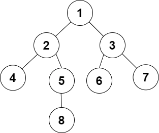

# Heap & Priority queues

## Priority queues

Let *E* be a set mapped by a priority function *p*. We call a priority queue a data type that allows us to:

* represent *E*,
* add an element, with a given __priority__, to *E*,
* remove an element with the __lowest/highest__ priority.

### Implementations

| Structure          | Search max/min | Insertion | Deletion |
| ------------------ | -------------- | --------- | -------- |
| __Unsorted Array__ | ``O(n)``       | ``O(1)``  | ``O(n)`` |
| __Unsorted List__  | ``O(n)``       | ``O(1)``  | ``O(n)`` |
| __Sorted Array__   | ``O(1)``       | ``O(n)``  | ``O(1)`` |
| __Sorted List__    | ``O(1)``       | ``O(n)``  | ``O(1)`` |

### Optimised implementation

| Structure | Search max/min | Insertion     | Deletion      |
| --------- | -------------- | ------------- | ------------- |
| __Heap__  | ``O(1)``       | ``O(log(n))`` | ``O(log(n))`` |

## Heap

### Level of a node

The level of a node X in a tree A is the __number of edges__ on the path from the root node to X.

<p align="center">
  
</p>

The level of the green node is __3__.

### Hierarchical numbering

For a binary tree A, hierarchical numbering consists of numbering, starting from 1, the nodes from *top to bottom* and for each level from the *left to the right*.

<p align="center">
  
</p>

### Complete binary tree

A complete binary tree is a binary tree in which every level, __except possibly the last__, is completely filled, and all nodes are *as far left* as possible.

<p align="center">
  
</p>

### Heap

Let *E* be a set mapped by a priority function *p*. A heap representing *(E,p)* is a couple *T=(A,obj)* where *A* is a __complete tree__ and *obj*  is a __bijection__ that maps for each node an element of *E*.

Thus, for all node *x* of *A* other than the root, *p(obj(x))>p(obj(Parent(x)))*

### Structure

``` c
typedef struct{
    element e;
    int priority
} node;

typedef struct{
    int size;
    node* t;
} heap;
```

You may be wondering as to why we represent it as an array! Well let me explain.

<p align="center">
  
</p>

The root is the node of index ``0``. And for a node of index ``i``, the __parent__ is the node of index ``i-1 div 2``, the __left child__ is the node of index ``2i+1`` and the __right child__ is the node of index ``2i+2``.

### Creation

``` c
heap create(int size) {
 node* t = (node*) malloc(size * sizeof(node));
 heap h;
 h.t = t;
 h.size = 0;
 return h;
}
```

### Insertion

* Insert the element at the end of the table.
* Keep swapping withe the parent until the priority constraint is respected.
  
``` c
heap insert(node o, heap h) {
 h.t[h.size] = o;
 h.size++;
 int current = h.size - 1;
 int parent = (current - 1) / 2;
 while (current > 0) {
  if (h.t[current].priority < h.t[parent].priority) {
   node temp = h.t[current];
   h.t[current] = h.t[parent];
   h.t[parent] = temp;
   current = parent;
   parent = (current - 1) / 2;
  }
  else
  {
   break;
  }
 }
 return h;
}
```

### Deletion

 In a __min heap__, we can only remove the node with __lowest priority__! In that case, it is the __root node__.

* Assign the value of the last node to the root.
* Delete the last node.
* Swap with the child node with lowest priority until the priority constraint is respected.
  
``` c
heap delete (heap h, node* o) {
 *o = h.t[0];
 h.t[0] = h.t[h.size - 1];
 h.size--;
 int current = 0;
 while (current < h.size)
 {
  int childMin = h.t[current * 2 + 1].priority > h.t[current * 2 + 2].priority ? current * 2 + 2 : current * 2 + 1;
  if (h.t[current].priority > heap.t[childMin].priority) {
   node temp = h.t[current];
   h.t[current] = h.t[childMin];
   h.t[childMin] = temp;
   current = childMin;
  }
  else {
   break;
  }
 }
 return h;
}
```
