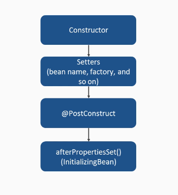

# Spring boot videos explanatiton

Author [@Saief1999](https://github.com/Saief1999)

## Section 1 : Introducing spring 5.0

### Video 1.2 : what is spring ?

**Spring** : an open source java based application framework, the latest major
stable release is version 5.0 . It is module based.

Modules include :

- Spring core container : Base module with `BeanFactory` and `ApplicationContext`
- Security : authentication / authorization (OAuth 2.0 )
- IOC : lifecycle management with dependency injection
- MVC : Used for creating RESTful web services
- Data access : Database management systems (`jdbc` access ... )

**Spring Boot** :

- Easy to use solution for creating a standalone Spring application with minimal effort & minimal configuration
- support for embedded tomcat , curated maven dependencies & simplified security
- behind the scenes, Spring boot uses Spring 5.0

### Video 1.3 : Choosing an IDE ?

- List of tools are available in this link <https://Spring.io/tools> .
- in this tutorial we're gonna use **IntelliJ**

> check student pack for IntelliJ ultimate version

#### To create a new project

`New project > Maven > fill groupId and artifactId > choose location > create`

### Video 1.4 : Setting Up Maven

- Maven: Software project build management tool providing a standard way for creating and managing java projects .
- dependencies : packages you software relies on.

#### Adding dependencies

We start by copying this dependency from <https://mvnrepository.com/artifact/org.springframework.boot/spring-boot-starter-parent>

```xml
<dependency>
    <groupId>org.springframework.boot</groupId>
    <artifactId>spring-boot-starter-parent</artifactId>
    <version>2.4.2</version>
    <type>pom</type>
</dependency>
```

we change it to `parent` and we delete the `type` attribute.

In `pom.xml`

```xml
<parent>
    <groupId>org.springframework.boot</groupId>
    <artifactId>spring-boot-starter-parent</artifactId>
    <version>2.4.2</version>
</parent>
```

**parent dependencies** : avoid redundancies and duplicate configuration in project (multiple version for example)

we add `spring-boot-starter-web` to `pom.xml`

```xml
<dependencies>
<dependency>
    <groupId>org.springframework.boot</groupId>
    <artifactId>spring-boot-starter-web</artifactId>
    <version>2.4.2</version><!-- this can be deleted-->
</dependency>
</dependencies>
```

##### To Download the dependencies

`right click project > maven > download sources and documentation`

### Video 1.5 : Creating a Run Configuration

#### Creating the main class

In `src/main/java/main.java`

```java
public class Main {

  public static void main(String[] args) {
    System.out.println("Hello");
  }
}

```

#### adding Run Configuration

To add a run configuration we do :

`Add run configuration < + < Application < name it ' Demo Run ' < Select Main.java as Main Class < Apply`

### Video 1.6 : Running a Spring Application

#### configuring main class

We move our Main class to `com.demo` and add necessary configuration

In `src/main/java/com.demo/main.java`

```java
package com.demo;

import org.springframework.boot.SpringApplication;
import org.springframework.boot.autoconfigure.SpringBootApplication;

@SpringBootApplication
public class Main {

  public static void main(String[] args) {
    SpringApplication.run(Main.class, args);
  }
}

```

#### Creating a Rest Controller

In `src/main/java/com.demo/RestController.java`

```java
package com.demo;

import org.springframework.web.bind.annotation.RequestMapping;

@org.springframework.web.bind.annotation.RestController
public class RestController {

  @RequestMapping("/hello")
  public String helloWorld() {
    return "hello World"; // this will return hello world as html
  }
}

```

### Section 2 : Working with Spring IOC

#### Video 2.1 : Introducing IOC ?

**Inversion of control** :

- a software design principle where parts of the software receive flow of control , for example from another framework.
- instead of the custom code calling the library . We have the framework calls the custom code.
- Used for decoupling execution of a task from actual implementation to avoid problems
- Separates **what to do** (defined by the interface) from **where to do** (a component implementing that interface)

- **Dependency Injection** :
  - one way of achieving inversion of control
  - control is inverted via setting other objects that an existing object depends on
  - Various ways (Setter-based DI / Field Based DI / Interface-based DI / Constructor-based DI)

##### Example Of Inversion of control

A printer that uses a document

Instead of using the `Document` in the `Printer` as an attribute. We create a `DocumentInterface` and we use it inside the Printer instead.

#### Video 2.2 : Dependency Injection with Annotations

- **Annotations** : metadata that is added to java source Code
  - Examples : `@override` and `@SuppressWarnings`
  - Are processed by annotation processors

##### Annotations in Spring

- to inject dependencies, the `@Autowired` annotation is commonly used in spring
- In addition we have (will be explained later) :
  - `@Qualifier` (DI by qualifier)
  - `@Component` and `@ComponentScan` (DI by name)

#### Video 2.3 : Introduction to the @Component Annotation

- **Spring Beans** :

  - Custom objects instantiated and managed by the Spring IOC container.
  - every bean require a definition for creating the actual instances of the bean object later

- **@Component** :
  - used to mark a classes as Spring managed components -> Beans.
  - `@ComponentScan` can be used to scan the class path and creates beans of classes annotated with `@Component`
  - **@Bean** and **@Component** both are used to create Beans
    - @Bean : declared a bean on the method level (we annotate a method to make it return a Bean), can only be used on configuration classes(@Configuration).
    - @Component : operates on the class level

#### Creating our First Bean

- We create a class named `Greeter.java`. We Annotate it with `@Component`

In `/src/main/java/com.demo/Greeter.java`

```java
package com.demo;

import org.springframework.stereotype.Component;

@Component
public class Greeter {

  String greet() {
    return hello;
  }
}

```

### Video 2.4 : Introduction to the @Autowired Annotation

- Annotation for auto-wiring(resolving beans via setter , constructor , or field
- if a **field** is annotated `@Autowired(required=true)`, Spring tries to resolve the annotated field and performs dependency injection
- If the required property is set to `false`, Spring won't throw exceptions of **unresolved beans**

In `/src/main/java/com.demo/Greeter.java`

```java
import org.springframework.beans.factory.annotation.Autowired;
//...
    private Greeter greeter ;

    @RequestMapping("/hello")
    public String helloWorld(){
        return greeter.greet();

    }
//...

```

- if we want to **disable exception throwing** for a field if the bean doesn't exist

In `/src/main/java/com.demo/NotABean.java`

```java
package com.demo;

public class NotABean {}

```

In `/src/main/java/com.demo/RestController.java`

```java
//...
@Autowired(required = false)
private NotABean notABean ;
//...
```

This will work without exceptions !

### Video 2.5 : Dependency Injection with the @Autowired Annotation

- the `@Autowired` annotation has different executions paths that define which way `@Autowired` dependencies are resolved
  - Match via the type (default)
  - match via the field name
  - Match via the qualifier by an additional `@Qualifier` and using `@Component(value=specifiedValue)`

#### Example

- We create an interface for our bean

In `GreetInterface.java`

```java
package com.demo;

public interface GreetInterface {
  String greet();
}

```

- now we add a second Bean implementing the same interface

In `FriendlyGreeter.java`

```java
package com.demo;

public class FriendlyGreeter implements GreetInterface {

  @Override
  public String greet() {
    return "Friendly Greeting";
  }
}

```

In `Greeter.java`

```java
package com.demo;

import org.springframework.stereotype.Component;

@Component
public class Greeter implements GreetInterface {

  @Override
  public String greet() {
    return "hello";
  }
}

```

In `RestController.java`

```java
//...
    @Autowired
    private GreetInterface greeter ;
    @Autowired
    private GreetInterface friendlyGreeter ;

    @RequestMapping("/hello")
    public String helloWorld(){
        return greeter.greet();
    }
    @RequestMapping("/hellofriendly")
    public String helloFriendly(){
        return friendlyGreeter.greet()  ;
    }
//...
```

**_IMPORTANT_** :

- In this case, spring uses the **Attribute Name** as an indication for **the bean that needs to be instantiated**
- If we change the **Attribute Name** (`friendlyGreeter` to `friendlyGreeter1` for example) Spring won't be able to recognize which class (Already two components implement this interface ).
- Therefore, We need to Use **@Qualifier(value="...")** or **@Primary** or **@Component(value="...")**

#### Solution 1 : Adding @Component(value="specificName")

In `Greeter.java` : We add `value` Field for `@Component`

```java
@Component(value="greeter1")
public class Greeter implements GreetInterface{
```

In `RestController.java` : We leave the name **as it is**

```java
@Autowired
private GreetInterface greeter1 ;
```

- The problem here, since we're using the interface, we should Name our Attribute **exactly** as it's mentioned in the component.

#### Solution 2 : Using @Qualifier(value="beanName")

In `RestController.java` : We add `@Qualifier` and we specify the `beanName`

```java
//...
@Autowired
@Qualifier(value="friendlyGreeter")
private GreetInterface friendlyGreeter1 ;
//...
```

#### Solution 3 : Using @Primary

In `Greeter.java` : We add `value` Field for `@Component`

```java
@Component
@Primary
public class Greeter implements GreetInterface {
  //class body
}

```

- In case of a conflict, the Primary bean will be instantiated.

### Section 3 : Working with Spring Beans

#### Video 3.1 : Introduction to Spring Beans

- **@Bean**
  - Can be used for methods in configuration classes ( annotated with `@Configuration` ), to register the **return value of a method** as a **Spring Bean**.
  - Declared at the **method** level (whereas `@Component` is declared at **class** level )
  - the bean name is the **same** as the method name (default)

##### Example : Class Based Configuration of components

1. We delete **@Component** from our classes

2. In `GreeterConfiguration.java` :

- We annotate class `@Configuration`

- We add methods `Greeter` and `FriendlyGreeter` , and annotate them with **@Bean**

- We make them return the wanted objects

```java
package com.demo;

import org.springframework.context.annotation.Bean;
import org.springframework.context.annotation.Configuration;

@Configuration
public class GreeterConfiguration {

  @Bean
  public GreetInterface greeter() { // first letter lowercase like the attribute name !
    return new Greeter();
  }

  @Bean
  public GreetInterface friendlyGreeter() {
    return new FriendlyGreeter();
  }
}

```

**IMPORTANT** :

- The attribute name **Should match** the method name when requesting the bean.

### Video 3.3 : Spring Bean Scopes

- Bean Scope : bean scope in spring influences its life cycle and exposure (visibility) to other components.

- Currently, Spring supports **six different scope types**.

- Annotated via **@Scope**

- Most commonly used

  - **Singleton** **(Default)** : only a single instance of an object exists in an application context
  - **Prototype** : A new instance is created every time the bean is requested from the IOC container.

- Less commonly used

  - Web-aware scopes : Can only be used in a web aware application context
    - **Request** : Scoped to the life cycle of a single HTTP request.
    - **Session Scope** : Scoped to the life cycle of a single HTTP session, a session usually holds information across multiple requests.
    - **Global Session** : scoped to the life cycle of a global HTTP session.
    - **Application** : Instance of the bean is shared across the **SevletContext**

#### Singleton and Request Scopes (Example)

1. In `GreeterConfiguration.java` :

   - We add @Scope from both Methods
   - We change the return types ( so we can change our attribute names later on )

   ```java
   @Configuration
   public class GreeterConfiguration {

     @Bean
     @Scope(value = "prototype")
     public Greeter greeter() {
       return new Greeter();
     }

     @Bean
     @Scope(value = "singleton")
     public FriendlyGreeter friendlyGreeter() {
       return new FriendlyGreeter();
     }
   }

   ```

2. In `GreeterBase.java` We add a variable to observe the scope of our beans

   ```java
   package com.demo;

   public abstract class GreeterBase implements GreetInterface {

     protected int greetCount = 0;
   }

   ```

3. In `Greeter` and `FriendlyGreeter` :

   - We extends the abstract class
   - we increment the variable at each call

   ```java
   package com.demo;

   public class Greeter extends GreeterBase {

     @Override
     public String greet() {
       greetCount++;
       return "hello " + greetCount;
     }
   }

   ```

4. In `RestController.java`

   - we add new attributes
   - We add necessary endpoints
   - We change attribute types

   ```java
   @Autowired
   private Greeter greeter1 ;
   @Autowired
   private FriendlyGreeter friendlyGreeter1 ;
   @Autowired
   private Greeter greeter2 ;
   @Autowired
   private FriendlyGreeter friendlyGreeter2 ;
   ```

   ```java
   @RequestMapping("/hellofriendly1")
   public String helloFriendly(){
       return friendlyGreeter1.greet()  ;
   }

   @RequestMapping("/hello1")
   public String helloWorld(){
       return greeter1.greet();
   }

   @RequestMapping("/hellofriendly2")
   public String helloFriendly2(){
       return friendlyGreeter2.greet()  ;
   }


   @RequestMapping("/hello2")
   public String helloWorld2(){
       return greeter2.greet();
   }
   ```

**NOTES** :

- when we go to `/hello1` : it keeps incrementing (instance of the bean greeter requested only once )
- when we go to `/hello2` :

  - a new instance for the bean greeter is requested , it's scope is **prototype** so a new object will be created .
  - We have a new Greeter with a new Counter , That keeps incrementing **independently of** `/hello1`

- When we go to `/hellofriendly1` :
  - a new Instance of the bean `FriendltyGreeter` is requested. It will be returned and the counter will keep incrementing
- When we go to `/hellofriendly2` : a new instance is requested. the bean's scope is **singleton** so the same object will be returned ( counter **shared** between both endpoints )

#### Request Scope (Example)

In `GreeterConfiguration.java` : We change the scope of `FriendlyGreeter` bean .

```java
//...
@Bean
@Scope(value= WebApplicationContext.SCOPE_REQUEST,proxyMode = ScopedProxyMode.TARGET_CLASS)
public FriendlyGreeter friendlyGreeter()
{
    return new FriendlyGreeter() ;
}
```

- each Call for `/hellofriendly1` `/hellofriendly2` creates a new `FriendlyGreeter` bean instance.

### Video 3.4 : Spring Bean Life Cycle and Callbacks

- Spring bean life cycle :

  - describes the entire span of existence of a spring bean
  - This starts with the bean creation by the IOC container , ends with its destruction.

- Simplified bean initialization life cycle



- Simplified bean destruction life cycle


- **Lifecycle interfaces** (bean implements interface & overrides methods ) :
  - **InitializingBean** : **Interface** that allows callbacks during initialization process of a bean.
  - **DisposableBean** : **Interface** that allows callbacks during the destruction process of a bean.
- Lifecycle Annotations :
  - **@PostCostruc**t : **Annotation** that can be used to annotate the methods of a bean that should be called **after** the bean has been **initialized** by the IoC container
  - **@PreDestroy** : **Annotation** that can be used to annotate the methods of a bean that should be called when a bean is **about to** be **destroyed**.

#### Example (Interfaces)

In `FriendlyGreeter.java`

```java
public class FriendlyGreeter
  extends GreeterBase
  implements InitializingBean, DisposableBean {

  @Override
  public String greet() {
    greetCount++;
    return "Friendly Greeting " + greetCount;
  }

  @Override
  public void afterPropertiesSet() throws Exception {
    System.out.println("afterPropertiesSet");
  }

  @Override
  public void destroy() throws Exception {
    System.out.println("destroy");
  }
}

```

**Notes :**

- The bean scope is **request** .So for each request a new instance is created then destroyed . For each request we see :
  `afterPropertiesSet`
  `destroy`
- If the bean scope is **singleton (default)**. the bean will be instantiated ( `afterPropertiesSet` shows up ) **with application startup** . and will be deleted ( `destroy` will show up ) with **application shutdown**.

#### Example (Annotations)

In `FriendlyGreeter.java`

```java
//...
@PostConstruct
private void postConstruct()
{
    System.out.println("postConstruct");
}

@PreDestroy
private void preDestroy(){
    System.out.println("preDestroy");
}
//...
```

- Order is the following for **Singleton** Scope :

```bash
//during startup
postConstruct
afterPropertiesSet

//during shutdown
preDestroy
destroy
```

### Video 3.5 : Spring Property Files

- Property files : used to provide additional application data ( example `db connexion URL`)
- To **read** Property files we use **@ConfugurationProperties**
  - it it used to **externalize** configuration data and separate it from beans
  - Annotation a class that has `@Configuration` to make it read properties from certain configuration files ( example : `application.yml` )

#### Spring Property Files Example

- in `src/main/resources` : we create `application.yml`

```yaml
database:
  url: url-to-database
  username: database-user
```

- in `src/main/resources` : we create `DatabaseConfiguration.java`
  - we add `@ConfigurationProperties(prefix="parentProperty")`
  - we add properties as fields
  - We add getters/setters
  - It's a `@component` not `@Configuration` !! (so we can do `@Autowired` later)

```java
@Component
@ConfigurationProperties(prefix = "database")
public class DatabaseConfiguration {

  private String url;
  private String username;

  public String getUrl() {
    return url;
  }

  public void setUrl(String url) {
    this.url = url;
  }

  public String getUsername() {
    return username;
  }

  public void setUsername(String username) {
    this.username = username;
  }
}

```

- in `GreeterConfig.java` :
  - we use our `DatabaseConfiguration` as `@Autowired`
  - We pass it to the constructor of the bean

```java
//...
@Autowired
private DatabaseConfiguration databaseConfig ;

    @Bean
    public FriendlyGreeter friendlyGreeter()
    {
        return new FriendlyGreeter(databaseConfig) ;
    }
//...
```

- in `FriendlyGreeter.java` : we pass the config in the **constructor**
  - we don't need `@Autowired` for the attribute ( it's passed to the constructor via the Configuration File of the bean `GreeterConfiguration.java` )

```java
//...
private DatabaseConfiguration config ;

 FriendlyGreeter(DatabaseConfiguration config)
 {
     this.config=config;
 }
//
```

**Result** : `Friendly Greeting 4 database-user url-to-database`

## Section 4 : Spring Data

### Video 4.1 : Introduction to Spring Data

- **Spring Data** :
  - simplifies database implementation
  - provides an abstract, interchangeable and consistent way for data access
- **spring data supports** this database solutions:

  - JDBC
  - java persistence API (JPA)
  - MongoDB
  - Couchbase

- **H2** :

  - Database management system for java-based applications
  - fully supported by Spring Boot
  - Default configuration in Spring Boot is the **in-memory storage** (the data is **lost on application restart**)

### Video 4.2 : Spring Data Dependencies

- Required Dependencies :
  - **Spring Boot Data JPA** dependency :Provides the basis for working with java-based database solutions.
  - **H2 database** dependency.

In `pom.xml` :

- We add the `H2` and `JPA` dependencies
- We delete the versions (already mentioned in the parent)
- We change the scope of h2 from `test` to `runtime`

```xml
<dependency>
    <groupId>org.springframework.boot</groupId>
    <artifactId>spring-boot-starter-data-jpa</artifactId>
</dependency>

<dependency>
    <groupId>com.h2database</groupId>
    <artifactId>h2</artifactId>
    <scope>runtime</scope>
</dependency>
```

### Video 4.3 : Creating a Data Model

- **Data Model** :
  - Java class representing an entity/object in the database.
- **JPA Annotations** : used for database model creation
  - **@Entity** : marks a java class as an Entity stored in DB
  - **@Id** : Marks a field as the unique identifier of the entity
  - **@GeneratedValue** : marks a field representing an automatically generated value.

#### Creating a Data Model Example

In `Customer.java`

```java
package com.demo;

import javax.persistence.Entity;
import javax.persistence.GeneratedValue;
import javax.persistence.Id;

@Entity
public class Customer {

  @Id
  @GeneratedValue
  private Long id;

  private String name;

  private int age;

  public Long getId() {
    return id;
  }

  public void setId(Long id) {
    this.id = id;
  }

  public String getName() {
    return name;
  }

  public void setName(String name) {
    this.name = name;
  }

  public int getAge() {
    return age;
  }

  public void setAge(int age) {
    this.age = age;
  }
}

```

### Video 4.4 : Setting Up a Repository

- **Repository<T, ID>** :generic interface all repositories inherit from

  - **T** : data type the repository stores
  - **ID** : type of the identifier ( annotated with @Id in the model )

- **CrudRepository<T, ID>** extends Repository(T,ID) : generic interface supporting CRUD operations

  - Create -> `save(...)`
  - Read -> `find(...)`
  - Update -> `save(...)`
  - Delete -> `delete (...)`

- **PagingAndSortingRepository<T, ID>** extends CrudRepository <T,ID>

  - supports key aspects of pagination
  - finding entities matching certain conditions -> `findAll(...)`

- **JpaRepository<T,ID>** extends PagingAndSortingRepository<T,ID> extends PagingAndSortingRepository<T,ID>
  - JPA-specific extension of repository
  - JPA-specific queries -> `getOne(...)`

#### To Create a Repository

1. Create an **interface**
2. let it **extend** one of the mentioned repository interfaces
3. **Annotate** the interface with `@Repository`
4. **implement/add** your own repository methods

#### To Create a Repository Example

- In `CustomerRepository.java`

```java
package com.demo;

import org.springframework.data.jpa.repository.JpaRepository;
import org.springframework.stereotype.Repository;

@Repository
public interface CustomerRepository extends JpaRepository<Customer, Long> {}

```

- In `RestController.java` : We **Autowire** the Repository

```java
package com.demo;

import org.springframework.beans.factory.annotation.Autowired;

@org.springframework.web.bind.annotation.RestController
public class RestController {

  @Autowired
  private CustomerRepository customerRepository;
}

```

### Video 4.5 : Reading and Writing the Database

- Setup Unit Testing :
  - Add the Spring boot JUnit dependency
  - Create a test class and add the **required annotations**
    - **@RunWith** : defines the runner the test should run with
    - **@SpringBootTest** : marks the class as a spring boot test (allows us to specify the main class)

#### Reading and Writing the Database Example

In `pom.xml` : we add the Unit test dependency

```xml
<dependency>
    <groupId>org.springframework.boot</groupId>
    <artifactId>spring-boot-starter-test</artifactId>
    <scope>test</scope>
</dependency>
```

In `src/test/java` : We create `CustomerRepositoryTest.java`

```java
@Repository
public interface CustomerRepository extends JpaRepository<Customer, Long> {}

```

then to use the repository in a controller / unit test we do

```java
@Autowired
  private CustomerRepository repository ;
```

#### Example of Unit Test

```java
//other imports ...
import static org.junit.Assert.assertEquals;

@RunWith(SpringJUnit4ClassRunner.class)
@SpringBootTest(classes = Main.class)
public class CustomerRepositoryTest {

  @Autowired
  private CustomerRepository repository;

  @Test
  public void testRepository() {
    Customer customer = new Customer();
    customer.setName("Tom");
    customer.setAge(40);

    repository.save(customer);
    assertEquals(1, repository.findAll().size()); // confirm save

    Customer loadedCustomer = repository.findById(customer.getId()).get(); // load / read by id
    assertEquals("Tom", loadedCustomer.getName());
    assertEquals(40, loadedCustomer.getAge());

    customer.setName("Peter"); // change name
    repository.save(customer); // update

    Customer updatedCustomer = repository.findById(customer.getId()).get(); // reload by id
    assertEquals("Peter", updatedCustomer.getName()); // check name updated correctly
    assertEquals(40, updatedCustomer.getAge()); // check age unchanged

    repository.delete(customer);
    assertEquals(0, repository.findAll().size()); // confirm deletion
  }
}

```

## Section 5 : Creating a Rest API

### Video 5.1 : Introduction to Creating Rest APIs

- **Rest** :
  - Representational State transfer
  - way for distributed systems to communicate with each other (client-server)
  - **Stateless** : each request contains all the required information
  - Highly scalable
- **HTTP Request Methods** :
  - **GET** : requests data from the server
  - **POST** : sends data to the server
  - **PUT** : changes/updates data on the server
  - **DELETE** : deletes data from the server

### Video 5.2 : Creating a RestController

- **Controller** : a class responsible for preparing data ( from a model) to be presented in a view
- **RestController** : a specific type of controller with capabilities for REST APIs
  - Annotated with `@RestController`

#### Creating a RestController Example

In `CustomerController.java`

```java
@RestController
public class CustomerController {

  @Autowired
  private CustomerRepository repository;
}

```

### Video 5.3 : Creating endpoints for receiving data

- POST endpoint :
  - Endpoint that takes data in JSON format and stores it in a repository
- PUT endpoint :
  - Endpoint that takes data in JSON format and uses it to update data in a repository

#### Creating endpoints for receiving data Example

```java
@RestController
public class CustomerController {

  @Autowired
  private CustomerRepository repository;

  @RequestMapping(value = "/customer", method = RequestMethod.POST)
  public Customer save(@RequestBody Customer customer) {
    return repository.save(customer);
  }

  @RequestMapping(value = "/customer", method = RequestMethod.PUT)
  public Customer update(@RequestBody Customer customer) {
    return repository.save(customer);
  }
  //...
}

```

**IMPORANT** :

- All endpoints except the **delete** should return the `customer` back.

#### Testing

- Creating a Customer(JSON POST Request) :

```json
{
  "name": "Tom",
  "age": 26
}
```

- Updating a Customer (JSON PUT request):

```json
{
  "id": 1,
  "name": "Tommy",
  "age": 27
}
```

### Video 5.4: Creating endpoints for Sending and Deleting Data

- GET endpoint :

  - Endpoint that loads data from a repository and sends it in JSON format

- DELETE endpoint :

  - Endpoint that removes data from a repository

#### Creating endpoints for Sending and Deleting Data Example

```java
@RequestMapping(value ="/customer/{id}", method=RequestMethod.GET)
    public Customer get(@PathVariable Long id)
    {
        return repository.findById(id).orElse(null); // we can use .get()
    }
    @RequestMapping(value="customer/{id}",method=RequestMethod.DELETE)
    public void delete(@PathVariable Long id)
    {
        repository.deleteById(id);
    }
```

Notes:

- we need the id to perform delete and get. We use `@PathVariable`

### Video 5.5: Testing the Endpoints

> This part concerns unit Testing. Check the videos if you're curious

## Section 6 : Going Reactive with Spring

### Video 6.1 : Introduction to Spring Reactive

- Reactive Programming :
  - Approach to process data asynchronously without any blocking IO operation
  - Instead of waiting for an async operation to finish (and block the thread) reactive programming relies on **observable streams**.
  - reactivity : the principle relies on **reacting to changes** happening on an **observed stream**.
  - Two instances :
    - **A publisher** : publishes events on the stream
    - **A subscriber** : who reacts to those events.
- `Webflux` :
  - fully supports non blocking reactive streams
  - Uses two publishers
    - Mono\&lt;T&gt; : for handling 0 or 1 element
    - Flux &lt;T&gt; : fir handling 0 to N element(s)
  - Flux can return a list of elements, or indefinitely emit new elements to the stream
  - API is **reactive** it it returns objects wrapped in `Mono` or `Flux`

#### Adding the Webflux Dependency

In `pom.xml`

```xml
<dependency>
    <groupId>org.springframework.boot</groupId>
    <artifactId>spring-boot-starter-webflux</artifactId>
</dependency>
```

### Video 6.2 : Creating a Reactive Repository

- JPA doesn't support reactive streams, so we're using a `HashMap` as a database.

```java
package com.demo;

import java.util.HashMap;
import java.util.Map;
import org.springframework.stereotype.Repository;
import reactor.core.publisher.Flux;
import reactor.core.publisher.Mono;

@Repository
public class ReactiveCustomerRepository {

  private static Map<Long, Customer> customers = new HashMap<>();

  Mono<Customer> save(Customer customer) {
    customers.put(customer.getId(), customer);
    return Mono.justOrEmpty(customer);
  }

  Mono<Customer> findById(Long id) {
    return Mono.justOrEmpty(customers.get(id));
  }

  Flux<Customer> findAll() {
    return Flux.fromIterable(customers.values());
  }

  Mono<Customer> deleteById(Long id) {
    return Mono.justOrEmpty(customers.remove(id));
  }
}

```

### Video 6.3 : Creating a Reactive RestController

```java
@RestController
public class CustomerController {

  @Autowired
  private ReactiveCustomerRepository repository;

  @RequestMapping(value = "/customer", method = RequestMethod.POST)
  public Mono<Customer> save(@RequestBody Customer customer) {
    return repository.save(customer);
  }

  @RequestMapping(value = "/customer", method = RequestMethod.PUT)
  public Mono<Customer> update(@RequestBody Customer customer) {
    return repository.save(customer);
  }

  @RequestMapping(value = "/customer/{id}", method = RequestMethod.GET)
  public Mono<Customer> get(@PathVariable Long id) {
    return repository.findById(id);
  }

  @RequestMapping(value = "/customer", method = RequestMethod.GET)
  public Flux<Customer> getAll() {
    return repository.findAll();
  }

  @RequestMapping(value = "customer/{id}", method = RequestMethod.DELETE)
  public void delete(@PathVariable Long id) {
    repository.deleteById(id);
  }
}

```
