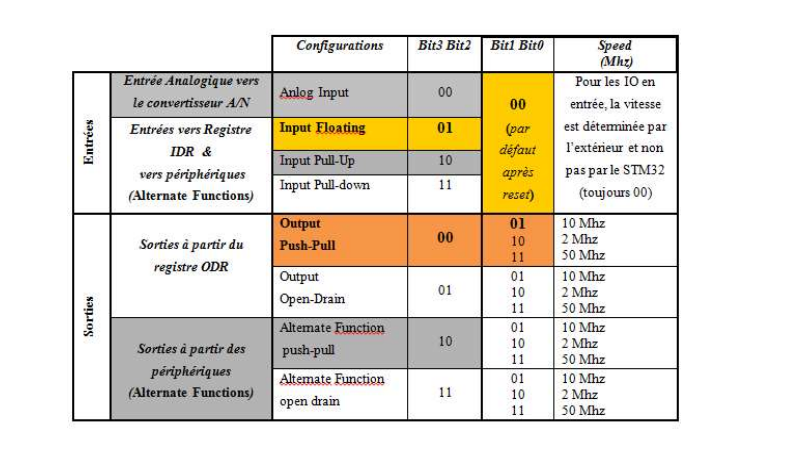
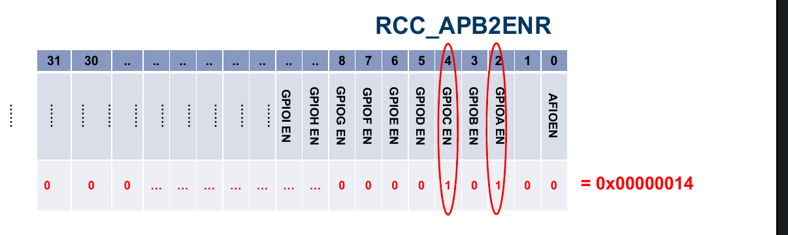
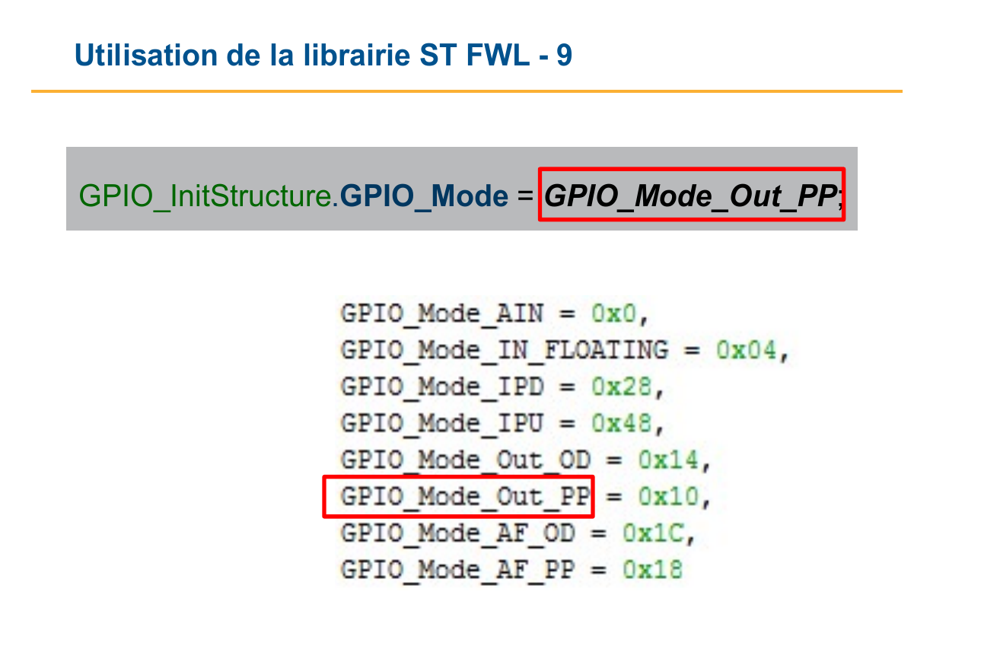

# Cheat sheet

## General Input Output

### Define registry

```c
#define Reg_name (type_data*) adr;

// example : registry spanning 8 bits , starting on address 0x300
#define PortA (uint8_t*) 0x300;

```

### Write to a registry

```c
#define PortA (uint8_t*) 0x300;
*PortA = 0x0FF;
```

### read from registry

```c
#define PortA (uint8_t*) 0x300;
int a = *PortA;
```

### Bitwose Not

```c
~ 0x34 != ~ 0x00000034;
~ (unit32_t) 0x34 == 0x00000034
```

### right to left shift

```c
int a = 0x01 << 8
a == 0x0100
```

## Chapter 2 : STM32

### RCC: Reset Control Clock

Is a module responsible for enabling / disabling other I/O Peripherals

Base address : 0x4002 1000

### GPIO

4 parts :

- Input data register **IDR**
- Output data register **ODR**
- Config Register
- 16 I/O ports connected to microcontroller pins

Frequencies :

- 2mhz
- 10mhz
- 50mhz

Config Regsiter :

- CRL : config register low 32 bit each pin is 4 bit
- CRH : config register high 32 bit each pin is 4 bit

How to program GPIO :

- define registries
- activate I/O interfaces ( GPIOx)
- configure GPIO
- impose or read the value of a bit

Example on how to light up a led with GPIOC on pin9 with push-pull

we use 0001 as config

We use CRH cuz 9 > 7

```c

// Le registre du module RCC permettant d’activer les interface E/S
// GPIOA is 2
#define RCC_APB2ENR (uint32_t*) 40021018;

// pin
// Le registre de configuration CRH du port GPIOC
#define GPIOC_CRH (uint32_t*) 0x40011004;

// Le registre ODR du port GPIOC
#define GPIOC_ODR (uint32_t*) 0x4001100C;

// Initialiser le registre RCC_APB2ENR pour activer GPIOC
*RCC_APB2ENR |= 0x00000010;

// set config to 0001
// pin 9 is from 4..7
*GPIOC_CRH &= ~ (((uint32_t)) 0x0F << 4);

*GPIOC_CRH |=0x01 <<4;

// allumer led

// allumer Led  : set pin 9 to 1
*GPIOC_ODR|= 0x01 << 9;

// eteindre led : set pin 9 to

*GPIOC_ODR &=  ~ ((unit32_t) 0x01  << 9);

```

Note you can set ODR register values on one go using BSRR and BRR addresses
Each BRR and BSRR are unique to each GPIO

set 9th bit to one : \*BSRR = 0x1 << 9

set 9th bit to zero : \*BRR = 0x1 << 9

## Chapter 3 : ST Firmware Library (ST FWL)

Every GPIO address is set as Struct with access to all registries like

- GPIOC->CRH
- RCC->APB2ENR

Program init

```c
GPIO_InitStructure.GPIO_Pin = GPIO_Pin_9 | GPIO_Pin_8 ;
GPIO_InitStructure.GPIO_Speed = GPIO_Speed_2MHz;
GPIO_InitStructure.GPIO_Mode = GPIO_Mode_Out_PP;
GPIO_Init (GPIOx , &GPIO_InitStructure);
```

GPIO_SetBits : take GPIOx and A pin and sets its to one

example : GPIO_SetBits ( GPIOC, GPIO_Pin_9 | GPIO_Pin_7);
) :

GPIO_ResetBits does the oposite

example : GPIO_ResetBits ( GPIOC, GPIO_Pin_9);

Activate I/O RCC with helper function :

```c
RCC_BUSxPeriphClockCmd ( RCC_BUSxPeriph_PPPx, ENABLE );
```

example :

```c
RCC_APB2PeriphClockCmd ( RCC_APB2Periph_GPIOA, ENABLE );
```

## Interuptions

INT : An interruption is generated

INTA : an acknologment of interuption

PC : (Program Counter)

IRR : Interrupt Request Register , a value of 1 in a bit indicates if the corresping perif has a request

ISR : In Service registry , Every bit indicates if the corresping interuption is being run (1) or waiting

ISRi : contains the code for periph i

IMR : Interrupt Mask Register , Similit to RCC , activates desactivates interruptions with each bit

IPR : Interrupt Priority Registers , 8 bit 0 -> 256

@ISRi : 4 \* i , pointer to ISR i ( for arm it starts at 0x04)

## ARM M3

ISERx : Interrupt Set Enable Register (32 bits) : chaque bit de ce registre permet d’autoriser
l’interruption correspondante quand il est mis à 1.

ICERx : Interrupt Clear Enable Register (32 bits): chaque bit de ce registre permet d’interdire
l’interruption correspondante quand il est mis à 1.

ISPRx : Interrupt Set Pedning Register (32 bits) : La mise à 1 d’un bit de ce registre active
(déclenche) une interruption (met l’interruption en état pending). Généralement, ce bit n’est pas mis
par software, mais par un périphérique « Figure -1 ».

ICPRx : Interrupt Clear Pedning Register (32 bits) : La mise à 1 d’un bit de ce registre met
l’interruption en état ‘not pending’. Ce bit est mis automatiquement à 1 par le matériel (logique de
contrôle du NVIC) après avoir commencé l’exécution du Handler associé à l’interruption. Mais, il peut
être également accédé par soft.

### priorities

ARM has a system of priority and sub-priority

ARM manages the number with of priority groups relative to subgroups with thelp of

```c
NVIC_PriorityGroupConfig ( uint_32t NVIC_PriorityGroup )

// NVIC_PriorityGroup_0 : pour PRIGROUP = 111
// NVIC_PriorityGroup_1 : pour PRIGROUP = 110
// NVIC_PriorityGroup_2 : pour PRIGROUP = 101
// NVIC_PriorityGroup_3 : pour PRIGROUP = 100
// NVIC_PriorityGroup_4 : pour PRIGROUP = 011
```

ISRi starts at 0x04 for ARM , 0x00 is reserved for MSP Main Stack pointer

We can move the ISRi vector using VTOR (Vector Table Offset Register)

### nvic config

uint8_t NVIC_IRQChannel : Il s’agit d’une valeur sur 8 bits qui identifie le numéro de l’interruption
à configurer. Ces numéros sont figés matériellement. La liste des sources de requêtes d’interruptions ainsi
que leurs numéros pour la famille F1 est donnée à la fin du chapitre « tableau -4 »
Remarque : Consulter le document d’aide de la librairie ST pour trouver les valeurs.

uint8_t NVIC_IRQChannelPreemptionPriority : C’est une valeur sur 8 bits indiquant le groupe de
priorité auquel appartient l’interruption à configurer « voir tableau 3 ».

uint8_t NVIC_IRQChannelSubPriority : C’est une valeur sur 8 bits indiquant le niveau de priorité
attribué à l’interruption au sein du groupe « voir tableau 3 ».

NVIC_IRQChannelCmd : peut prendre la valeur ENABLE (1) pour autoriser l’interruption ou bien
DISABLE (0) pour interdire son déclenchement.

```c
typedef struct
{
//  attributes
} NVIC_InitTypeDef ;


NVIC_InitTypeDef
 NVIC_InitStruct ; // Déclarartion d’une structure de type NVIC_InitTypeDef
NVIC_InitStruct .NVIC_IRQChannel = FLASH_IRQn; // L’identifiant de l’interruption générée par le Flash.
NVIC_InitStruct. NVIC_IRQChannelPreemptionPriority = 15; // Le groupe ayant la priorité la plus basse.
NVIC_InitStruct. NVIC_IRQChannelSubPriority = 0;
 // un seul niveau d’interruption est disponible (0).
NVIC_InitStruct. NVIC_IRQChannelCmd = ENABLE; // autoriser l’interruption.
NVIC_Init (&NVIC_InitStruct);

NVIC_Init( & NVIC_InitStruct )


```

## handle interup function

```c
void ........._IRQHandler ( )
{
  // Code à exécuter
  Periph_ClearITPendingBit();
  // Code à exécuter


}

//  multiple events

void ........._IRQHandler ( )
{
If ( periph _GetITStatus ( .....FLAG 1 ) )
{ .......
periph_ClearITPendingBit (.....)
}
...............
.................
}
If ( periph_GetITStatus ( .....FLAG N) )
{ .......
periph_ClearITPendingBit (......)
}

```

Tail Chaining dure que 6 cycles.






