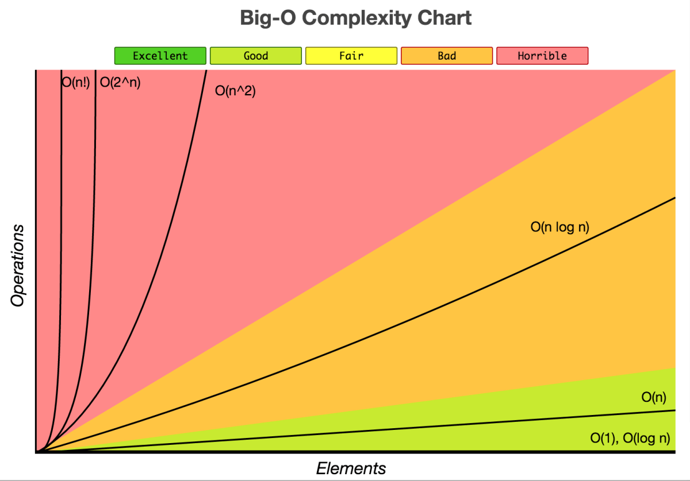
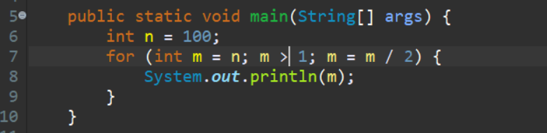
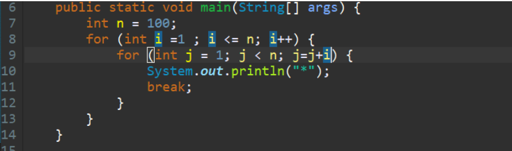
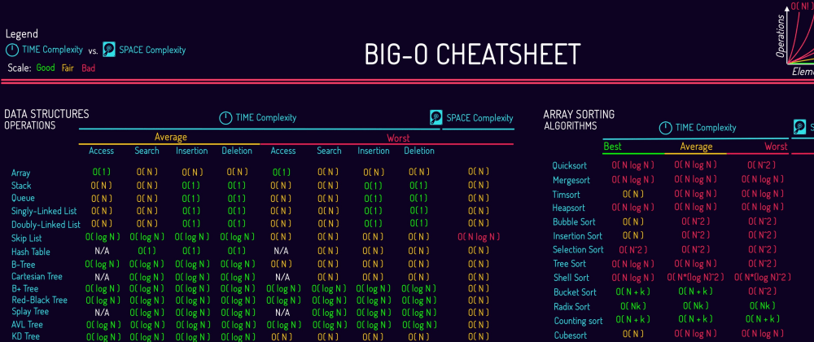
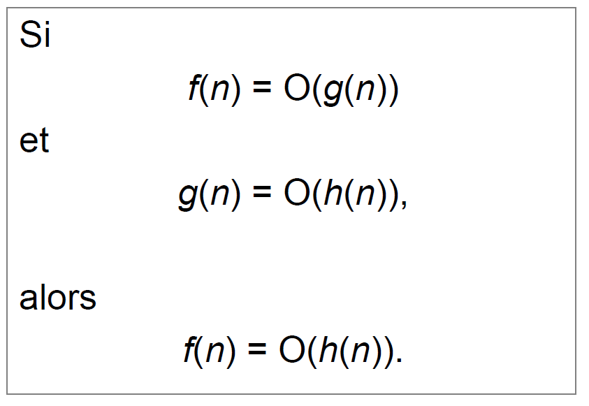
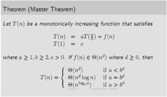

# Cheat sheet

Author [@rihemebh](https://github.com/rihemebh)


## Time Complexity

### Introduction ? 
<aside>
💡 The time complexity of an algorithm is the total amount of time required by an algorithm to complete its execution.

</aside>
<br/>



### **1)** O(1) — Constant Time

Constant time means the running time is constant, it’s *not affected by the input size (i.e.* Basic Operations (arithmetic, comparisons, accessing array’s elements, assignment*))*

Example :

```c
read(x)    // O(1)
a = 10;    // O(1)
a = 1.000.000.000.000.000.000 // O(1)
```

### **2)** O(n) — Linear Time

When an algorithm accepts n input size, it would perform n operations as well.

Consider the following example, below I am linearly searching for an element, this has a time complexity of O(n) because it goes through the loop n times.

```c
int find = 66;
var numbers = new int[] { 33, 435, 36, 37, 43, 45, 66, 656, 2232 };
for (int i = 0; i < numbers.Length - 1; i++) {
    if(find == numbers[i]) {
        return;
    }
}
```

### **3)** O(log n) — Logarithmic Time

Algorithm that has running time O(log n) is slight faster than O(n). Commonly, algorithm divides the problem into sub problems with the same size. Example: binary search algorithm, binary conversion algorithm.



```
+-----------+--------------------+
| Iteration  |     Value of M     |        
+-----------+--------------------+
| 1         | n                  | 
| 2         | n/2                |
| 3         | n/2^2              | 
| 4         | n/2^3              |
| .         |  .                 |
| .         |  .                 |
| k         | n/2^k              |
+-----------+--------------------+
```

loop will run k times so that m>1.

*m>1 ; putting value of m for as $n/2^k$*

$*n/2^k >1*$

$*2^k > n*$

*k > logn*

### **4)** O(n log n) — Linearithmic Time

This running time is often found in “divide & conquer algorithms” which divide the problem into sub problems recursively and then merge them in n time. Example: Merge Sort algorithm.

example:




so n+n/2+n/3+..+1 times total loop will run

n(1+1/2+1/3+1/4) = nlogn

so time complexity is nlogn.

### **5)** O(n²) — Quadratic Time

For example Bubble Sort algorithm, in other words, a loop inside a loop :

```c
for(i=0; i < N; i++) {
  for(j=0; j < N;j++) { 
    statement;
  }
}
```

### **6)** O(n³) — Cubic Time

It has the same principle as O(n²).

### **7)** O(2^n) — Exponential Time

It is very slow as input get larger, if n = 1000.000, T(n) would be 21000.000. Brute Force algorithm has this running time.

An algorithm is said to have an exponential time complexity when the growth doubles with each addition to the input data set.

```c
def fibonacci(n):
    if n <= 1:
        return n
    return fibonacci(n-1) + fibonacci(n-2)
```

### **8)** O(n!) —Factorial Time

Its the slowest of them all.

An algorithm is said to have a factorial time complexity when it grows in a factorial way based on the size of the input data

Example: Travel Salesman Problem (TSP), Heap Permutation

```python
def heap_permutation(data, n):
    if n == 1:
        print(data)
        return

    for i in range(n):
        heap_permutation(data, n - 1)
        if n % 2 == 0:
            data[i], data[n-1] = data[n-1], data[i]
        else:
            data[0], data[n-1] = data[n-1], data[0]
```




## Cours Complexité (robbena)


### Algorithme

Un ensemble d’instructions qui transforme un ensemble de données en un ensemble de résultats en un nombre fini de taches. => Utilisation de la mémoire et le temps

### Algorithme polynomiale

Un algorithme est polynomial si pour un certain k> 0, son temps d'exécution sur les entrées de taille n est O ($n ^ k$). Cela inclut linéaire, quadratique, cubique et plus. D'un autre côté, les algorithmes à temps d'exécution exponentiel ne sont pas polynomiaux.

### Algorithme efficace 

la compexité est au maxium polynomiale

 Un algorithme est dit efficace si sa complexité asymptotique est dans O (P(n)) ou P(n) est une fonction polynomiale en fonction de donnée

un algorithme A est meilleur que B ssi : $t_A (n)=O(t_B (n))$  Et   $t_B (n) ≠O(t_A (n))$

### Algorithme NP-complet (wikipedia)
Un algorithme NP-complet est un problème de décision vérifiant les propriétés suivantes :

- il est possible de vérifier une solution efficacement (en temps polynomial) ; la classe des problèmes vérifiant cette propriété est notée NP ;
- tous les problèmes de la classe NP se ramènent à celui-ci via une réduction polynomiale ; cela signifie que le problème est au moins aussi difficile que tous les autres problèmes de la classe NP.

### Pire cas, meilleur cas, cas moyen

- Meilleur cas : Tmin(n)
- Pire cas : Tmax(n)
- Cas Moyen:  $Tmoy (n)= ∑^n _i 〖p_i*t(i)〗$: p probabilité

---

### Complexité asymptotique

- Le décompte détaillé de nombre d’instruction peut être compliqué engendrant une expression qui nécessite une approximation. En plus le temps d’exécution des instructions élémentaires est différent d’une machine à une autre. Définition : La complexité asymptotique décrit le comportement d’un algorithme quand la taille de donnée n devient de plus en plus grande plus tout qu’une mesure exacte (sorte de ignorance des constante devant les termes variant en fonction de n)
- **Grand – O** : soit T(n) une fonction non négative, elle est s’il existe deux constantes positive c et  $n_0$ telles que :


- **Grand - Ω:** soit T(n) une fonction non négative, elle est s’il existe deux constantes positive c et $n_0$ telles que :


- **Grand – θ** : pour une fonction T(n) no négative si son grand – O et son grand - Ω coïncide alors on parle d’un Grand – θ

<aside>
📎 Remarques : 
 - Le meilleur cas n’est pas le cas ou la taille est fixée à 1 
- Le pire cas n’a rien à avoir avec la complexité asymptotique

</aside>

---

### Recursivité

[Recursion](Recursion)

- Récursivité simple : une fonction qui s’appel à elle-même
- Récursivité croisée : F1 qui appelle F2 et F2 qui appelle F1
- Récursivité terminale : Appel récursive terminant le corps de la fonction
- Récursivité non terminale : fonction Comporte un traitement après l’appel récursive

1- Les appels récursifs de la fonction doivent s’arrêter à un moment donné (test d’arrêt)

2- Un processus de réduction : on doit avec chaque appel de rapprocher de la condition d’arrêt

---

### Divide and Conquer

  Des algorithmes à structures récursives devisant le problème initial en des problèmes similaires de tailles moindres, les résoudre, puis les combiner pour résoudre le problème initial. (Diviser, Régner, Combiner)

Complexité:

$t(n)= a*t(n/b)+f(n)$ 

a est le nombre d'appelavec la taille n/b

 f(n)est le cout de la combinaison

Ainsi : si f(n)=θ(n^a ) avec a>0 alors


Un algorithme de taille n contenant un appel récursif, son temps d’exécution est décrit par une équation de récurrence en fonction de temps d’exécution pour des entrées de taille moindre

La récurrence définissant le temps d’exécution de l’algorithme se décompose en 2 cas :

1- si la taille de données n est suffisamment réduite

2- si on décompose le problème en a sous problèmes de taille 1/b la taille initiale on a :

$T(n)= D(n)+aT(n/b)+C(n)$

D temps necessairepour la decomposition

T temps de resoudre probleme

C temps de composition de la solution finale

---
### Simplification
### Les regles :




### Pour calculer la complexité d'un algorithme :


---


### Normalisation des boucles

**Boucle for arithmétique:** for (i=k; i<=n; i+=c)  ****

**Boucle for normalisée:** for (j=0; j<=nb-1; j++)

- Le nombre d’itération de la boucle arithmétique est ($E((n-k)/c+1)$ si  $`k>n`$
- En transformant on retranche une valeur ε de la borne sup de la boucle tel que

La transformation de la boucle for (i = sup ; i inf ; i-= dec) en  for (i = inf ; i sup ; i+=dec) garde le même nombre d’itérations

```c
i = sup ;
 while (i > inf) 
{
 //instructions ne modifiant ni inf ni sup ni dec ; 
i-=dec ;
 }
```

- est équivalente en nombre d’itérations à la boucle  `for (i = sup ; i inf ; i-= dec)`

(de même si on inverse sup est inf et on changeant la décrémentation en incrémentation)

- La boucle ‘’ `do while` ‘’ est équivalente à une boucle while précédée par l’exécution de son corps une fois

**Boucles géométriques** : `for (i=inf ; i ≤ sup – ε ; i*=c)`


Comme dans le cas des boucles arithmétique, les boucles géométriques précédentes ont des équivalentes par  `while`  et `do while` 


### Master Theorem

 **The Master Method is used for solving the following types of recurrence**


```
procedure T( n : size of problem ) defined as:
If n < 1 then exit
Do work of amount f(n)
T(n/b)
T(n/b)
…repeat for a total of a times…
T(n/b)
end procedure**
```


⇒ **T (n) = a T (n/b) + f (n)** 

with a≥1 

b≥1 constant 

 f(n)  function

Let T (n) is defined on non-negative integers by the recurrence.

- n is the size of the problem.
- a is the number of sub problems in the recursion. (nb appel de la fonction)
- n/b is the size of each sub problem. (Here it is assumed that all sub problems are essentially the same size.)
- f (n) is the time to create the sub problems and combine their results in the above procedure
## Complexity




The master theorem cannot be used if:

- T(n) is not monotone. eg. `T(n) = sin n`
- `f(n)` is not a polynomial. eg. `f(n) = 2n`
- a is not a constant. eg. `a = 2n`
- `a < 1`


## Useful Videos / playlist

- https://www.youtube.com/channel/UCZCFT11CWBi3MHNlGf019nw
- https://www.youtube.com/watch?v=2H0GKdrIowU&ab_channel=Rman

