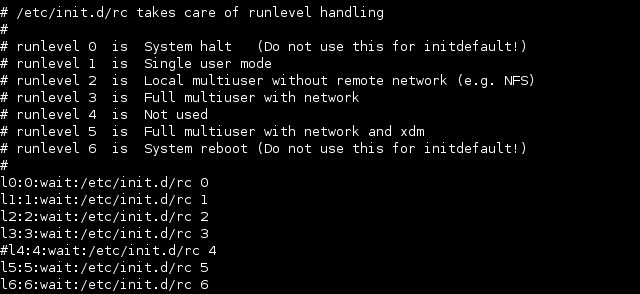

# Cheat Sheet

Author [@Saief1999](https://github.com/Saief1999)

## Shells, Scripting, Programming and Compiling

### Login vs. Non-login shell

- **Login shell**: Shell started with login, bash -l or su – command (reads a series of configuration file as it is started)
- **Non-login shell**: Shell started any other way (inherit settings (environment variables) from the parent program which started it)

### Variable inheritance

- Variables declared inside a shell are inherited by child processes if the variable has been exported.
- If a child process changes it's own copy of an exported variable, the parent shell's copy is not changed. The changed value is exported to any subchild processes.

### Interactive and non-interactive shells

- interactive : with prompt where theuser can type commands
- non-interactive : without prompt

### Sequence of events when bash starts

#### Interactive login bash : bash --login or su - username or from login

/etc/profile : system wide env settings

~/.bash_profile : ind user's shell settings

~/.bash_login : executed if ~/.bash-profile doesn't exist

~/.profile : Executed if ~/.bash_login or ~/.bash_profile doesn't exist.

#### interactive non login bash :su username or bash -c command)

~/.bashrc : The only script executed when started. Inherits from parent bash environment.

##### Non-Interactive non-login bash (forked when scripts are run)

BASH_ENV : Reads file in the variable BASH_ENV.

ENV : Reads file in the variable ENV if BASH_ENV doesn't exist.

##### Extra files

/etc/inputrc System bash line editing (readline) configuration file

~/.inputrc Individual bash line editing (readline) configuration file

~/.bash_logout Executed (if exists) when a login shell exits.

### Commands for shell/environment variables

Variablename=value (set var)

`export (or declare -x) Variablename=value` : `export var as env var`

env (or export) : display all env vars

### Aliases

- generalement declaré dans un fichier de config (~/.bashrc ou ~/.profile)
- alias : Displays all the current shell aliases.
- `alias alias1 alias2  aliasN` : shows info about alias(es) in paremeter
- `alias AliasName="command(s)..."` : create new alias
- alias cp="cp -i" : replaces the original command cp with cp -i for interactive copying
- unalias AliasName : Unsets (deletes) the alias

### functions

- local vars in functions
  - $1 - $9 Positional parameters
  - $# Number of positional parameters
  - $* :  "$1 $2 $3 ..." (string)
  - $@ "$1" "$2" "$3" . (array)

- to export : `export -f FunctionName`
- Definition :

```bash
FunctionName () {
command ;
command ;

return 0 ; # to return a value
}
```

Or

```bash
function FunctionName () {
command ;
command ;
...
return 0 ; # to return a value
}
```

**To call a function :** `functionName parameter1 parameter2 ... parameterN`

### write simple scripts

first Line :  #!/bin/bash (which interpreter to use )

#### Passing parameters to a script

- Scripts can be given up to 9 positional parameters (for all interpreters) or up to 99 parameters with bash.
- Inside the script each parameter will be identified as `$1` to `$9` or `${10}` to `${99}`

- $0 : scriptname

| command | description                                                  |
| ------- | ------------------------------------------------------------ |
| `$n`      | Positional parameter n max. n=9 ($0 is the name of the shell script) |
| `${nn}`   | Positional parameter nn (for nn>9)                           |
| `$#`      | Number of positional parameters (not including the script program) |
| `$@, $*`  | All positional parameters                                    |
| `"$@"`    | Same as "$1" "$2" . . . "$n"                                 |
| `"$*"`    | Same as "$1c$2c . . . $n" c = content of **$IFS** (default is space) |
| `$?`      | Exit status of the last command                              |
| `$$`      | Process ID of the current shell                              |
| `$-`      | Current options in effect                                    |
| `$!`      | Process ID of the last background command                    |
| `$is`     | Name of the current shell (in this case 'bash')              |

**shift** : décalage à gauche des parametres d'entrée ( $2 became $1 and &3 become $2 ...)

set aa bb cc dd  : assign aa to $1, bb to $2, cc to $3 and dd to $4

### Conditional Statements

#### if

```bash
if <condition_is_true> ; then
.................
elif <condition_is_true> ; then
.................
else
run_these_commands_instead
.................
fi
```

- **Test the status of files or directories (exists or not )**
`if test -e /etc/fstab ; then`
or
`if [ -e /etc/fstab ] ; then`

- **Command or script exit code**
`if (ifconfig | grep 'ppp0') ; then`

-**content of var**
`if $1 ; then` (true if $1 has value inside , **true for 0 too !** )

- **String testing**
`if [ "$net" = "eth0" ] ; then (string testing)`

- **Notes** :
  - there needs to be a **space** after `[` and before `]`
  - `test` and `[]` can both be used interchangeably

#### switch

```bash
case <Variable> in
x1)
cmd
;;
x2)
cmd
;;
*)
cmd
;;
esac
```

### Looping

#### while

```bash
while <condition_is_true> ; do
run_these_commands
done
```

#### until

```bash
until <condition_is_true> ; do
run_these_commands
done
```

#### for

```bash
for variable in list ; do
run_these_commands
done
```

Exemple  : (les 3 noms des fichiers vont etre enregistré dans le fichier ~/allfiles)

```bash
for item in ~/file1 ~/file2 ~/file3 ; do
echo "------------ Content of $item -----------"
cat $item >> ~/allfiles
done
```

### The && and || conditional branching

- The exit code can be used to execute another command (only one) depending upon its success or its failure.
- && : is used to designate the command to run if the exit code is success (0).
- || : designates the command to run if the exit code is not a success (1-255).

### Mailing messages to root from a script

`mail -s "subject" destination_mail_address "message.."`

- Syntax1:

  - `mail` -s "subject" destination_mail_address "message.."

- Syntax2:

  - `program | mail -s "subject" destination_mail_address`

- Syntax3:

  - ```bash
    mail -s "subject" destination_mail_address <<EOM
    message body.......
    EOM
    ```

**Example** : df | mail -s "HD Space on $(date)" root

### Conditional Expressions

- There must be whitespace after the **opening** bracket, and before the **closing** bracket.
- Whitespace must also separate the **expression arguments** and **operators**.
- If the expression evaluates to **true**, then a **zero** exit status is returned, otherwise the expression evaluates to false and a non-zero exit status is returned.

#### Tests on files

| Test              | Description                                            |
| ----------------- | ------------------------------------------------------ |
| -a file / -e file | true if file exists                                    |
| -f file           | true if file exists and is **regular file**            |
| -d file           | true if file exists and is a **directory**             |
| file1 -nt file2   | true if file1 **newer than** f2 (by modification date) |
| file1 -ot file2   | true if file1 **older than** f2                        |
| file1 -ef file2   | true if same device + same inode number                |

#### Tests on strings

| Test                       | Description                                                  |
| -------------------------- | ------------------------------------------------------------ |
| -n str                     | true if length of string is not 0                            |
| -z str                     | true if length of string is 0                                |
| str1 = str2 / str1 == str2 | equal ( != for not equal)                                    |
| string = pattern           | true if **string matches pattern** (!= for doesn't match)    |
| string1 < string2          | True if string1 sorts before string2 lexicographically in the current locale( > for after) |

#### Test on integers

| Test          | Description                   |
| ------------- | ----------------------------- |
| exp1 -eq exp2 | equal eg. [ "$#" -eq 4 ]      |
| exp1 -ne exp2 | not equal eg. test "$#" -ne 3 |
| exp1 -le exp2 | less or equal                 |
| exp1 -lt exp2 | less than                     |
| exp1 -ge exp2 | greater or equal              |
| exp1 -gt exp2 | greater than                  |

#### Generic Tests

| Test          | Description                                        |
| ------------- | -------------------------------------------------- |
| ! exp         | True if the given expression is false              |
| exp1 -a exp2  | exp1 and exp2                                      |
| expr1 -o exp2 | exp1 or exp2                                       |
| `\( exp \)`   | True if exp is true; used to **group expressions** |

**Example** :

`[ "$A" = "$B" -a \( "$C" = "$D" -a "$E" = "$F" \) ]`

> always use a space between the `[ ]`  , `\( \)` and expressions .

---

## Gestion de modules (105.1)

### Kernel Modules

- Modules are files with the extension '.o' , eg. **serial.o**

- Kernel options at boot time : **/usr/src/linux/Documentation/kernel-parameters.txt**

- Kernel modules are located in : **/lib/modules/kernel-version/***

- to get the "kernel-version" we do : **/lib/modules/$(uname -r) /***

- Modules can **depend on other modules** being loaded. The list of modules and their dependencies are in:
  - `/lib/modules/kernel-version/modules.dep`

### Loading Modules

> Note: The modulename never contains the '.o' extension of its filename.

- `lsmod` : **lists** the loaded modules. same result as `cat /proc/modules`
  - **Format** : `modulename size usedBy`
  - **usedBy** : `number module1,module2,...moduleN`
- `insmod modulename [module_parameters]` : **Loads** a module (no dependency check) ( in my version , the **filename** needs to be provided and not the **modulename** )
- `modprobe modulename`  : Loads all the dependencies if needed and then **loads** the module.
- `modprobe -r modulename` : **removes** module with dependency check
- `rmmod [-r] module1 [module2] ....` : removes modules ( -r : removes recursively through dependencies )
- `modinfo [-adlpn] [-F field] modulename` :
  - Prints information about a module.
  - -n = /path/filename of module's file
  - -F --field  : Only print this field value, one per line.
  - Field names: author (-a) description (-d) license (-l)  param (-p)
- `depmod [-abeFAn]` :
  - Determines module dependencies and writes modules.dep file.
  - -n=Writes only to screen
  - Example :
    - depmod -av  :Checks all and writes modules.dep

### /etc/modules.conf (or /etc/conf.modules)

- This file is used by kmod to load the right modules automatically when certain devices are accessed, or by modprobe to add needed options to modules and possibly run certain commands before and/or after loading and/or unloading modules. It can contain the following information:
  - **Module Parameters (options)**
    - Syntax: `options modulename options`
    - Example : `options ne io=0x300 irq=5`
  - **Alias names for modules**
    - Modules that has 2 names.
    - Syntax: `alias aliasname modulename`
    - Example: `alias eth0 3c509`
  - **Commands that should be run before and/or after a module is loaded**
    - Syntax :
      - `pre-install modulename command`
      - `post-install modulename command`
    - Example :
      - `post-install bttv insmod tuner`
  - **Commands that should be run before and/or after a module is un-loaded**
    - Syntax :
      - `pre-remove modulename command`
      - `post-remove modulename command`

### uname

- Displays information about the current system.
- **-a : all options**
- -n, --nodename : network node hostname
- -s, --kernel-name : kernel name
- **-r :  current release**
- -v, --kernel-version : prints kernel version (date)
- -m, --machine : hardware machine name
- -p, --processor : processor type
- -i, --hardware-platform : hardware plateform
- -o, --operating-system : prints operating system

---

## Regex Informations

**Grep :**

```pseudocode
Si le fichier sur lequel porte la recherche n’existe pas 
Alors $?=2 
    Sinon Si grep trouve des lignes correspondant au critère de recherche 
        Alors $?=0 Sinon $?=1
```

**Sed :**

- use `" "` if there's a variable inside the expression , instead of `' '`

- Lorsqu'on on a des caracteres qu'on ne veut pas interpreter ( comme `!d` ) on fait ça
  - `cat f3 | sed "/$x/"'!d'`
- Check last year's course on **Regular Expression** to learn more .  

---

## Administrative Tasks

### Gestion de groupes et utilisateurs

#### /etc/passwd

- contains user account info, one account per line. Fields are separated by ':'
- username : x : userID : GroupID : UserInfo : HomeDir : Shell
  - Field 2 = Password field
    - x = reference to /etc/shadow,
    - empty =no password
    - `*` or `!` = no login possible

#### /etc/shadow

this file contains the encrypted passwords for each user and their expiry parameters. Fields are separated with ':

1. User login name
2. Encrypted password
   - empty : no pass
   - `*` : no login possible
3. Days since 1970 when it was last changed
4. Days until change allowed (0 : always allowed)
5. Days before change required  
6. Days warning before expiration (empty : no warning)
7. Days before account becomes inactive (empty : never inactive)
8. Days since 1970 when account will be disabled (empty : never disabled)
9. Reserved

#### Administration of user accounts

- located in /etc/passwd
- passwords in /etc/shadow
- default template for creating ( **useradd -m** ) in **/etc/skel**

#### useradd

- adds user to the system

- useradd [OPTIONS] username

- Options :

  - `-b default_home_directory_path` : new base directory path (username will be automatically added to it to create home_directoy) (Example /home/insat )
  - `-d default_home_directory_path` : new home directory path (overrides the -b option and sets the whole home_directory) ( Example : /home/something )
  - `-e default expire_date` : day on which user account is disabled

  - `-f default_inactive` : number of days after password has expirted before account becomes disabled
  - `-s default_shell` : name + location of the new shell
  - `-m` : copies the directory to /etc/skel to user home directory
  - `-k template_dir` : will copy template_dir instead of /etc/skel

- **Default parameters** :
- Location : **/etc/default/useradd**
  - Can be accessed with **useradd -D**

#### usermod

- Modifies the existing user's login parameters
- usermod username
  - [-c comment]
  - [-d home_dir [ -m]]
  - [-e expire_date]
  - [-f inactive_time]
  - [-g initial_group]
  - [-G group[,...]]
  - [-l login_name]
  - [-p passwd]
  - [-s shell]
  - [-u uid [ -o]] [-L|-U]

#### userdel

- deletes a user
- Syntax : userdel username [-r]
  - -r : delete home directory as well

#### passwd

- Changes the password and password expiry info of user
- Syntax : passwd [options] [username]
  - -e : user forced to change pass at next login
  - -l : an administrator can lock the account of the specified user
  - -u : a system administrator can unlock the specified account
  - -n min :  user will not be permitted to change the password until min days have elapsed
  - -x max : max days for password validity (today > maxday+1 => you need to change pass)

#### chage

- list (-l) or change user password's expiry parameters
- **chage -l username** : list username's password current expiry parameters
- Syntax : `chage [options] username`
- Options :
  - [-m mindays] [-M maxdays] [-d lastday]
  - [-I inactive] [-E expiredate] [-W warndays]

#### newusers

- Update and create new users in batch mode , using `<passfile>` for input
- Syntax  : `newusers <passfile>`

#### chpassword

- Modifies the passwords of multiple users in batch mode using  for input
- Syntax : `chpasswd <passfile>`

#### Other login / user related commands

- `id -ng [username]` : present effective groupe of a user
- `id -nG [username]` / `groups [username]` : shows all groups current user belongs too
- `echo $USER` : shows current user
- `id -u` : id of a user
- `who` / w / users  : users presently logged in locally
- `finger [-l username]` : users presently logged in locally/remotely
- `lastlog` : all logins since  /var/log/lastlog was created
- `last` : all logins since /var/log/wtmp was created
- `lastb` ! all logins since /var/log/btmp was created (generally compressed & recreated)

### Administration of groups

- A user can belong to more than one group at the same time.
- A user who is member of a group can change to that group without password but a user who is NOT a member can only change to that group if the group password exists and the user gives it.
- One or more users can become group administrators for specific groups.

#### groupadd

- `groupadd [options] group`
- System administrator (root) adds a group to the system
- the first available gid lower than GID_MAX will be automatically selected (if -g not used)
- Options
  - -g gid : GID , numeric >0 and unique (unless -o used)
  - -o : assings an existing ID to a group
  - -r : instructs groupadd to add a system account.

#### groupmod

- modifes a group
- Syntax : `groupmod [-g newgid] [-n newname] group`
- Options:
  - -g : new GID
  - -n : new name

#### groupdel

- Delete group
- Syntax : `groupdel group`

#### gpasswd

- adds/changes the group's password.
- The group's password is only needed if a user, who is not a member of the group, wants to temporarily become one and have it as his effective group. He will be prompted to give the group's password.
- Syntax : gpasswd [options] group
- Options for use by the **System Administrator**:
  - -R Makes the group reserved for members-only. Result: No change of group through sg or newgrp is allowed for non-members. The password in /etc/gshadow becomes '!'
  - -A user,... adds Group Administrator(s) to a group.
  - -M user,... adds Group Member(s) to a group.
  - -r group Removes the password for the group.
    - The group is then also reserved for members-only. Password in /etc/gshadow is simply deleted.
- Options for use by **Group Administrators**:
  - gpasswd [options] group : adds new pass to group
  - -a user : permanantly add user to group
  - -d user : Permanently deletes a user from a group.
  - -r group : Removes the password for the group. (same as with root)

#### newgrp [group]

- A user changes himself temporarily to a new group.
- If the user is not a permanent member, password is required. The user will be denied access if the group password is empty and the user is not a permanent member

#### sg

- Runs a command as participant of the given group and returns to normal after the command finishes.

- Syntax : sg group -c command

#### grpck

- System administrator checks a group.
- grpck group

#### Group Configuration files

MembersList : member1,member2 ...

- **/etc/group**: lists all users of each group

  - groupname : Password or x or ! : GID : Memberlist

- **/etc/gshadow** : contains group passwords

  - groupname : Password or ! : AdminUsersList : MemberUsersList

#### Checking the consistency of password and group files

- using pwck (user) / grpck (group)

## Tips and tricks

- Showing all the registered users and their groups in detail (For systems where the UID starts at 500):
  - `grep ':[5-9]..:' /etc/passwd | cut -d: -f1) ; \ for user in $users; do id $user ; done ;`

- **To disable an Account**:
  - Add a *** or a !** to the encrypted password in **/etc/shadow** file.

- To show list of connected users : users
- To show the list of groups a  user belongs too : groups ( or groups [user])

---

## Boot, Initialization, Shutdown and Runlevels

1. BIOS initializes its devices
2. The Boot Loader on MBR of boot disk is read and executed At this point the Boot Loader may allow the user to enter Kernel options. The Kernel and maybe initrd is fetched from the Floppy/Hard disk/CDROM.
3. The Kernel initializes its hardware environment, using modules compiled in the kernel.
4. The Kernel starts its first process: init (PID=1)
5. The Kernel tests the root (/) and other partitions as per fstab and mounts them.
6. The Kernel **initializes more hardware using /etc/modules**.conf and some boot scripts.
   - init reads its configuration file **/etc/inittab** and acts accordingly. /etc/inittab contains the **list of processes that init should start**, like console gettys, default runlevel, run level definitions, etc.
   - init starts the default run level scripts and passes control to the getty on virtual terminal 1 for user login.
   - If xdm/kdm/gdm display manager is started as part of the default runlevel, then the display manager takes over control of the display for graphic user login.

**/etc/modules.conf** :  used during startup , contained different parameters for the moldules

**Boot Log files** : /var/log/messages

**/etc/lilo.conf** : image config

### Change runlevels and shutdown or reboot system

- **A runlevel** : is a software configuration of the system which starts a selected group of processes
- **Default** runlevel: defined in **/etc/inittab**
  - id:5:initdefault

#### Run levels

- Runlevels are identified by: 0 1 2 3 4 5 6 S and s

| runLevel | description                                              |
| -------- | -------------------------------------------------------- |
| 0        | Halt                                                     |
| 1        | Single user (root) login                                 |
| 2        | Multi-User                                               |
| 3        | Multi-User Mode with Networking                          |
| 5        | Multi-User Mode + Networking + graphic mode              |
| 6        | Reboot                                                   |
| S & s    | Scripts to run before entering runlevel 1 (single login) |

#### /etc/init.d

- **directory** that contains **initialization scripts**(full liste of scripts) to start and stop system services and links.

#### Other Config Files

- **Dans /etc**

| file                     | role                                                         |
| ------------------------ | ------------------------------------------------------------ |
| rc.sysinit               | The startup script launched by **init** at boot time         |
| rc.local                 | A script for **local startup customizations**, started automatically after the system is running. |
| rc                       | A script used to change runlevels.                           |
| /etc/rc0.d -> /etc/rc6.d | Directories containing **symbolic links** to **scripts** in **/etc/init.d**. |

- Names of the **links** are in the **format**  : `[K|S][nn][init.d_name]`
  - K/S : Kill / Start
  - nn : sequence number controlling startup or shutdown order.
  - The script names starting with S are run with the argument start, and the ones with K are run with the argument stop
- Upon entering a new runlevel:
  - K scripts are run if their equivalent S scripts had been started in the previous runlevel,
  - S scripts are run if they had not already been started in the previous runlevel.
- **on each change of runlevel**, the **rc** script **checks the scripts** of the **previous** and **new** runlevels to determine which K or S scripts should be run

#### Displaying the current runlevel

- **runlevel** : Affiche niveau d'execution courant
  - Exemple : N 3 (previous was was none (after rebooting) and present is 3)
- On peut utiliser aussi **who -r**

#### Changing the runlevel

- `telinit (init) [-t] runLvl`
  - runLvl
    - 1 -> 6 : switch to runLvl
    - a,b,c : process only those /etc/inittab file entries having runlevel a,b or c.
    - Q,q : re examine /etc/inittab
    - S,s : signle user mode (1)
    - U : re-execute itself (runLvl should be sS12345)
  - -t : tell the init process how long it should wait between sending processes the SIGTERM and SIGKILL signals when shutting down a runlevel service. (binet chaque signal)

#### /etc/inittab

The **/etc/inittab** file is the configuration file used by the **System V (SysV)** initialization system in Linux. This file defines three items for the **init process**:

- the default runlevel
- what processes to start, monitor, and restart if they terminate
- what actions to take when the system enters a new runlevel
- format :
  - Each line starting with '#' is a comment.
  - Each entry uses one line.
  - Syntax : `id:runlevels:action:process`

- id : sequence 1-4 chars that identifies enty
- runlevels : runlevels where to do action
- action : describes which actions to take (respawn , wait(init process will wait for its end), once, boot,...)
- process : specifies process/command to be executed (script par exemple)

Example :



#### Shutdown Command

- Syntax : shutdown [options] time
  - options : -c : cancel / -r : restart / -h : halt
  - time format : now / +2m / hh:mm

- The file /etc/shutdown.allow may contain user names (one per line) who have permission to run the shutdown command.

#### Ajouter un fichier dans rcx.d

```bash
ln -s /etc/init.d/service /etc/rcx.d/S01service
```

#### Processus d'init

init va lire sa configuration de /etc/inittab pour savoir les processus à executer suivant le niveau d'execution , /etc/initab utilise un autre script appelé rc qui lui meme qui accedent au repertoires rcx.d , lorsqu'on change d'un niveau à un autre , les repertoires rcx.d contiennent des liens symboliques sur les fichiers qui doivent executer pour ce runLvl (qui pointent sur /etc/init.d)

---

## Gestion de processus

- ps -ef : Listetoute les processus de la machine (f pour le detail)
  - `UID:PID:PPID:C:STIME;TTY:TIME:CMD`
    - STIME : start Time
- pour le detail complet : ps -efl
  - `F S UID PID  PPID  C PRI  NI ADDR SZ WCHAN  STIME TTY TIME CMD`
  - `State (2)`: S-sleeping, R-running, T-stopped or traced, D-uniterruptable sleep, Z=zombie

- Singals :
  - `kill -1 $pid` (`-SIGHUP`) : (restart)
  - `kill -2 $pid` (`-SIGINT`) (ctrl+c)
  - `kill -9 $pid` (`-SIGKILL`) (stopper)
  - `kill -15 $pid` (`-SIGTERM`) (stopper)
  - `kill -18 $pid` (`-SIGCONT`) (reprendre)
  - `kill -20 $pid` (`-SIGSTP`) (susprendre)

- pour trouver le pid d'un proc :
  - `pidof [options] <command>`
  - `pgrep [options] <pattern>`

- Filtrage de ps -ef :
  - `ps -ef | awk '{printf("%d\t%s\n",$2,$8)}'`

- Trouver les proc avec ppid =ppidVal
  - `ps -ef | tr -s " "| grep -E "^[a-zA-Z]+ [0-9]+ ${ppidVal} .*$"`

---

## Automate system administration tasks by scheduling jobs to run in the future

### Cron

- cron executes specific commands in crontabs on a regular basis based on configuration created by root or users.

#### User Crontab

- Create a new Crontab : crontab -e
- Each user gets a new crontab file in : **/var/spool/cron/tabs/username**
- These file contains 6 fields

#### System wide crontab file : /etc/crontab

- main system crontab
- contains 7 field (+1 field for user)

#### /etc/cron.d

- contains extra crontabs of the same format as the /etc/crontab and will be recognized by crond

#### `/etc/cron.{hourly,daily,weekly,monthl}` directories

- contains scripts that will run from /etc/crontab

#### File format

- If the first character of a crontab line is a '-' then cron will not send a message to syslog each time the command is executed, otherwise it will.
- A line starting with # is considered a comment.
- An environment setting is in the form: VariableName = value
- Each cron entry can be very long but MUST exist on a single physical line.

- `crontab -e`
  - create/edit a user crontab (scheduling) file (incl. root). The crontab program will save this file under the user's name in the /var/spool/cron/tabs/ directory. eg. /var/spool/cron/tabs/joe

- `crontab -l`
  - Display user's crontab file.

- `crontab -r`
  - Delete user's crontab file.

- `crontab -e -u username`
  - Edit a user's crontab file (need to be root)

#### cron.allow & cron.deny

- If cron.allow exists then only users listed in it are allowed to use the cron service and the /etc/cron.deny file is ignored.

- If cron.allow doesn't exist and cron.deny does exist, then all users are allowed to use the cron service except those listed in cron.deny.

#### anacron

- anacron is a service similar to cron, except that its frequency is expressed in days and not in minutes. Unlike cron, it does not assume that the machine is running continuously. Hence, it can be used on machines that aren't running 24 hours a day, to control daily, weekly, and monthly jobs that are usually controlled by cron.

#### AT command on one line (useful in scripts)

`echo "command1;command2;..." | at time`

Example:

`xhost + localhost echo "xmessage -display :0 'It works'" | at +1 minutes`

`watch -n1 atq`

```bash
cpio dd dump restore tar
```

- tar :

Recursively creates archives of files and directories including file properties. It requires at least one mode option to function properly. Basic Mode options:

-c Create a new archive. -t List the content of the archive -x Extract files from the archive

- dump

dump allows you to backup a whole partition or a full directory

Output of dump: Hard Disk, or Tape or File(Option -f)

Max. Backup Levels: 10 (0-9) Level 0: Full backup , Level 1-9: Incremental backup relative to the lower level backup.

```bash
dump [-level] [-ua] [-f BackupFile] Source
```
