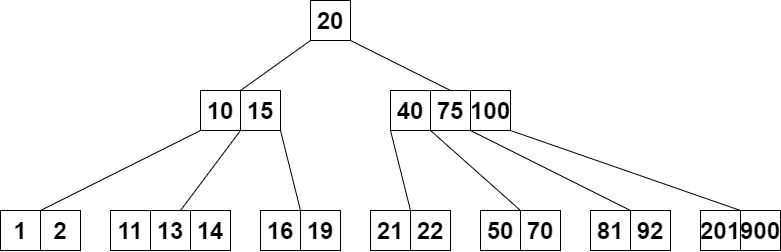

# B-Trees

Author [@hajali-amine](https://github.com/hajali-amine)

B-trees are **self-balanced search trees**, they are commonly used in databases.

## Definition

A B-tree of **order m** follows the following rules;

- the **root node** has _k_ keys, `1<=k<=2m-1`,
- the **other nodes** have _k_ keys, `m-1<=k<=2m-1`,
- the leaves are of the _same depth_,
- if the tree has _more than one leaf_, the root has `at least two children` and `at most 2m children`.

## Node's structure


- p*i* is a pointer to a node that has keys, `keys<ki`,
- a node that has `2m children` is called a **complete node**,
- the size of a node is usually the size of a **page**,
- satellite information are stored with corresponding keys or in an another page.



### Structure

```c
typedef struc bNode{
    bNode* children[2*m];
    int key[2*m-1];
    int size; // Number of keys, we can always determine later on number of children by doing size+1.
} node;
typedef node* bTree;
```

## Creating an empty tree

```c
bTree create(){
    bTree t = malloc(sizeof(node));
    for (int i = 0; i < 2*m; i++){
        t->children[i] = NULL;
    }
    t->size = 0;
    return t
}
```

## Searching a key in a B-Tree

```c
bTree search(bTree t, int key){
    if(t == NULL) return NULL;
    int i = 0;
    while(i < t->size && t->key[i] < key) i++;
    if (t->key[i] == key) return t;
    if (t->key[i] > key) return search(t->children[i], key);
    if (t->key[i] < key) return search(t->children[i+1], key);
}
```

## Inserting a key in a B-Tree

### Seperating the node in case it exceeds 2m-1 keys

```c
void seperate(bTree t, int nodeIndex)
{
    bTree newTree = create(M);
    bTree childTree = t->children[nodeIndex];
    for (int i = 0; i < M - 1; i++) // initialize the newTree Keys with the right half of the to-be-split element
        newTree->key[i] = childTree->key[i + M];
    if (childTree->children[0] != NULL) // if old tree Node @ nodeIndex has children
        for (int j = 0; j < M; j++)     // copy second half of children onto the newly created Tree.
            newTree->children[j] = childTree->children[j + M];
    childTree->size = M - 1;
    newTree->size = M - 1;
    // In the next segment we'll make space to pull up the middle element of the nodeIndex node in the correct spot of his parent node so we have to set off the right half  by 1 index;
    //  It will look something like this
    // [-,-,-,-],middleNode,[-,-,-,-]
    //          ||
    //          V
    //      ...,middleNode,...
    //          /       \
    //   [-,-,-,-]      [-,-,-,-]
    for (int i = t->size; i > nodeIndex; i--) //Setting off keys by 1 index to the right
        t->key[i] = t->key[i - 1];
    for (int i = t->size + 1; i > nodeIndex + 1; i--)
        t->children[i] = t->children[i + 1]; // Setting off children by 1 index
    t->size++;
    t->key[nodeIndex] = childTree->key[M - 1]; // M is exactly the middle element that we pulled up in order to split
    t->children[nodeIndex + 1] = newTree;
}
```

### Inserting in an incomplete node

```c
void insertIncomplete(bTree t, int key)
{
    if (t->children[0] == NULL) // if t is a Leaf Node
    {
        int i = t->size - 1;
        while (i >= 0 && key < t->key[i]) // Set off all elements bigger than the key 1 index to the right
        {
            t->key[i + 1] = t->key[i];
            i--;
        }
        // Shifting is over and now correct spot of key is empty
        t->key[i + 1] = key;
        t->size++;
    }
    else
    { // if t is not a Leaf Node
        int i = 0;
        while (i < t->size && t->key[i] < key) // finding the right index to insert Key at.
            i++;
        if (t->children[i]->size == 2 * M - 1)
        { // If the node at i is full on keys we sperate then insert in the appropriate half.
            seperate(t, i);
            if (key < t->key[i]) // determine wether to insert in left half (i) or the new right half (i+1)
                i++;
        }
        insertIncomplete(t->children[i], key);
    }
}
```

### Insertion in a B Tree

```c
bTree insert(bTree t, int key){
    if (t->size == 2 * M - 1)
    { // if the root node t is full on keys seperate then insert properly. Note that using this way, the tree will grow upwards and sideways everytime we add a key.
        bTree newTree = create(M);
        newTree->children[0] = t;
        seperate(newTree, 0); // Seperate node t into 2 parts an lift up the middle key to the new Root node newTree.
        insertIncomplete(newTree, key);
        return newTree;
    }
    else
    {
        insertIncomplete(t, key);
        return t;
    }
}
```

## Removing a key in a B Tree

| IMPORTANT                                                                                                                                                                                                                                                        |
| ---------------------------------------------------------------------------------------------------------------------------------------------------------------------------------------------------------------------------------------------------------------- |
| In here you will find two functions `borrowRight`, `fusionRight` and `deletePred`, you should know that there are also two other `borrowLeft`, `fusionRight` and `deleteSucc` that are basically symetrical to the right version. **You should implement them**. |

### Borrowing a key from a right child

```c
void borrowRight(bTree t, int nodeIndex){
    bTree tLeft = t->children[nodeIndex];
    bTree tRight = t->children[nodeIndex + 1];
    tLeft->key[tLeft->size] = t->key[nodeIndex];
    tLeft->children[tLeft->size + 1] = tRight->children[0];
    tLeft->size++;
    t->key[nodeIndex] = tRight->key[0];
    for(int i = 0; i < tRight->size - 1; i++){
        tRight->key[i] = tRight->key[i + 1];
        tRight->children[i] = tRight->children[i+1];
    }
    tRight->children[tRight->size - 1] = tRight->children[tRight->size];
    tRight->size--;
}
```

### Connecting the elements of the right sibling to his left

```c
void fusionRight(bTree t, int nodeIndex){
    bTree tLeft = t->children[nodeIndex];
    bTree tRight = t->children[nodeIndex + 1];
    tLeft->key[tLeft->size] = t->key[nodeIndex];
    for(int i = 0; i < tLeft->size; i++){
        tLeft->key[tLeft->size + i + 1] = tRight->key[i];
        tLeft->children[tLeft->size + i + 1] = tRight->children[i];
    }
    tLeft->key[2*m-1] = tRight->children[tRight->size];
    tLeft->size = 2*m-1;
    free(tRight);
    for(int i = nodeIndex; i < t->size - 1; i++){
        t->key[i] = t->key[i + 1];
        t->children[i] = t->children[i + 1];
    }
    t->children[t->size - 1] = t->children[t->size];
    t->size--;
}
```

### Remove the last element of the left child and put it in place of the key-to-delete

```c
int deletePred(bTree t){
    if(t->children[0] == NULL){
        t->size = t->size - 1;
        return t->key[t->size];
    }
    if(t->children[t->size]->size < m){
        if(t->children[t->size - 1]->size < m)
            fusionLeft(t, t->size);
        else
            borrowLeft(t, t->size);
    }
    return deletePred(t->children[t->size]);
}
```

### Remove key from an internal node

```c
bTree internalDelete(bTree t, int key){
    int i = 0;
    if (t->children[0] == NULL){
        while(i < t->size - 1 && key > t->key[i])
            i++;                          //i points to the key
        if (key == t->key[i])
            for (int j = i; j < t->size - 1; j++)
                t->key[i] = t->key[i+1];
        t->size = t->size - 1;
        if(t->size == 0){
            free(t);
            t = NULL;
        }
    }else{                            //root is not a leaf
        while(i < t->size && key > t->key[i])
            i++;
        if(i < t->size && key == t->key[i]){ // key exists in root
            if(t->children[i]->size >= m){
                t->key[i] = deletePred(t->children[i]);
            }else if(t->children[i+1]->size >= m){
                t->key[i+1] = deleteSucc(t->children[i+1]);
            }else{
                fusionRight(t,i);
                t = internalDelete(t, key);
            }
        }else{                                       // key doesn't exist in t
            if(t->children[i]->size >= m){          // no need to restructure the tree
                t->children[i] = internalDelete(t->children[i], key);
            }else{                                   // need to restructure tree
                if(i == 0){                          // there are no left child
                    if(t->children[1]->size >= m){
                        borrowRight(t, 0);
                        t->children[0] = internalDelete(t->children[0], key);
                    }else{
                        fusionRight(t, 0);
                        t->children[0] = internalDelete(t->children[0], key);
                    }
                }else{// (i > 0)                     // there is a left child
                    if(t->children[i-1]->size >= m){
                        borrowLeft(t, i);
                        t->children[i+1] = internalDelete(t->children[i+1], key);
                    }else{
                        fusionLeft(t, i);
                        t->children[i-1] = internalDelete(t->children[i-1], key);
                    }
                }
            }
        }
    }
    return t;
}
```

### Removing a key

```c
bTree deleteNode(bTree t, int key){
    if(t->size == 1 && t->children[0] != NULL && t->children[0]->size < m && t->children[1]->size < m){
        fusionRight(t,0);
        bTree temp = t->children[0];
        free(t);
        return internalDelete(temp, key);
    }
    return internalDelete(t, key);
}
```
