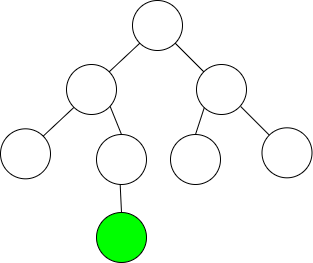
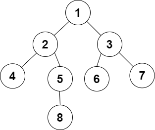
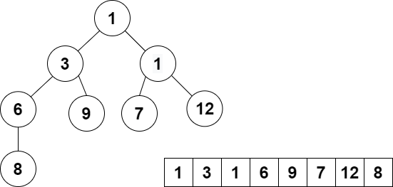

# Heap & Priority queues

Author [@hajali-amine](https://github.com/hajali-amine)

## Priority queues

Let _E_ be a set mapped by a priority function _p_. We call a priority queue a data type that allows us to:

- represent _E_,
- add an element, with a given **priority**, to _E_,
- remove an element with the **lowest/highest** priority.

### Implementations

| Structure          | Search max/min | Insertion | Deletion |
| ------------------ | -------------- | --------- | -------- |
| **Unsorted Array** | `O(n)`         | `O(1)`    | `O(n)`   |
| **Unsorted List**  | `O(n)`         | `O(1)`    | `O(n)`   |
| **Sorted Array**   | `O(1)`         | `O(n)`    | `O(1)`   |
| **Sorted List**    | `O(1)`         | `O(n)`    | `O(1)`   |

### Optimised implementation

| Structure | Search max/min | Insertion   | Deletion    |
| --------- | -------------- | ----------- | ----------- |
| **Heap**  | `O(1)`         | `O(log(n))` | `O(log(n))` |

## Heap

### Level of a node

The level of a node X in a tree A is the **number of edges** on the path from the root node to X.



The level of the green node is **3**.

### Hierarchical numbering

For a binary tree A, hierarchical numbering consists of numbering, starting from 1, the nodes from _top to bottom_ and for each level from the _left to the right_.



### Complete binary tree

A complete binary tree is a binary tree in which every level, **except possibly the last**, is completely filled, and all nodes are _as far left_ as possible.


### Heap : Complete binary tree

Let _E_ be a set mapped by a priority function _p_. A heap representing _(E,p)_ is a couple _T=(A,obj)_ where _A_ is a **complete tree** and _obj_ is a **bijection** that maps for each node an element of _E_.

Thus, for all node _x_ of _A_ other than the root, _p(obj(x))>p(obj(Parent(x)))_

### Structure

```c
typedef struct{
    element e;
    int priority
} node;

typedef struct{
    int size;
    node* t;
} heap;
```

You may be wondering as to why we represent it as an array! Well let me explain.



The root is the node of index `0`. And for a node of index `i`, the **parent** is the node of index `i-1 div 2`, the **left child** is the node of index `2i+1` and the **right child** is the node of index `2i+2`.

### Creation

```c
heap create(int size) {
 node* t = (node*) malloc(size * sizeof(node));
 heap h;
 h.t = t;
 h.size = 0;
 return h;
}
```

### Insertion

- Insert the element at the end of the table.
- Keep swapping withe the parent until the priority constraint is respected.

```c
heap insert(node o, heap h) {
 h.t[h.size] = o;
 h.size++;
 int current = h.size - 1;
 int parent = (current - 1) / 2;
 while (current > 0) {
  if (h.t[current].priority < h.t[parent].priority) {
   node temp = h.t[current];
   h.t[current] = h.t[parent];
   h.t[parent] = temp;
   current = parent;
   parent = (current - 1) / 2;
  }
  else
  {
   break;
  }
 }
 return h;
}
```

### Deletion

In a **min heap**, we can only remove the node with **lowest priority**! In that case, it is the **root node**.

- Assign the value of the last node to the root.
- Delete the last node.
- Swap with the child node with lowest priority until the priority constraint is respected.

```c
heap delete (heap h, node* o) {
 *o = h.t[0];
 h.t[0] = h.t[h.size - 1];
 h.size--;
 int current = 0;
 while (current < h.size)
 {
  int childMin = h.t[current * 2 + 1].priority > h.t[current * 2 + 2].priority ? current * 2 + 2 : current * 2 + 1;
  if (h.t[current].priority > heap.t[childMin].priority) {
   node temp = h.t[current];
   h.t[current] = h.t[childMin];
   h.t[childMin] = temp;
   current = childMin;
  }
  else {
   break;
  }
 }
 return h;
}
```
