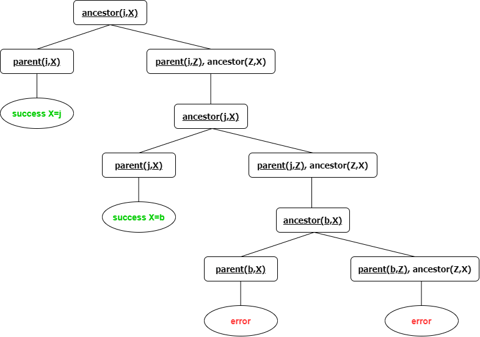

# Cheat sheet - Haj Ali

Author [@hajali-amine](https://github.com/hajali-amine)

## SLD Resolution

Logic programming is based on a specific resolution strategy called SLD resolution (_Selective Linear Definite resolution_).

- Based on linear resolution.
- Generally, this method is **incomplete**.
- It is complete when applied to **definite clauses**.
  - _a_ is a definite clause, also referred to as an **atomic clause**. (a being an atom).
  - _a<=b_ is a definite clause, also referred to as a **rule**, where a, the **head**, is an atom and b is a body.
  - A **knowledge base** is a set of definite clauses.

## Prolog

Prolog is intended primarily as a **declarative programming language**; the program logic is expressed in terms of **relations**, represented as _facts_ and _rules_. A computation is initiated by running a query over these relations.

**Important note:**

> When we write a goal like _X = Y_ in Prolog, we are testing for more than simple equality in the mathematical sense. We are testing whether X (which might be a variable, an atom, or an arbitrarily complex term) **unifies** with Y (which might also be an atom, a variable, or a term).
> Whenever you write "=" in a Prolog procedure, review the code to see whether you can get rid of the "=" clause by replacing the item on the left of "=" by the item to the right of it, elsewhere in the procedure.

## Example

- Socrates is a human.
- All humans are mortal.
- Is Socrates mortal?

In prolog, this will be translated to;

```prolog
human(socrates).
% X is a variable
mortal(X):-human(X).

mortal(socrates).
```

## Execution

| IMPORTANT                                                                                                                                                                   |
| --------------------------------------------------------------------------------------------------------------------------------------------------------------------------- |
| Prolog explores the rules _in the order of their implementation_ in the program, it explores the list of goals from _the left to the right_, and creates a **search tree**. |

Execution of a Prolog program is initiated when the user writes a **query**. Logically, the Prolog engine tries to find a **resolution refutation** of the _negated query_. If the negated query can be refuted, it follows that the query, with the appropriate variable bindings in place, is a logical consequence of the program. In that case, _all generated variable bindings are reported to the user_, and the query is said to have succeeded.

Operationally, Prolog's execution strategy can be thought of as a generalization of _function calls_ in other languages, one difference being that multiple clause heads can match a given call. In that case, the system creates a choice-point, **unifies** the goal with the clause head of the first alternative, and continues with the goals of that first alternative. If any goal fails in the course of executing the program, all variable bindings that were made since the most recent choice-point was created are **undone**, and execution continues with the next alternative of that choice-point. This execution strategy is called chronological **backtracking**.

### Execution Example

```prolog
parent(i,j).
parent(j,b).
ancestor(X,Y):-parent(X,Y).
ancestor(X,Y):-parent(X,Z),ancestor(Z,Y).

ancestor(i,X).
```

**Execution:**



## Arithmetics

Prolog knows integers and floats.

An arithmetic expression is created using _numbers_, _variables_ and _arithmetic operators_.

**Usual operators:**

| Operator | Description      |
| -------- | ---------------- |
| `+`      | Addition         |
| `-`      | Substraction     |
| `*`      | Multiplication   |
| `//`     | Integer division |
| `/`      | Float division   |
| `mod`    | Rest of division |

**Predefined mathematical functions:**

| Function    | Description                                 |
| ----------- | ------------------------------------------- |
| `abs(X)`    | Absolute value                              |
| `log(X)`    | The log function                            |
| `sqrt(X)`   | Square root                                 |
| `exp(X)`    | The exponential function                    |
| `sign(X)`   | The sign function                           |
| `random(X)` | Evaluates to a random integer _i_, _0<=i<X_ |
| `sin(X)`    | The sine function                           |
| `cos(X)`    | The cosine function                         |
| `tan(X)`    | The tangent function                        |
| `max(X,Y)`  | The maximum function                        |
| `min(X,Y)`  | The minimum function                        |

**Be careful!** Expressions are represented with **trees** in prolog!

```prolog
X = 3 + 2.
% X=3+2
```

```prolog
X + Y = 3 + 2.
% X=3, Y=2
```

This is easily explained by the fact that expressions are represented with **trees** and the `=` operator is used for the **unification**.


- `Exp1 =:= Exp2`, is successful if the two expressions are equal. (The opposite of the the `=\=` operator)
- `Exp1 < Exp2`, is successful if the value of Exp1 is strictly inferior than Exp2. (The opposite of the the `>` operator)
- `Exp1 =< Exp2`, is successful if the value of Exp1 is inferior or equals Exp2. (The opposite of the the `>=` operator)

## Unification

| Comparaison                                                                                                 | Unification                                                                             |
| ----------------------------------------------------------------------------------------------------------- | --------------------------------------------------------------------------------------- |
| `X == Y`, is successful if X is identical to Y whereas `X \== Y`, is successful if X is not identical to Y. | `X = Y`, unifies X with Y whereas `X \= Y`, is successful if X is not unifiable with Y. |

```prolog
X is 9 mod 4.
% X=1
```

```prolog
X = 9 mod 4.
% X=9mod4
```

```prolog
X == 9 mod 4.
%error
```

## Recursivity

Let's take the **Facrotial function** as an example;

0! = 1

n! = n(n-1)! for n>0

```prolog
fact(0,1).
fact(N,R):-N>0,N1 is N-1,fact(N1,R1),R is N*R1.
```

## Dynamic manipulation

In Prolog, it is possible to modify dynamically your program by adding and removing clauses.

**Predefined predicates:**

| Predicate              | Description                                                         |
| ---------------------- | ------------------------------------------------------------------- |
| `asserta`              | adds a fact or a rule at the **top** of the list of facts or rules. |
| `assert` and `assertz` | adds a fact or a rule at the **end** of the list of facts or rules. |
| `retract`              | Removes a fact or a rule from the knowledge base.                   |

To be able to use the predicates, you have to declare the concerned predicates using `dynamic`!

```prolog
dynamic man/1.
% Let's add Jean is a man to our knowledge base
assert(man(jean)).
% Now let's remove it
retract(man(jean)).
```

We can also write our programs in a text file, and then load them dynamically with the predicate `consult/1`.

```prolog
% loads the file load or load.pl
consult('load').
```

We have other predicates, such as:

- `listing`: lists all of the facts and the rules in our knowledge base.
- `fail`: a predicate that always gives an error.
- Predicates to verify the type: `var`, `nonvar`, `integer`, `float`, `number`, `atom`, `string`,...
- `read` and `write`: IO.
- and so many other predicates!

## Lists

A list is a data structure in Prolog which consists of a sequence of objects that can have different types.

> [a, [1,2,3],X,Y] is a list.

- Empty list `[]`
- A list that are not empty `[a,b,c]`
- Lists' constructor `|`
  - `[Head | Rest]`
  - `[a]` is the same as `[a | []]`
  - `[a,b]` is the same as `[a | [b]]` which is the same as `[a | [b | []]]`

```prolog
[a,b,c]=[X|L].
%X=a, L=[b,c]
[1|L]=[1,2,3].
%L=[2,3]
[1,2,3|L]=[1,2,3].
%L=[]
[a,b|L]=[1,2,3].
%error
[a,b|L]=[a,b,3,4].
%L=[3,4]
[Y]=[].
%error
[X, Y] = [1| [2]].
%X=1, Y=2
[X| L] = [1, []].
%X=1, L= [[]]
```

**Predicates:**

`member/2`

```prolog
member(X, [X|_]).
member(X, [_|L]):-member(X,L).
```

- _Mode(input, input)_, it verifies if an element is a member of the list.
- _Mode(output, input)_, it lists the elements of the list.

`length/2`

```prolog
length([],0).
length([_|L],N):-length(L,M),N is M+1.
```

- _Mode(input, input)_, it verifies if the length of the list given in input is right.
- _Mode(input, output)_, it returns the length of the list.

`append/3`

```prolog
append([],L2,L2).
append([X|L],L2,[X|L3]):-append(L,L2,L3).
% thus
member(X,L):-append(_,[X|_],L).
```

`reverse/2`

```prolog
reverse([],[]).
reverse([X|Xs],Ys):-reverse(Xs,Zs),append(Zs,[X],Ys).
% or
reverse([],L,L).
reverse([X|Xs],Ys,L):-reverse(Xs,[X|Ys],L).
reverse(Xs,Ys):-reverse(Xs,[],Ys).
```

`delete/3`

```prolog
delete([],_,[]).
delete([X|Ys],X,Ys).
delete([Y|Ys],X,[Y|Zs]):-X =\= Y,delete(Ys,X,Zs).
```

`permute/2`

```prolog
permute([],[]).
permute([X|Xs],Ys):-permute(Xs,Zs),insert(X,Zs,Ys).
insert(X,Ys,[X|Ys]).
insert(X,[Y|Ys],[Y|Zs]) :-insert(X,Ys,Zs).
```

`findall/3`, this predicate allows you to return a list of all of the objects that verifies a certain condition. Returns an **empty list** if condition not satisfied.

```prolog
num(0).
num(1).
num(2).
num(3).
num(4).
num(5).
num(6).
num(7).
num(8).
num(9).
solution(X):-num(X),0<X*X-10*X+20.

findall(X,solution(X),L).
%L=[0,1,2,8,9]
```

`bagof/3`, same as findall except it return an error when the condition is not satisfied and the fact that it gives a list for each value of the goal's **free variables**.

```prolog
num(0,pair).
num(1,impair).
num(2,pair).
num(3,impair).
num(4,pair).
num(5,impair).
num(6,pair).
num(7,impair).
num(8,pair).
num(9,impair).
solution(X,Y):-num(X,Y),0<X*X-10*X+20.

bagof(X,solution(X,Y),L).
%Y=impair, L=[1,9]
%Y=pair, L=[0,2,8]
```

## Cut

- Cut or `!` is a predefined predicate that is always **satisfiable**.
- It's made to control the search tree to get rid of useless explorations.
- Cut is not logical.

_H:-B1,B2,...,Bi,!,Bi+1,...,Bm._

- Once the predicate `!` is executed, the choice-points in _H, B1,...,Bi_ are deleted.
- However, it can still explore other choice-points in _Bi+1,...,Bm_.

**Why use cut?**

- To stop useless explorations.

```prolog
member(X,[X|Y_]):-!.
member(X,[_|Xs]):-member(X,Xs).
```

- If else statements.

```prolog
f(X,0):-X < 3,!.
f(X,2):-X < 6,!.
f(X,4).
```

- Expression of the negation in Prolog.

```prolog
different(X,Y):-X = Y,!,fail.
different(X,Y).
```

**Green cut:** the declarative semantic of the program isn't modified. (We can remove the cut, and the program will function.)

```prolog
min(X,Y,X):- X=<Y,!.
min(X,Y,Y):- Y<X,!.
```

**Red cut:** the declarative semantic of the program is modified. (Removing the cut will lead to the malfunctioning of the program.)

```prolog
min(X,Y,X):- X=<Y,!.
min(X,Y,Y).
```

## Negation

The `not` in Prolog has two limitations:

- It has to be in the body of a clause.

```prolog
strong(X):-athletic(X),not(small(X)).
```

- The `not` is different from the logical negation.

```prolog
r(a).
q(b).
p(X):-not(r(X)).

q(X),p(X).
% true.
p(X),q(X).
% false.
```

> **not(X)** does not mean that X is always false, it means that _we don't have enough information_ to prove X.

Each time we use the `not/1`, we have to create another search tree;

- if it shows a success, then the not will return **false**.
- if it returns all errors, the the not will return a **true**.

## Binary search trees


The following tree can be implemented as;

```prolog
t(6,t(4,t(2,nil,nil),t(5,nil,nil)),t(9,t(nil,nil,10),nil)).
```

`member_tree/2`

```prolog
member_tree(X,t(_,X,_)).
member_tree(X,t(G, Root,_)):-X<Root,member_tree(X,G).
member_tree(X,t(_,_,D)):-X>Root,member_tree(X,D).
```

`insert_tree/3`

```prolog
insert_tree(A,X,A1).
insert_tree(nil,X,t(nil,X,nil)).
insert_tree((t(G,X,D),X,t(G,X,D)).
insert_tree(t(G,R,D),X,t(Ag,R,D)):-X<R,insert_tree(G,X,Ag).
insert_tree(t(G,R,D),X,t(G,R,Ad)):-X>R,insert_tree(D,X,Ad).
```
