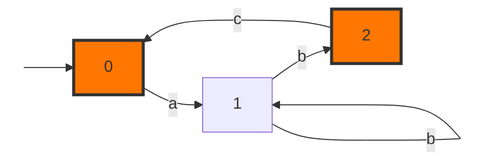

# Finite State Automata

### 1.1 Definition

A finite state automata is a quintuplet $\mathcal{A}=(V,\Sigma,q_0,F,\delta)$ with:

- $V$ is a finite set of states
- $\Sigma$ is a finite set representing the alphabet
- $q_0\in V$ is the initial state of the automata
- $F \subseteq V$  represents the recognized states
- $\delta \subseteq V\times \Sigma \times V$ is the transition relation

### 1.2 Transition

We say that $e=(u,a,v)$ is a transition if $e\in \delta$  

Informally speaking, if the automata was on the state $u$, and it receives $a$ , then one of the possible states it can go to is $v$

### 1.3 Deterministic Finite State Automata

A deterministic finite state automata $\mathcal{A}=(V,\Sigma,q_0,F,\delta)$ is a finite state automata in which $\delta$ is a partial function.

In other words, $\delta:\mathcal{T}\rightarrow V$ is a fonction with $\mathcal{T}\subseteq V\times \Sigma $

Roughly speaking, this is to say that if there is a transition from $u$ that accepts $a$, it should be $(u,a,\delta(u,a))$

### 1.4 Execution

A possible execution of an automata with length $n\in\mathbb{N}^*$ is a tuple $\mathcal{E}=(u_0,s_0,u_1,s_1,\dots,u_{n-1},s_{n-1},u_n)$ defined by:

- $u_0=q_0$
- $\forall i \in\{0,\dots,n\},\quad u_i\in V$
- $\forall i \in\{0,\dots,n-1\},\quad s_i\in \Sigma$
- $\forall i\in\{1,\dots,n\},\quad (u_{i-1},s_{i-1},u_i)\in \delta$

- $u_n\in F$

Each other sequnence will be rejected by the automata.

#### 1.5 Recognized Strings and langage

a string $S=s_0\dots s_{n-1}\in\Sigma^*$ is said to be recognized by $\mathcal{A}$ if there exists an execution $\mathcal{E}=(u_0,s_0,u_1,s_1,\dots,u_{n-1},s_{n-1},u_n)$

The langage $\mathcal{L}\subseteq \Sigma^*$ recognized by $\mathcal{A}$ is the set of all recognized strings.

### 1.5 Example

The example above defines an automata $\mathcal{A}=(V,\Sigma,q_0,F,\delta)$ with:

- $V=\{0,1,2\}$

- $\Sigma=\{a,b,c\}$

- $q_0=0$

- $F=\{0,2\}$ represenst the final states

- $\delta$ is represented by:

  |       | a    | b      | c    |
  | ----- | ---- | ------ | ---- |
  | **0** | 1    |        |      |
  | **1** |      | 1 or 2 |      |
  | **2** |      |        | 0    |

1. $(1,b,1)$ et $(1,b,2)$ are two transitions. Note that the automata is not *deterministic* because at the state $1$ there are two transitions possible with the character $b$

2. A possible execution is: $(0,a,1,b,1,b,2,c,0)$, It recognizes the character $abbc$

3. The recognized language by $\mathcal{A}$ est is represented with the following regular expression:

$$
(ab^+c)^* (ab^+)^?
$$

*Démonstration*
$$
\begin{align}
L_1&=bL_1+bL_2\\
\implies L_1&=b^*bL_2\\
L_2&=cL_0+\epsilon\\
L_0&=aL_1+\epsilon\\
&= ab^+L_2+\epsilon\\
&=ab^+cL_0+ab^++\epsilon \\
\implies L_0&=(ab^+c)^* (ab^++\epsilon) \\
&=(ab^+c)^* (ab^+)^?

\end{align}
$$

## 