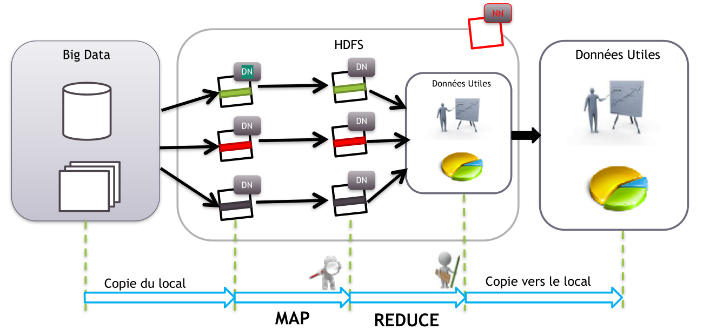
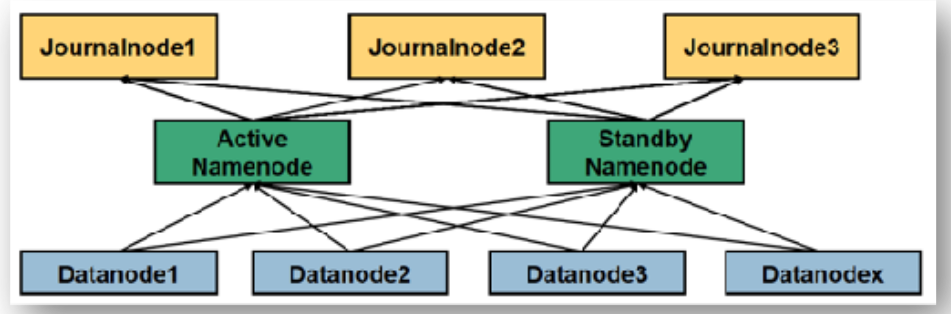
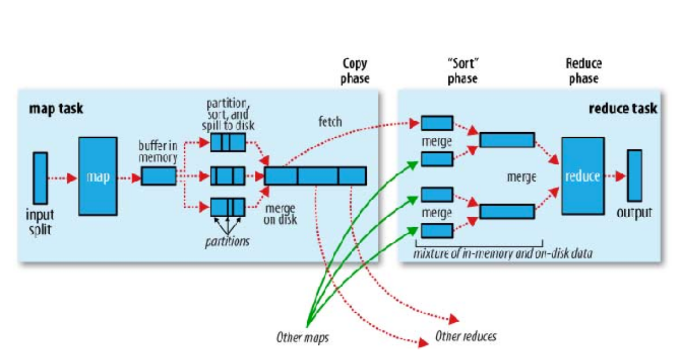
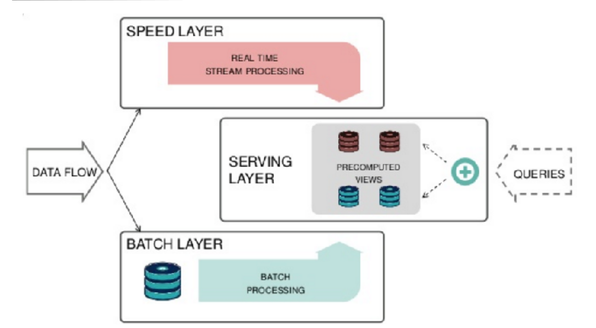

# Cheat sheet

## introduction & 5vs

Big data is based on 5 characteristics what we call 5 Vs :

- Volume :

  - Data comes in huge volumes
  - no information is worthless
  - how should it be saved ? Backup strategy ? fault tolerance ?
  - how to access it rapidly and efficiently ?

- Variety:

  - Data comes with no predefined schema, unstructured
  - Multiple data types and formats

- Velocity

  - Data comes in real time and must be stored fast

- Veracity

  - Some data quality may be questionable at best
  - data must be verified and cleaned
  - data my differ in origin
  - some origins can't be trusted

- Value
  - Data can have a lot of value ranging from statistics, analysis, predictions

## Hadoop & Map Reduce

### Hadoop

Hadoop is not a single piece software, it's a set of tools for managing :

- Data storage ( HDFS )
- Data processing ( Map reduce, spark, Yarn ...)

It based on some points :

- Distributed data patterns ( File is divided across multiple machines in chunks )
- Distributed processing patterns what we call clusters
- Prioritize in place data processing ( Data is processed where its stored trying to heavily avoid remote operations)
- Clusters are horizontally scalable alongside data growth

Hadoop can also be used for :

- Data extraction
- Data simplification
- Coordination between tools
- Cluster monitoring

Some good to know tools ( Related and under Yarn / Map-reduce ) :

- Pig: Scripting language
- Hive: Hive Query language
- R connectors ( To query data from hdfs, Use map reduce from R)
- Mahout : Machine learning library
- Oozie: Order map reduce jobs

Some storage tools ( Related and under Yarn / Map-reduce ) :

- Hbase: NoSQL data base
- Impala: get data directly from HDFS or Hbase with hive QL

Data connectors:

- Sqoop : read and write data to and from external sources
- Flume: Collect HDFS logs

Administration:

- Ambari : Administer clusters
- Zookeeper: Centralized configuration service

## HDFS

HDFS: Hadoop distributed file system

- HDFS is a distributed extensible and portable file system
- Written in java
- Stores huge amounts of data in multiple machines "Nodes"
- Data is stored in chunks across machines ( 64mo, 128mo , configurable... )
- Each chunk has a unique name to it
- We have two types of nodes:
  - DataNodes DN: contains actual file data
  - NameNode NN: contains file metadata, Responsible for file assembly
- Some problems may appear :

  - Network failure
    - Hadoop is rack aware
    - It tries to distribute data across machines far in the network
  - Disk failure ( NN & DN ) :

    - If name node fails data is lost
    - Hadoop replicates data 3 times by default across nodes
    - Strategy:
      - 1 replica in same rack
      - 1 replica in another rack
      - 1 replica in 2nd rack in different node
    - If a node is down hadoop automatically replicates data to always have 3 available replicas

  - Different data bloc sizes
  - Unused nodes

### HDFS NN (Name Node)

NameNode can be replicated in secondary NameNode for backup and load distribution

Name node keeps track of:

- Directories hierarchy
- File permissions
- File chunks location ( Blocs )

Data stores in two persistent structures:

- FsImage: File system metadata snapshot
  - Efficient for read operations
  - Inefficient for small writes and changes like file names
- EditLog
  - Regular operation are stored here first
  - A checkpoint is regularly written to FsImage in regular times or when a certain limit of log files are present to avoid large EditLog size

FsImage generation is very resource heavy and may take minutes while at the same time data must be ready for user access
Hadoop relies on another node for that operation named StandBy NameNode
or secondary NameNode

#### Checkpoint with 2NN

2NN copies log from NN then generates new FsImage from fusion with it previous FsImage and sends it back to NN

#### Checkpoint with SbNN

Data operations are written from NN directly to minimum 3 journal nodes which SbNN picks up ( Based on time or number ) and builds new FsImage then sends it back to NN

## Map/Reduce

- Parallel and distributed data processing
- Java based with option to use other language with streaming
- Data is processed in chunks

Two Type of workers:

- Mappers:
  - Mapper are scoped to single item operations, they strictly must only rely on it, Runs on parallel
  - Mapper must return Key, Value couple
- Reducer: Reducer has a wider context and access to multiples items
  

### MRv1

composed of

- API
- Framework: Job execution and
- Resource manager: Manage nodes and order jobs

Daemons :

- JobTracker :
  - Exists in single node and divides the work on Mappers and reducers
- TaskTracker :
  - Executes processing tasks

How it works :

- Task are divided in mappers and reducers
- Each tasks in executed in a node
- Each node has predefined slots:
  - Map slots
  - Reduce slots
- Job trackers :
  - Allocates tasks
  - Coordinates Map reduces jobs

Potential Problems :

- Job Tracker is limited to a single machine with huge responsibilities
- Job Tracker is a single point of failure
- Slots number are predefined
- Job Tracker is strongly integrated with map reduce ( Cannot execute outside of HDFS )

### MRv2

- Map Reduce 2 :
  - API
  - Framework
- Yarn
  - API
  - Resource management

No slots, Resource are allocated just in time.
Multiple masters in cluster

Daemons :

- Resource manager :

  - Runs on master node
  - Global resource manager

- Node Manager (NN)
  - Runs on slave nodes
  - Communicates with RM
- Containers
  - Created in demand by RM
  - Allocates resources
- Application Master AM
  - Single
  - Runs on container
  - Demands container to execute tasks

### Patterns

#### Filtering pattern

- Filter based on criteria
- Sample
- Random Sample
- Top-N

#### Recapitulation pattern

Make indexed and meaningful data points to better explain your data : like min max, first and last , mean

## Data processing

### Batch

- Efficient for large data sets
- Data is collected, stored, processed then results
- Map reduce is an example of batch processing system
- Has global access to data
- suitable for complex and heavy tasks
- runs on minutes
- Targets volume and variety

Bad points :

- Data must be ready
- cant execute iterative and recursive jobs

### Streaming

- Data processed in very small quantity on an item basis
- Processing must happen in real time
- Second wide latency

Bad points :

- Lacks global data access
- High operational complexity
- Data loss is a risk

why ? :

- Real time recommendation
- Surveillance
- IOT

### Lambda Architecture

https://www.cyres.fr/blog/architecture-lambda-big-data/
