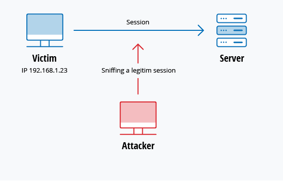
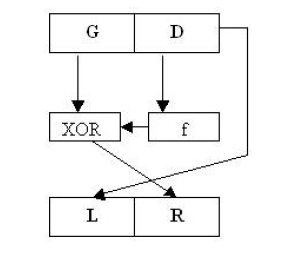
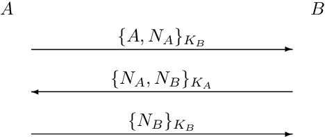
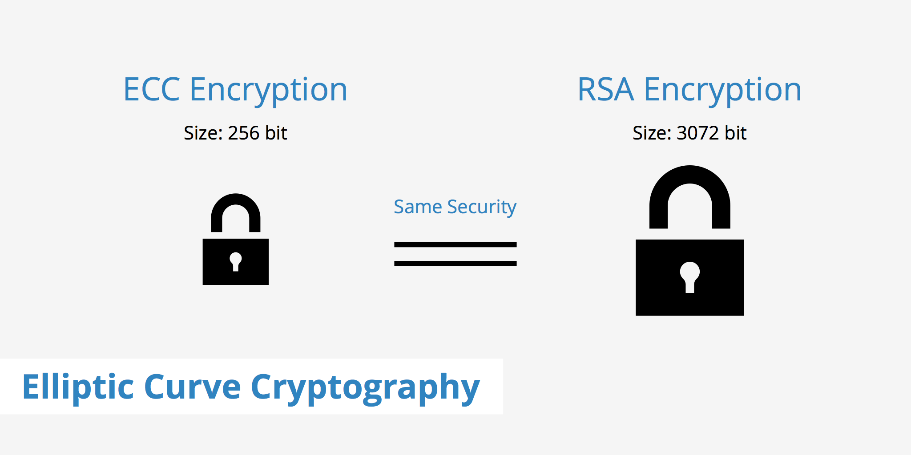

# Cheat sheet

Author [@rihemebh](https://github.com/rihemebh)

## Some important notions

|name|description|
|---|---|
|Identification|Who are you ?|
|Authentication|Prove it|
|Authorization|Do you have the right to do something ?|
|Audit| What did you do ?|
|FootPrint|Recognition|
|Integrity|Ensuring that information cannot be changed|
|Confidentiality|Ensuring that information can be accessed (read) only by authorized persons|
|DLP| Discret Logarithm Problem : finding the number y where x = g^y mod, g is given and p is a large prime number |

### Frequently used CMDs

``gpg`` :  is the cmd for encryption

- Get Hostname

```console
hostname -I
```

- Connect remotely via a private network

```console
ssh <username>@<hostname>
```

- Secure copy :

```console
scp <filename> <username>@<hostname>:<path>
```

## Attacks

|Attack|Description|Example|
|---|---|---|
|Birthday Attack|It is made against the Hash algorithms. (Belongs to a class of brute force)  

 All hashed messages have a fixed length (independent from the input length) and they unique for that message. this attack refers to the probability of finding two random messages m1 and m2 that has the same Hash h(m1) = h(m2) so the attacker can safely replace the message by his own one|What is the relation with the birthday:

 Since we have a finite number of days in one year (365) there is a big chance to have 2 persons with the same birthday in a finite number of persons.|
|Password attack|Trying to guess the password or having a databse of passwords called dictionnary|- **Brute Force** : using a random approach by trying different passwords and hoping that one work Some logic can be applied by trying passwords related to the person’s name, job title, hobbies or similar items.

- **Dictionary attack**: dictionary of common passwords is used to attempt to gain access to a user’s computer and network. One approach is to copy an encrypted file that contains the passwords, apply the same encryption to a dictionary of commonly used passwords, and compare the results.|
|Man in the middle|occurs when a hacker inserts itself between the communications of a client and a server|Session hijacking




|SQL Injection|SQL commands are inserted into data-plane input (for example, instead of the login or password) in order to run predefined SQL commands|“SELECT * FROM users WHERE account = ‘’ or ‘1’ = ‘1’;”

 Because ‘1’ = ‘1’ always evaluates to TRUE, the database will return the data for all users instead of just a single user.|
|Cross-site scripting (XSS)|Use third-party web resources to run scripts in the victim’s web browser or scriptable application|


|Ransomware|Ransomware is a type of malware from cryptovirology that threatens to publish the victim's personal data or perpetually block access to it unless a ransom is paid. While some simple ransomware may lock the system without damaging any files, more advanced malware uses a technique called cryptoviral extortion.|

## Firewalls

The major role of firewalls is:

- Intercepting incoming traffic between network and trust levels
- Authorizing or reject access
- Enabling a more secure connection to open networks
- Audit network usage

### Netfilter

Netfilter is a Linux kernel module that provides the ability to monitor, modify and filter IP packets, and track connections. It thus provides firewall functions, Internet connection sharing and network traffic authorization.

### IpTables

IpTable in a  CMD interface to configure Netfilter

#### Commands

The commands tells iptables what to do with the rest of the rule that is sent to the interpreter.

The chain's name : INPUT

- Rules' List

```shell
iptable -L --line-numbers
```

- Create a Chain (named allowed)

```shell
iptables -N allowed
```

- Erase a chain

```shell
iptables -X allowed
```

- Modify the authorization

```shell
iptables -P INPUT DROP
```

- Add rule to end of the chain

```shell
iptables -A INPUT
```

- Drop rule

```shell
iptables -D INPUT --dport 80 -j DROP, iptables -D INPUT 1
```

- Replace a rule

```shell
iptables -R INPUT 1 -s 192.168.0.1 -j DROP
```

- Insert a rule anywhere

```shell
iptables -I INPUT 1 --dport 80 -j ACCEPT
```

- Clear the chain's rules

```shell
iptables -F INPUT
```

## Encryption

Encryption is used to garantee Confidentiality.

### Symmetric Encryption

Use one shared encryption key between sender and receiver.

- Encrypt the file :
  - Binary format (default)

     ```console
     gpg -c <filename>
     ```

  - ASCII format

     ```console
     gpg -c --armor(or -a) <filename>
     ```

- Get all the algos

```console
 gpg --version 
```

Examples of symmetric algorithms:

AES (Advanced Encryption Standard), DES (Data Encryption Standard), IDEA (International Data Encryption Algorithm),RC4/5/6 (Rivest Cipher 4/5/6)

- Encrypt the file and specify the algo (cipher)

```console
gpg -c -a --cipher-algo <filename>
```

- Decrypt

```console
gpg -d <filename>
```

|Advantages ++ |Disadvantages -- |
|---|---|
|Fast|non secure key|
|-|Large number of keys|
|-|Without signature|

#### Feistel

- It's a block cipher

**Encryption algorithm**:

1. The plain text is divided into 2 equal halves : G and D
2. The encryption function is applied on the right half D of the plaintext block. The result of this encryption function is then XORed with the left half G . The result of XOR function becomes the new right half R .



f : is the the encryption function  that takes (data block) as input and returns one output of the same size as the data block.

**Decryption Algorithm** :

D = L and G = R XOR f(L)

**Know that**:

We could repeat this algo as many time as we need if we want to increase the security.

The security also increases when the block is larger and the round function is more complex, but it may decrease the speed of encryption and decryption.

### Asymmetric Encryption

Use public keys for encryption and private keys for decryption

- Generate Keys

```console
gpg --full-generate-key
gpg --gen-key
```

- Get the Key List

```console
gpg --list -keys
```

- Export a public key

```console
gpg -o KEY -a --export <KeyID> 
```

- Import Key

```console
gpg --import KEY
```

- Encryption

```console
gpg -o file.enc -a -r <publicKey> -encrypt file
```

- Sign

```console
gpg -o file.signed --sign-file
```

- Verify a signature

```console
gpg --verify file.signed 
```

- Decrypt

```console
gpg -o file --decrypt file.enc
```

|Advantages ++ |Disadvantages -- |
|---|---|
|Secured|Slow|
|Signature||
|Less number of keys||

#### Needham-Schroeder

Authentication Protocole



- pka : public key of na
- pkb : pyblic key of nb
- Na / Nb : random numbers

**Algorithm**: A wants to prove his identity to B

1. A sends his name and random number Na,this message is encrypted by an asymmetric encryption algorithmwith the public key of B (pkb ),
2. B decrypts the message with his private key
3. returns the random number generated by A (so A could make sure that the message is comming from B) and a new random number Nb : encrypted by the public Key of A
4. A receives the message and decrypt it with his private key
5. A sends Nb to B encrypted with pkb (to tell B that he successfully get his message)
6. Indentity proved !

**Problem**:

This algo could easly be attacked by the Man in the midlle  

**Solution**:

- By adding b (prove the identity of b) , a will make sure if he is talking with b or with not


#### RSA

NP-complete problem

**Parameters**:

1. choose 2 prime numbers p & q
2. N= p*q
3. L = (p-1)*(q-1)
4. Generate the public Key (e,N): e is between 1 and L and coprime with N and L
5. private key (d,N) : d*e mod L =1

**Encryption** :
 mod N = C

**Decryption** :
M =  mod N

#### ELGamal

DLP : Discrete logarithm problem  

**Public Infos**:

q : prime number

p = 2 q +1

Gq: cyclic group

g: generator of Gq

- Choose a private key X from Gq  
- Public Key: y = g^X mod p

**Encryption** :

1. Choose a number k from Gq
2. u = g^k mod p
3. v = y^k M mod p ( M : message )
4. publish : (u,v)  

**Decryption**:

1. D(u,v) = v/u^X = m

### Hybrid Encryption

#### DH

p (prime number) and g are public infos

**Algorithm**: A and B want to communicate with each other by sharing the same Key

1. A chooses a random number "a" between 0 and p-1
2. B chooses a random number "b" between 0 and p-1
3. u =  mod p (published by A) ; v=  mod p (published by B)
4. Key of B : Kb=  =  mod p
5. Key of A : Ka=  =  mod p

 => Ka = Kb

### Kerberos

it is responsible for authenticating, authorizing and monitoring users who want to access resources and services on your network. It acts as a watchdog against intruders on your network services.

Based on

- “Ticket” Granting
- Secret Key Cryptography
- Mutual authentication
- Time-limited tickets
- Anti-replay mechanisms

- It is based on 3 tiers architecture :
  - Client/user : Who wants to access a resource from the server
  - Ressources server : the machine that has resources
  - KDC: Key Distribution Center: Grant ticket for users allowed to access a service

**Principal** : Each user and service on the network is a principal.

Implementation : <https://github.com/rihemebh/Kerberos-project>

### Elliptic Curve

ECC is based on the elliptic curve discrete logarithm problem, or (ECDLP), Instead of numbers, the elliptic curve’s problems operate on points, and multiplication is used instead of exponentiation : **Finding the number k given a base point P where the point Q = kP.**

#### ECC Auth

The standard algorithm used for signing with ECC is ECDSA, which stands for elliptic curve digital signature algorithm.
This algorithm has replaced RSA signatures and classical DSA signatures in many applications. It is, for example, the only signature algorithm used in Bitcoin and is supported by many TLS and SSH implementations.

#### Signature generation

##### Parameters

n is the number of point in the curve

G = (x,y) is a base point

private key = d

public Key P = dG

##### Algorithm

1. Hash a message (SHA-256 or BLAKE2) ⇒ generate h between 0 and n-1
2. Pick a random number k between 1 and n-1
3. compute kG
4. set r = x mod n
5. compute s = (h+rd)/ k mod n
6. signature = (r,s)

#### Signature Verification

1. compute w = 1/s  = k / (h+rd) mod n
2. wh = hk(h+rd) = u
3. wr = rk(h+rd) = v
4. Q = uG + vP

The verifier only accepts the signature if the x coordinate of Q is equal to the value r from the signature.

#### Signature Verification Encryption

We have:

- (q ,G, G1, e), P un point de la CE E tq q divise p^k - 1
- n longueur du message
- H1 : (0, 1)*-> G*
- H2 : G1 -> (0, 1)^n
- PKG : calcule P pub = rP


#### Decryption


### RSA VS ECC

Elliptic curve cryptography is often viewed as an alternative to RSA for public-key cryptography, but ECC and RSA don’t have much in common.

RSA is only used for encryption and signatures, whereas ECC is a family of algorithms that can be used to perform encryption, generate signatures, perform key agreement, and offer advanced cryptographic functionalities such as identity-based encryption.

The significant difference:
**=> The same level of security with small numbers**



ECC has two major advantages over RSA: **shorter signatures and signing speed.**

Because ECC works with shorter numbers, it produces shorter signatures than RSA (hundreds of bits long, not thousands of bits), which is an obvious benefit if you have to store or transmit numerous signatures.

Signing with ECDSA is also much faster than signing with RSA (though signature verification is about as fast) because ECDSA works with much smaller numbers than RSA does for a similar security level.

**Reference** : Serious Cryptography A Practical Introduction to Modern Encryption by --Jean-Philippe Aumasson

### Hash

Hash is used to garantee Integrity : We use non-bijective functions to hash the message.

Whatever the size of the real message, the size of a hash message is always the same.  

**Examples of Hash functions** : sha, sha256, md5  

- Hash a file

```console
asc25sum file
md5sum file
sha256sum file
```

### OpenSSL

#### Definition

SSL  (Secure Sockets Layer)

- Is an encryption-based protocol
- Ensure confidentiality,,Authentication and Integrity
- the predecessor of modern TLS(Transport Layer Security) encryption in use today

=> A website that implements SSL / TLS has an “HTTPS” in its URL instead of an “HTTP”.

OpenSSL is a software library for applications that secure communications over computer networks against eavesdropping or need to identify the party at the other end.
It contains an open-source implementation of the SSL and TLS protocols. The core library, written in C programming language, implements basic cryptographic functions and provides various utility functions.

#### CMD

- Encrypt the "file" with "aes-128-cbc" algorithm and put the result in "file.enc"

```ubuntu
openssl enc -aes-128-cbc -in file -out file.enc

// Apply the algoritm 2 times

openssl enc -aes-128-cbc -iter 2 -in file -out file.enc
```

- Decrypt

```console
openssl enc -d -aes-128-cbc -in file.enc -out filerestored
openssl enc -d -aes-128-cbc  -iter 2 -in file.enc -out filerestored
```

- Generate RSA Key:

```console
openssl genrsa -out mykey 2048

```

- Generate RSA params:

```console
openssl rsa -in mykey -text -noout 
```

-noout : print the output in the terminal

- Generate a public key from a private key

```console
openssl rsa -in mykey -pubout -out pub 
```

- Private Key Encryption :

```console
openssl rsa -in mykey -des -out mykey.enc 
```

- Encrypt with public key

```console
openssl rsault -encrypt -pubin -inkey PUB -in file -out file.enc 
```

- Decrypt

```console
openssl rsautl -decrypt -inkey mykey.enc -in file -out rsa.enc 
```

#### Signature

- Sign with the private key

```console
openssl rsault -sign -inkey myKey.enc -in file -out fileRSA.sign 
```

- Verify signature

```console
openssl rsault -verify -pubin -inkey PUB -in fileRSA.sign
```

- Encrypt + Sign

```console
openssl dgst -sha256 -verify PUB -signature fileHashSign file 
```

#### Certificate

- Digital Certificates are verifiable small data files that contain identity credentials to help websites, people, and devices represent their authentic online identity.
- Digital certificates cover three main uses:
  - Authentication: used to validate the identity of issuers as part of an authentication process, a crucial element of computer network security.
  - Signing: sed to sign a document or a file and to guarantee its integrity
  - Encryption: Garantee the security and integrity of information exchanged between a website and a browser, by means of a cryptographic key enabling a secure session to be activated (HTTPS protocol)

- Certification Authority issues digital certificates

----------------------------------------------------------------------------

- Get the Certification of the www.google.com website:

```console
openssl s_client www.google.com:443
```

- Get the authority of a certification :

 google.cert is the file that contains google certification : output of the above cmd

```console
openssl x509 -in google.cert -subject -issuer -noout
```

=> google trust

----------------------------------------------------------------------------

Goal:

- Create a certification authority called "**INSAT**"
- Create a certification for INSAT
- **GL4** will ask a certification from **INSAT**
- **INSAT** will verify this request and generate a certificate
- Now **INSAT** is the authority of **GL4**

----------------------------------------------------------------------------

- Create RSA keys for INSAT and put it in INSAT.key

```console
openssl genrsa -des3 -out INSAT.key 3072
```

- Create a certification for INSAT

```console
openssl req -new -x509 -days 730 -key INSAT.key -out INSAT.cert
```

=> In this certificate INSAT is the subject and issuer : **Self Signed Certificate**

- Create keys for GL4

```console
openssl genrsa -des3 -out gl4.key 3072
```

- Create request for a certiif from INSAT

```console
openssl req -new  -key gl4.key -out gl4.req 
```

- Generate a Certificate for GL4:

```console
openssl x509 -req -in gl4.req -out gl4.cert -CA INSAT.cert -CAKey INSAT.key -CAcreateserial -CAserial gl4.srl
```

- Export the certificate

```console
openssl pkcs12 -export -out gl4.pfx -in gl4.cert -inkey gl4.key -name "certificat de gl4"
```

=> pkcs12 : put the certificate and the keys in the same file "gl4.pfx" so you can import it in the browser

- Import it

|preference -> certificate manager -> my Certificates -> import |
|---|

- Add Authority

| preference -> certificate manager -> Authorities -> import -> choose INSAT.cert |
|---|
