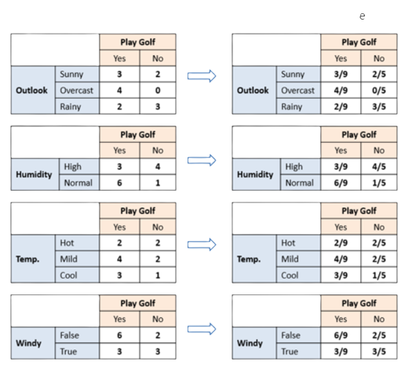
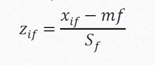
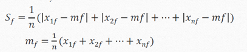

# Cheat sheet

Author [@rihemebh](https://github.com/rihemebh) **Note that this cheat sheet is not completed yet please make your PR to contribute**

## Definitions

- **Data Mining** presents the discovery of knowledge (interesting information) from large amounts of data, by automatic methods

- **Machine learning** is a subfield of AI that focus on the study of algorithms built based on data in order to fuilfil a specific task. the algorithm performance could be improved with experience.

Example: hand writing recognition

- Task= recognition and classification of words written manually from images.
- Experience = a database of handwritten words with the appropriate classifications.
- Performance = The number of correctly classified words

## ML VS DM

Data mining is designed to extract the rules from large quantities of data, while machine learning teaches a computer how to learn and comprehend the given parameters

## Methodologies

### KDD (by Ossama Fayyad - 1996)

KDD knowledge discovery process is iterative and interactive, comprises of nine steps :

1. **Building up an understanding of the application domain**
2. **Choosing and creating a data set on which discovery will be performed**
3. **Preprocessing and cleansing**
4. **Data Transformation** In this stage, the creation of appropriate data for Data Mining is prepared and developed. Techniques here incorporate dimension reduction( for example, feature selection and extraction and record sampling), also attribute transformation(for example, discretization of numerical attributes and functional transformation).
5. **Prediction and description** We are now prepared to decide on which kind of Data Mining to use, for example, classification, regression, clustering, etc.
6. **choose the right Data Mining algo**
7. **Implement the algo**
8. **Evaluation**
9. **Using the discovered knowledge**

### SEMMA

1. **Sample**

   Extracts samples from a large data set, in numbers large enough to contain the important information, but small enough to be quickly manipulated.

2. **Explore**

   Exploring the data by looking for unforeseen anomalies in order to better understand the data.

3. **Modify**

   Modifies data by creating, selecting and transforming variables to focus on the model selection process.

4. **Model**

   Models the data by allowing the software to automatically search for a combination of data that reliably predicts the desired outcome

5. **Assess** Assesses the usefulness and reliability of the results of the Data Mining process and assesses how it will perform

### CRISP-DM: CRoss-IndustryStandard Processfor Data Mining (By IBM)

1. **Business Understanding**

   Essential things to be determined in this phase:

   · Business Objectives

   · Data Mining Goals

   · Definition of project success criteria

2. **Data Understanding**

   Explore the data with the statistical method and data visualization.

3. **Data hub building (Data Preparation)**

   · Select Important Columns

   · Sampling Rows (Train Test Split, Cross-Validation)

   · Create or Derives new compound variables

   · Filter data (Filter Out Irrelevant data points)

   · Merging data sources (Data Aggregations)

   · Impute or Remove Missing value

   · Decide whether to remove or keep Outlier

4. **Modelling**

   Choose the right algorithm for modelling:

   Are you doing supervised learning or unsupervised learning?

   Which types are your problem? Regression? Classification?

   -> From there, you can determine your algorithm

5. **Evaluation**
6. **Deployment**

## To know

|  | Meaning |
| --- | --- | --- | --- | --- | --- | --- | --- | --- | --- | --- | --- | --- | --- | --- | --- | --- |
| Features | predictor variables |
| Class | Target variable |
| Overfitting | we talk about overfitting when a model has learned too much the particularities of each of the examples provided as an example. It then presents a very high success rate on the training data (which can reach up to 100%), but does not generalize well (less good performance on the test data). |  | Underfitting | An algorithm that does not learn enough from the learning phase (poor performance on the training set) |  | Positive | We consider the positive is the less recent case in other words what our task is searching for Example: if our task is to pridict the spam emails so the positive is an email is spam |  | Negative | The more recent case: which is generally the normal case |  | True and False positive **TP & FP** | When the model correctly predicts the positive: **_True positive_**, else it is called: **_False positive_** |  | True and False negative **TN & FN** | When the model correctly predicts the negative : **_True negative_**, else it is called **_False negative_** |

## Supervised Learning

Supervised learning is a type of machine learning that it is based on labeled or classified dataset to predict the label of new unkonw data.

### How it works ?

Supervised learning uses a training set to teach models to yield the desired output. This training dataset includes inputs and correct outputs, which allow the model to learn over time. The algorithm measures its accuracy through the loss function, adjusting until the error has been sufficiently minimized. (IBM-2020)

**When we need domain expert ?**

We need an expert at the begining to put the correct labels on data.

**Classification**: When the data that we want to predict is discret (YES/NO , {1,2,3..} ..)

**Regression**: When the Data that we want to predict is continous (price, distance .. )

### Libraries to use

- scikit-learn/sklearn
- keras

### Decision Tree

// edit to add

#### Entropy


#### Information Gain


### Bagging & Random Forest

// edit to add this part

### K-NN

Predict the label of a data point by :

- Looking at the ‘k’ closest labeled data points
- Taking a majority vote

#### Choosing k

- Larger k= smoother decision boundary = less complex model
- Smaller k=more complex model=can lead to overfitting

#### Practice

Fit and predict

```python
from sklearn.neighbors import KNeighbors

Classifierknn = KNeighborsClassifier(n_neighbors=6)
knn.fit(iris['data'], iris['target'])

X_new = np.array([[5.6, 2.8, 3.9, 1.1],       [5.7, 2.6, 3.8, 1.3],       [4.7, 3.2, 1.3, 0.2]])
prediction = knn.predict(X_new)

print('Prediction: {}’.format(prediction))
## output:
Prediction: [1 1 0]
```

Split and calculate performance with score()

```python
from sklearn.model_selection import train_test_split
X_train, X_test, y_train, y_test =    train_test_split(X, y, test_size=0.3, random_state=21, stratify=y)
knn = KNeighborsClassifier(n_neighbors=8)
knn.fit(X_train, y_train)
y_pred = knn.predict(X_test)
print(\"Test set predictions:\\n {}\".format(y_pred))
# Output : Test set predictions: [2 1 2 2 1 0 1 0 0 1 0 2 0 2 2 0 0 0 1 0 2 2 2 0 1 1 1 0 0 1 2 2 0 0 2 2 1 1 2 1 1 0 2 1]

knn.score(X_test, y_test)

#Output: 0.9555555555555556


```

### Naive bayes

Associate to each new instance the class that has the biggest probability. Naive Bayes classifier assumes that the features we use to predict the target are independent and do not affect each other. That’s why it is called naïve.

Bayes Formula: P(class| features) = P(Features|class) \* P(class) / P(features)

• P(A|B) is the probability of hypothesis A given the data B. => **posterior** probability.

• P(B|A) is the probability of data B given that the hypothesis A was true. => **Likelihood** probability

• P(A) is the probability of hypothesis A being true (regardless of the data). This is called the prior probability of A.

• P(B) is the probability of the data (regardless of the hypothesis).

#### How it works?

We will take the example of the famous weather dataset

- Create a frequency and likelihood table for Every features against all classes



We have 3 rules for the classification

- **Majority rule**

=> We choose the class that has the maximum P(class)

- **Maximum rule**

=> We choose the class that has the maximum P(class|feature)

- **Bayes rule**

=> We choose the class that has the maximum P(class|feature)\* P(class)

#### Practice with scikit-learn

```python
from sklearn import naive_bayes

nb = naive_bayes.MultinomialNB(fit_prior=True)
# Training
nb.fit(irisData.data[:], irisData.target[:])
# Prediction
p31 = nb.predict([irisData.data[31]])

plast = nb.predict([irisData.data[-1]])

predicted_results = nb.predict(irisData.data[:])
print("Prediction results", predicted_results)
print("Actual results", irisData.target)
```

#### Calculate performance

```python
import numpy as np
# Training
nb.fit(irisData.data[:], irisData.target[:])
# Predict
P = nb.predict(irisData.data[:])

Y = irisData.target

#Calculate score
#Method 1
ea = 0
for i in range(len(irisData.data)):
  if (P[i] != Y[i]):
    ea = ea+1
print("Error using sum function :",ea/len(irisData.data))

# Method 2

#Non-zero values represent errors made by the model. So we can use the count_nonzero() function from the numpy package.
print("Error using numpy :",np.count_nonzero(P-Y)/len(irisData.data))

# Method 3

print("Accuracy : ",nb.score(irisData.data,Y))
```

### Test

#### Cross Validation

The original sample is divided into k samples, then one of the k samples is selected as the validation set while the k-1 other samples constitute the training set. After learning, a validation performance can be calculated. Then the operation is repeated by selecting another validation sample from among the predefined blocks. At the end of the procedure we thus obtain performance scores, one per block.

The mean and standard deviation of performance scores can be calculated to estimate bias and variance in validation performance.

#### Cross Validation Practice

```python

from sklearn.model_selection import cross_val_score
from sklearn.linear_model import LinearRegression
reg = LinearRegression()
cv_results = cross_val_score(reg, X, y, cv=5)
print(cv_results)

# different performance scores : [ 0.63919994  0.71386698  0.58702344  0.07923081 -0.25294154]
np.mean(cv_results)
# the mean result : 0.35327592439587058
```

#### Train Test Split

We split our dataset to 2/3 for training and 1/3 for test

=> Calculate performance on a new data

Why we use it?

- When the dataset is large it is very expensive to use other test methods like cross validation also we have enough data for our model to learn from and test with new data will be more efficient and very close to the real-life performance

### Measuring model performance

Gerenally our metric is " **Accuracy** " : The more it is higher the more we have better performance. But this isn't the case when we are working with unbalanced datasets when there is significant disparity between the number of positive and negative labels which is the most common case in the real life problems that's why we need to have other metrics

#### Confusion matrix

- It is generally used with binary classification: (True/Flase , Spam/NotSpam .. )


| Metric | Meaning |
| --- | --- |
| Accuracy | General metric : Fraction of correct predictions: number of correctly classified instances / total number of instances |
| Precision | When the cost of false positive is high : TP/ TP + FP |
| Recall | When the cost of false negative is high : TP/ TP + FN |
| F-Score | A measure that combines precision and recall is their harmonic mean : 𝐹=2∗𝑃𝑟e𝑐𝑖𝑠𝑖𝑜𝑛∗𝑅ecall / Precision+𝑅ecall |

We should note that it works well with non binary classification: [See this article for more details](https://towardsdatascience.com/confusion-matrix-for-your-multi-class-machine-learning-model-ff9aa3bf7826)

## Unsupervised learning

Unsupervised learning is based on unlabled data, it uses machine learning algorithms to analyse and cluster those data without human intervention

**When we need domain expert ?**

Since we are dealing with unlabeled data so the most critical part that need domain expert is the validation of the clusturing

**Clusturing** : Clustering is a data mining technique which groups unlabeled data based on their similarities or differences.

We optimize the clusturing by calculating the intercluster (between 2 clusters) + intracluster (within a cluster) distances **Similarity**: Similarity is the fact that 2 instances are similar depending on the metric we use. The larger the measure, the more similar the points. the metric used to calculate similarity is the distance The calculation of the distance depends on the data type:

<-- edit to complete this part -->

| Types     | Distance                                                     |
| --------- | ------------------------------------------------------------ |
| continous | 1. Normalisation : transform data into values between [0..1] |


-- Xif is the value of the feature "f" in the line "i"

1. Standarisation

Z-score= 

where Sf, mf = 

1. Distance :

- Minkow

- Menhaten

- Euclidien | | Binary | | | Nominal | | | Ordinal | | | Mixed | |

### Clusturing Algorithms

#### K-means

#### K-Medoides

### Hierarchical Algorithms

#### AGNES

#### DIANA

Implementation : <https://github.com/rihemebh/ML-Labs/blob/main/unspervised_learning/diana.py>

### Performance
