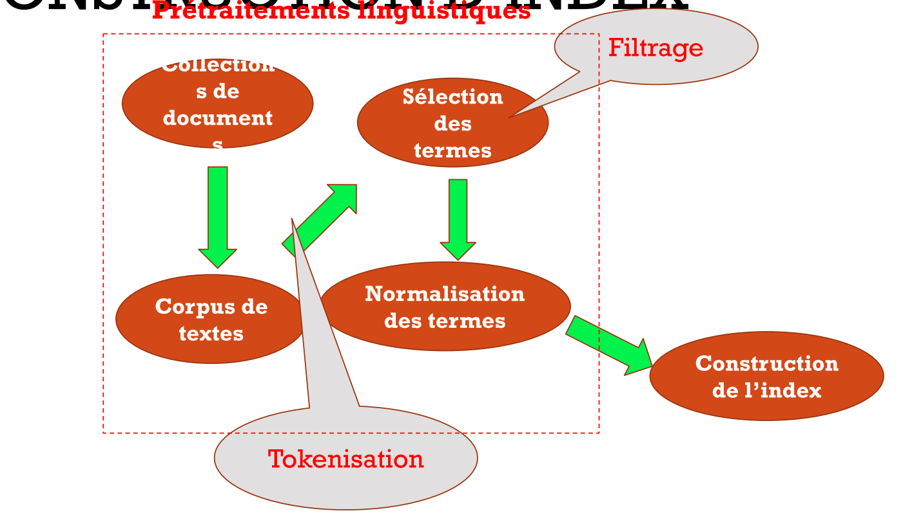
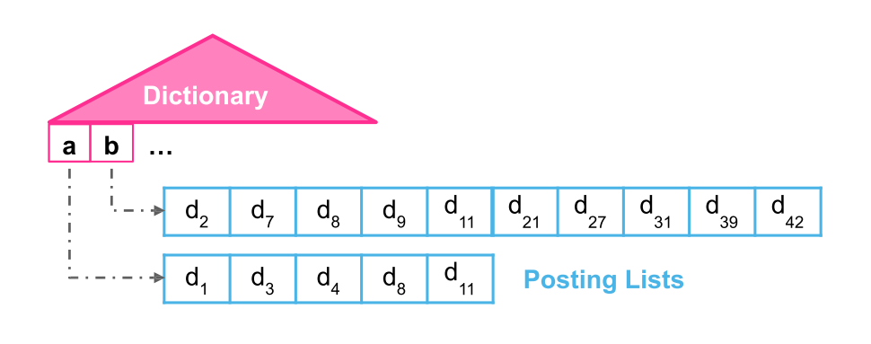
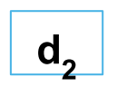
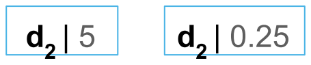
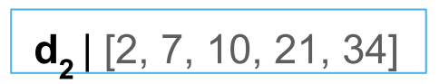
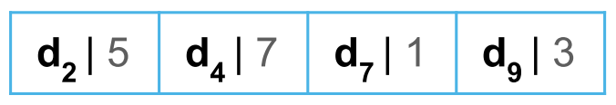
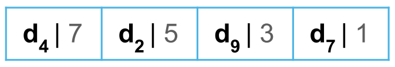
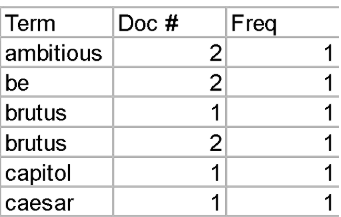
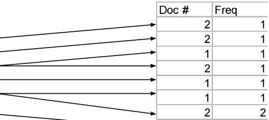

---
authors:
  - name: Mohamed Ben Salah
    url: https://github.com/medbensalah
---

# Cheat sheet

Author [@medbensalah](https://github.com/medbensalah)

## Indexation

### Definition

Processus permettant de construire un ensemble d'éléments
**clés** permettant de caractériser le contenu d’un
document / retrouver ce document en réponse à une requête

### Indexation Libre / Controlée

#### Indexation Libre

- Mots, termes des documents

#### Indexation Contrôlée

- Listes de termes prédéfinies
- Vocabulaire contrôlé
- Thésaurus

#### Construction d'index



#### Tokenisation

- Identification des élements élementaires
  - phonèmes
  - morphèmes
  - mots, ...
- Complexe en certains langues

#### Filtrae des mots vides "StopWords"

- Determinants
- pronons
- prépositions, ...

!!! parfois ces mots portent un sens<

#### Normalisation

- Normalisation textuelle
  - Unifier les termes
  - Enlever la ponctuation
  - La casse : réduction des lettres en miniscules
  - Enlever les accents
  - Unifier les dates et les valeurs monétraires

- Normalisation linguistique
  - Lemmatisation
    - verbe => infinitif
    - nom, adj, article => masculin singulier
  - Racinisation (Stemming)
  - Etiquetage
    - Associer aux mots leur catégorie morphosyntaxique (treeTagger)
  - Recherche de groupes de mots
    - n-grammes ; n > 1 / un n-gramme sera considéré comme un terme

#### Construction de l'index

- Algorithme naïf

  ```algorithm
  input requête q;
  
  for every document d in collection
        if d matches q
            add its docid to list L;

  output list L
  ```

- Index inversé
  - Construire une matrice d'incidence
  
|        | documents |
| ------ | :-------: |
| termes |   0 / 1   |

&nbsp;&nbsp;&nbsp;&nbsp;&nbsp;&nbsp;&nbsp;&nbsp;&nbsp;&nbsp;&nbsp;&nbsp;0: Le terme n'appartient pas au document

&nbsp;&nbsp;&nbsp;&nbsp;&nbsp;&nbsp;&nbsp;&nbsp;&nbsp;&nbsp;&nbsp;&nbsp;1 : le terme apparait dans le document

&nbsp;&nbsp;&nbsp;&nbsp;&nbsp;&nbsp;&nbsp;&nbsp;pmatrice éparse => représenter que les 1
+

- Composantes



**Dictionnaire:** en mémoire centrale permettant un accès rapide
aux termes et leurs informations

**Postings:** au niveau du disque et sauvegardant les
informations des termes et les identifiants des documents

Ce qu'on stocke dépend du modèle de la recherche :

- Recherche booléenne : L'identifiant du document est suffisant
    

- Recherche Rankée : Fréquence ou score du terme
  
    
- Recherche de proximité / de séquence : Fréquence ou score du terme
  
    

    Les liste de posting peuvent être triées selon:
- Document ID :
    

- Term Frequency :
    

- Construction d'un fichier inverse
  - Extraire les termes de chque document

| Termes | Document |
| ------ | :------: |
| terme  |   doc#   |

-
  - Trier les termes par ordre alphabétique
  
  

  - Indexation
  
  -  => 
  
  - Compression
  Minimiser le nombre de bits transférés

### Variable-Byte Encoding

Le bit du poids le plus fort est un **stop bit**

- Exemple:

13   = 00000000 00000000 00000000 00001101

VBE  : 10001101

- Exemple:

131  = 00000000 00000000 00000000 10000011

VBE  : 00000001 10000011

- Exemple:

1337 = 00000000 00000000 00000101 00111001

VBE  : 00001010 10111001

- Exercice

00000111 10011100 10000101 01111010 01011000 10111101

&nbsp;&nbsp;&nbsp;&nbsp;&nbsp;&nbsp;&nbsp;&nbsp;&nbsp;&nbsp;&nbsp;&nbsp;&nbsp;924&nbsp;&nbsp;&nbsp;&nbsp;&nbsp;&nbsp;&nbsp;&nbsp;&nbsp;&nbsp;&nbsp;&nbsp;&nbsp;&nbsp;&nbsp;&nbsp;&nbsp;&nbsp;&nbsp;&nbsp;&nbsp;5&nbsp;&nbsp;&nbsp;&nbsp;&nbsp;&nbsp;&nbsp;&nbsp;&nbsp;&nbsp;&nbsp;&nbsp;&nbsp;&nbsp;&nbsp;&nbsp;&nbsp;&nbsp;&nbsp;&nbsp;&nbsp;&nbsp;&nbsp;&nbsp;&nbsp;2010173
