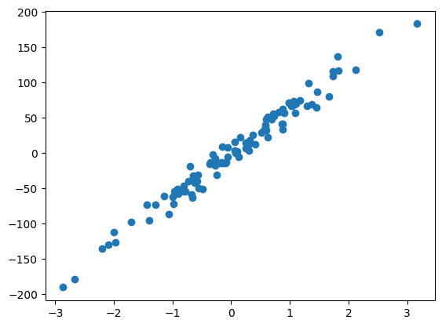
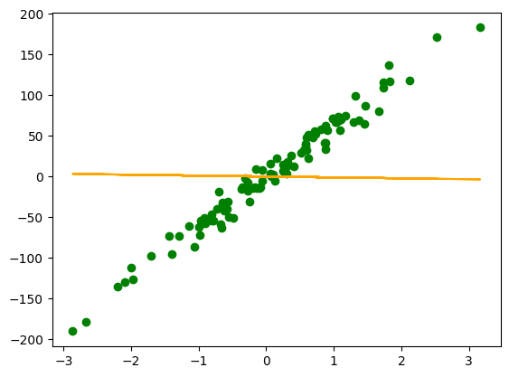
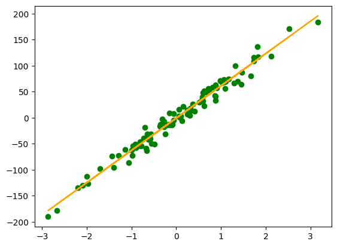
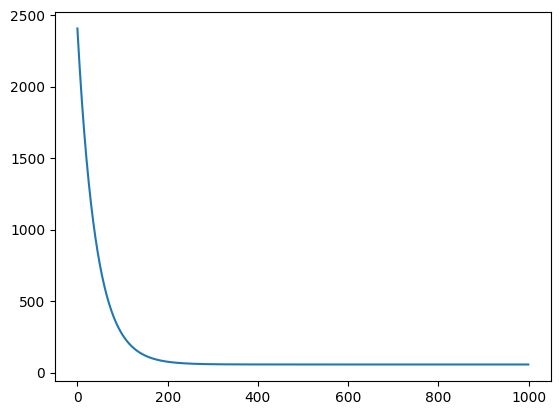
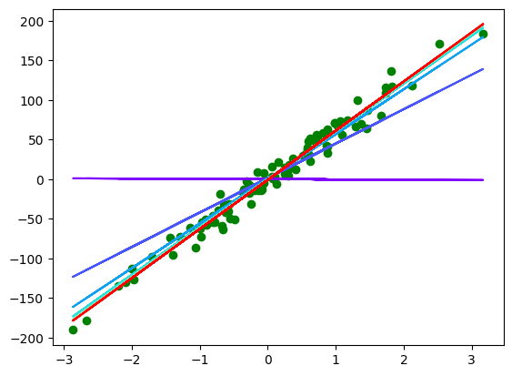
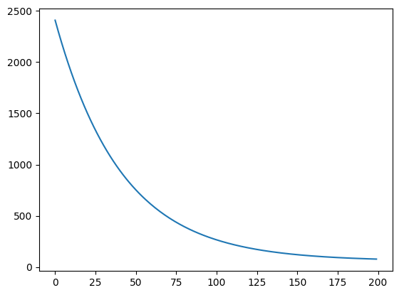
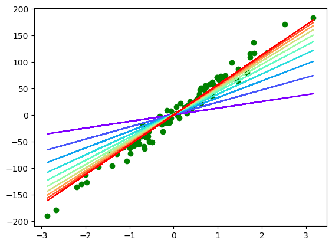

# Linear Regression

4 things to take in consideration:


1. __Dataset:__
    
    ($x$, $y$) with $x$ being the feature and $y$ being the target.

2. __Model:__

    represented by the function $f(x) = ax + b$, $a$ and $b$ being the parameters.

3. __Cost Function:__

    A function to compute the error between the predicted values and the targets.

    In our case, $J(a,b) = {{1 \over{2m}} \sum_{i=1}^{m} (f(x^{(i)}) - y^{(i)})^2 }$, $m$ being the number of rows.

4. __Minimisation Algorithm:__

    In our case, we are going to use the _Gradient Descent_.

    Basically, for each parameter $a_{i}$, we compute $a_{i}$ = $a_{i}$ - $\alpha$ $\frac{\partial J}{\partial a_i}(a)$.

    $\alpha$ being the _learning rate_.

## Transform this to a problem using matrices!

Let's $n$ is the number of features, $m$ is the number of rows. 

$x$ = 
$
\begin{pmatrix}
    x_{1}^{(1)} & x_{2}^{(1)} & x_{3}^{(1)} & \dots  & x_{n}^{(1)} \\
    x_{1}^{(2)} & x_{2}^{(2)} & x_{3}^{(2)} & \dots  & x_{n}^{(2)} \\
    \vdots & \vdots & \vdots & \ddots & \vdots \\
    x_{1}^{(m)} & x_{2}^{(m)} & x_{3}^{(m)} & \dots  & x_{n}^{(m)}
\end{pmatrix}
$ 
thus $X$ = 
$
\begin{pmatrix}
    x_{1}^{(1)} & x_{2}^{(1)} & x_{3}^{(1)} & \dots  & x_{n}^{(1)} & 1 \\
    x_{1}^{(2)} & x_{2}^{(2)} & x_{3}^{(2)} & \dots  & x_{n}^{(2)} & 1 \\
    \vdots & \vdots & \vdots & \ddots & \vdots & \vdots \\
    x_{1}^{(m)} & x_{2}^{(m)} & x_{3}^{(m)} & \dots  & x_{n}^{(m)}  & 1
\end{pmatrix}
$ 
$\in {\rm I\!R}^{m \times (n+1)}$

$y$ = 
$
\begin{pmatrix}
    y^{(1)} \\
    y^{(2)} \\
    \vdots \\
    y^{(m)}
\end{pmatrix}
$ 
$\in {\rm I\!R}^{m \times 1}$

And the parameters $\theta$ = 
$
\begin{pmatrix}
    a_{1} \\
    a_{2} \\
    \vdots \\
    a_{n} \\
    b
\end{pmatrix}
$ 
$\in {\rm I\!R}^{(n+1) \times 1}$


Finally we get the model $F = X\theta \in {\rm I\!R}^{m \times 1}$

As for the cost function $J(\theta) = {{1 \over{2m}} \sum_{i=1}^{m} (F - y)^2 } = {{1 \over{2m}} \sum_{i=1}^{m} (X\theta - y)^2 } \in {\rm I\!R}$

As for the gradient $\frac{\partial J}{\partial \theta}(\theta) = {{1 \over{m}} X^T(X\theta - y) } \in {\rm I\!R^{(n+1) \times 1}}$

Thus $\theta = \theta - \alpha \frac{\partial J}{\partial \theta}$


```python
import numpy as np
from sklearn.datasets import make_regression

x, y =  make_regression(n_samples=100, n_features=1, noise=10) # Here m=100 and n=1
y = y.reshape(y.shape[0], 1)
x.shape, y.shape

```


    ((100, 1), (100, 1))


```python
import matplotlib.pyplot as plt

plt.scatter(x, y)
```


    <matplotlib.collections.PathCollection at 0x7f179cdc6940>


    

    


```python
X = np.hstack((x, np.ones((x.shape[0], 1))))
X.shape
```


    (100, 2)


```python
theta = np.random.randn(X.shape[1], 1)
theta
```


    array([[-1.11140959],
           [ 0.15718568]])


```python
def model(X, theta):
    return X.dot(theta)

plt.scatter(x, y, c='g')
plt.plot(x, model(X, theta), c='orange')
```


    [<matplotlib.lines.Line2D at 0x7f179afe2550>]


    

    


```python
def cost_function(theta, X, y):
    return 1 / (2 * len(y)) * np.sum((X.dot(theta) - y) ** 2)
cost_function(theta, X, y)
```


    2466.3199193827004


```python
def gradients(theta, X, y):
    return 1 / len(y) * X.T.dot(X.dot(theta) - y)
gradients(theta, X, y)
```


    array([[-76.34230311],
           [ -4.87819021]])


```python
def gradient_descent(theta, X, y, learning_rate, n):
    for i in range(n):
        theta = theta - learning_rate * gradients(theta, X, y)
    return theta
final_theta =  gradient_descent(theta, X, y, 0.01, 1000)
```


```python
plt.scatter(x, y, c='g')
plt.plot(x, model(X, final_theta), c='orange')
```


    [<matplotlib.lines.Line2D at 0x7f179af63e80>]


    

    


And there you have it, we have created a linear model that represents our data!

Now, let's study the learning process.

Let's visualize the _cost function_'s variation, and the _linear model_ variation!


```python
def gradient_descent_v2(theta, X, y, learning_rate, n):
    costs = []
    thetas = []
    for i in range(n):
        theta = theta - learning_rate * gradients(theta, X, y)
        costs.append(cost_function(theta, X, y))
        thetas.append(theta)
    return {"theta": theta, "costs": costs, "thetas": thetas}
```


```python
result = gradient_descent_v2(theta, X, y, 0.01, 1000)
```


```python
plt.plot(range(1000), result["costs"])
```


    [<matplotlib.lines.Line2D at 0x7f179add55e0>]


    

    


```python
plt.scatter(x, y, c='g')
color = iter(plt.cm.rainbow(np.linspace(0, 1, 10)))
for i in range(10):
   c = next(color)
   plt.plot(x, model(X, result["thetas"][i * 100]), c=c)
```


    

    


What we can conclude is $n = 200$ is sufficient to train the model. Let's test it!


```python
result = gradient_descent_v2(theta, X, y, 0.01, 200)
```


```python
plt.plot(range(200), result["costs"])
```


    [<matplotlib.lines.Line2D at 0x7f179ad34430>]


    

    


```python
plt.scatter(x, y, c='g')
color = iter(plt.cm.rainbow(np.linspace(0, 1, 10)))
for i in range(10):
   c = next(color)
   plt.plot(x, model(X, result["thetas"][i * 20 + 19]), c=c)
```


    

    


