# Cheat sheet

Author [@Saief1999](https://github.com/Saief1999)

> This is a resume over the first few chapters of Information System Urbanization. Might come in handy in the exam.

## Chapter 1 : Introduction

### A. Architectures d'Entreprise

#### 1. Definition

Plan conceptuel, définit la structure et le fonctionnement des organisations.

Implique la pratique de l'analyse, de la planification, de la conception et de la mise en œuvre éventuelle de l'analyse sur une entreprise.

Les concepts d'architecture d'entreprise sont différents d’un profil à l’autre dans une même organisation

- Professionnels IT: Infrastructures, d'applications et de composants de gestion sous leur contrôle.  
- Architectes d'entreprise: Architectures logicielles, processus et orchestration  
- Intégrateurs: Assemblage de matériels et logiciels

#### 2. Importance

Aider les différents départements d'une entreprise à mieux comprendre le modèle d'entreprise et à articuler les défis et les risques commerciaux.

- **Alignement stratégique**

Unification et la coordination des processus départementaux au sein d'une organisation

Identification des lacunes de l’entreprise par tous ses acteurs

- Prise de décision plus éclairée.

#### 3. Couches d'une Architecture d'Entreprise

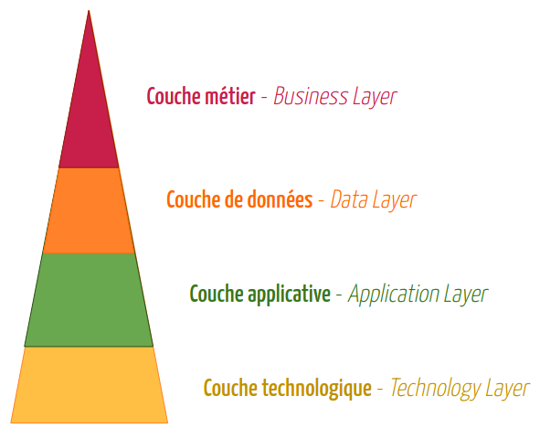

##### a. Couche métier - Business layer

Processus métier, workflows et règles qui articulent les autorités, responsabilités et politiques affectées. Décrit:

- Les objectifs stratégiques, politiques d’entreprise, et modèles opérationnels
- Décompositions fonctionnelles et modèles organisationnels
- Processus métier, workflows et règles qui articulent les autorités, responsabilités et politiques affectées
- Organisation des cycles, périodes et calendriers

#### b. Couche de données - Data layer

Concerne les informations et données collectées, organisées, sauvegardées et distribuées. A les caractéristiques suivantes:

- Architecture d’Information: Une vue globale du flux d’information de l’entreprise
- MDM: Master Data Management & BI: Business Intelligence
- Data quality: identifier, analyser, améliorer et mesurer la qualité des données, les problèmes d’intégrité et les efforts d’amélioration
- Abstraction des modèles de bases de données
- Gestion du cycle de vie des données

#### c. Couche applicative - Application layer

description rigoureuse des applications logicielles, par exemple:

- Un inventaire des applications et des diagrammes logiciels
- Les interfaces entre les applications qui sont: les événements, messages, etc.
- Modélisation des entités structurelles: composants logiciels réutilisables, applications et systèmes d’informations
- Définition des collaborations entre les applications ou services

##### d. Couche technologique - Technology layer

Couche technique, tout ce qui est materiel physique:

- Les middlewares
- Les environnement d’exécution des applications et frameworks
- Les serveurs et systèmes d’exploitation, d’authentification et d’autorisation.
- Les plateformes matérielles et serveurs hôtes
- Les systèmes de sécurité et de monitoring.
- Les bases de données et langages de programmation utilisés

### B. Frameworks d'Architectures d'Entreprise

### 1. ZF : Zachman’s Framework  

Représente les artefacts de conception de divers produits selon le public cible (perspective) ainsi que le contenu ou sujet de l’artefact (abstraction)

![[zachman.png]]

![[zachman2.png]]

#### 2. **EAP** : Enterprise Architecture Planning  

EAP permet de définir la façon d’approcher la création des deux premières lignes dans le framework de Zachman, le planner et le owner. ( La conception du système en tant que tel est en dehors du scope de EAP. )

EAP définit ce que les données, applications et technologies permettent de faire pour le bénéfice de l’entreprise.  

Définit 4 niveaux (Levels) et 7 composants

- **Level 1** Par où commencer? : Production d’un plan, couvrant les  décisions à prendre pour la méthodologie à utiliser, les parties impliquées et les outils nécessaires
- **Level 2** Où en sommes-nous aujourd’hui? : Définition des processus métiers et des systèmes et technologies actuellement utilisés.
- **Level 3** Où voulons-nous aller?
  - (1) définition des données nécessaires pour le métier
  - (2) définition des applications majeures nécessaires pour la gestion des données et des fonctions métier
  - (3) définition des plateformes nécessaires pour supporter ces applications
- **Level 4** Comment y arriver? :
  - Définition des plans d’implémentation des applications, une analyse coût/bénéfice, et un chemin clair pour la migration.

#### 3. **FEAF**: Federal Enterprise Architecture Framework  

Architecture d’entreprise de référence réalisée par le gouvernement fédéral aux États Unis.

C’est un framework spécifiquement réservé aux agences fédérales, contrairement aux autres frameworks plus génériques tels que Zachman ou TOGAF.

Ce framework est basé sur l’approche Zachman, comme c’est le cas pour EAP, par contre il inclut les trois premières colonnes.

Définit quatre niveaux d’architecture:

- Architecture métier: Ce qui est fait, par qui, comment et pourquoi  
- Architecture de données: Informations utilisées par l’agence pour réaliser le métier  
- Architecture d’application: Applications et logiciels qui traitent les données selon les règles métiers définies.  
- Architecture de technologie: Technologies de communication et matériel utilisé pour supporter les trois couches ci-dessus.

FEAF Définit un assortiment de modèles de référence appelé CRM (Consolidated Reference Model) qui développe une taxonomie commune pour décrire les ressources IT

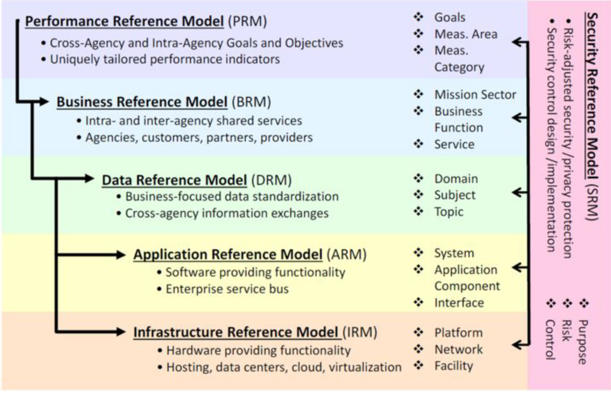

#### 4. **TOGAF** : The Open Group Architecture Framework

### C. TOGAF

Se base sur les 4 domaines d’architecture précédemment cités (métier, données, application et technologie), mais définit également d’autres domaines en combinant ces quatre couches:

- L'architecture d’information
- Les architecture de risque et de sécurité
- L’architecture digitale

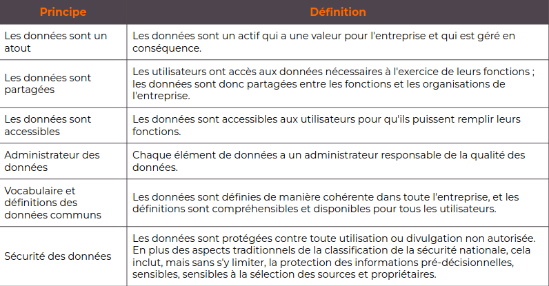
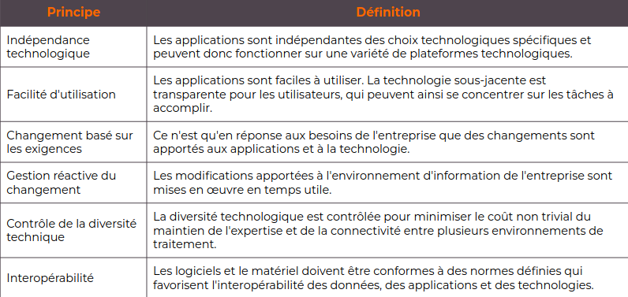

#### 1. ADM : Architecture Development Method

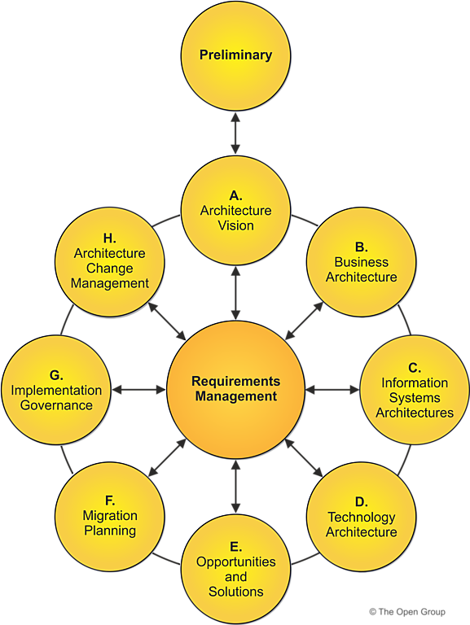

TOGAF ADM fournit un processus testé pour le développement des architectures.

ADM permet d’établir un EAF, de développer le contenu d’une architecture, et faire la transition et de gouverner la réalisation d’architectures.

Cycle itératif de définition et réalisation continues d’architectures. Permet une transformation contrôlée des entreprises, en réponse de leurs besoins et opportunités métiers.

- Phase 0 : Phase préliminaire : Activités de préparation et d’initiation pour créer l’architecture, inclut la personnalisation du framework TOGAF et la définition des principes d’architecture.  

- Phase A : Architecture Vision : Phase initiale du cycle de définition de l’architecture. Informations sur la définition de sa portée (scope), identification des parties prenantes, et l’obtention de l’accord nécessaire pour sa mise en place.

- Phase B : Business Architecture : Développement de l’architecture métier.  

- Phase C : Information Systems Architecture : Développement de l’architecture du SI.

- Phase D : Technology Architecture : Développement de l’architecture technologique.

- Phase E : Opportunities & Solutions : Planning initial d’implémentation et identification des livrables de l’architecture prédéfinie.

- Phase F : Migration Planning : Comment passer de l’architecture initiale vers l’architecture cible en finalisant un plan détaillé d’implémentation et de migration.  

- Phase G : Implementation Governance Définition d’un contrat d’architecture pour gérer le processus d’implémentation et déploiement, et attribution des rôle pour les intervenants.

- Phase H : Architecture Change Management Établissement de procédures pour gérer les modifications de la nouvelle architecture.  

- Phase Centrale : Requirements Management Définition du processus de gestion des besoins tout au long de l’ADM.

### 2. Contenu de l’architecture dans TOGAF

Le TOGAF Content Framework définit un cadre de catégorisation à utiliser pour structurer :

- La description de l'architecture  
- Les produits de travail utilisés pour exprimer une architecture  
- La collection de modèles qui décrivent l'architecture.

Il permet de:

- Fournir un modèle détaillé des produits du travail architectural  
- Favoriser la cohérence des résultats créés en suivant l’ADM.  
- Fournir une liste de contrôle complète des produits d'architecture qui pourraient  
être créés.  
- Réduire le risque de lacunes dans l'ensemble des livrables d'architecture finaux.  
- Aider l'entreprise à définir des concepts, des termes et des livrables d'architecture  
standard.

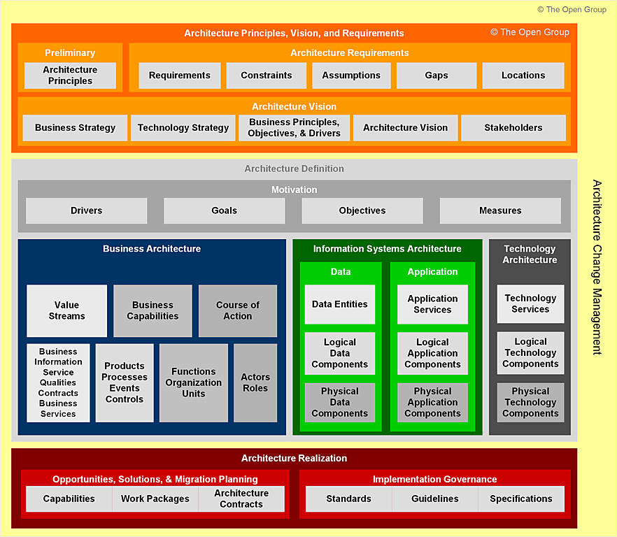

### 3. Artefacts d'architecture selon les phases de l'ADM

TOGAF définit plusieurs concepts pour satisfaire les besoins des différentes parties prenantes, tels que les blocs de construction, les catalogues, les matrices et les diagrammes.

- Blocs de constructions (building blocks)
  - Entités d'un type particulier dans le métamodèle
    - par exemple, un service commercial appelé "Bon de commande"
  - Peuvent également inclure des entités dépendantes ou contenues selon le contexte de l'architecture
    - par exemple, un service commercial appelé "Bon de commande" peut inclure  implicitement un certain nombre de processus, d'entités de données, de  composants d'application, etc.
- Catalogues
  - Listes de blocs de construction d'un type spécifique, ou de types apparentés, qui sont utilisés à des fins de gouvernance ou de référence
    - par exemple, un organigramme, indiquant les lieux et les acteurs
- Matrices
  - Grilles qui montrent les relations entre deux ou plusieurs entités du modèle
  - Utilisées pour représenter les relations qui sont basées sur des listes plutôt que sur des graphiques
    - par exemple, une matrice CRUD montrant quelles applications créent, lisent, mettent à jour et suppriment un type particulier de données.
- Diagrammes
  - Rendus du contenu architectural dans un format graphique pour permettre aux parties prenantes de récupérer les informations requises
    - par exemple, un diagramme de flux ou BPM

## D. Urbanisation des Systèmes d’Information

- Ensemble de règles s’imposant à tout ou partie du SI
- Définition de règles à respecter par les applications, pour obtenir un SI évolutif
- Les concepts manipulés s'apparentent à ceux de l'urbanisation de l'habitat humain  
(organisation des villes, du territoire)

-> Le processus d'urbanisation répond aux couches "Scope (contexte)" , "Business Model (conceptuel)" et "System Model (logique)" des Architectures d’Entreprise.

- Imposer des règles globales aux concepteurs de façon à tenir compte des contraintes techniques et d’exploitation  
- Respecter l’asynchronisme et indépendance des traitements  
- Unifier les interfaces

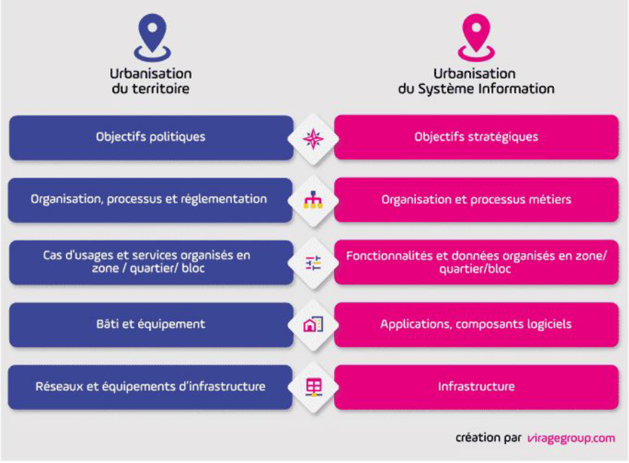

## Chapter 2 : Service Oriented Architecture

### A. Besoins

- Prise en compte de l’évolution des besoins fonctionnels à la  conception des application
- Éviter le décalage entre besoins métiers et leur réalisation
- Besoin de réutilisation des fonctionnalités ( Non fournie par le modèle MVC classique )
- Processus métiers de plus en plus inter-départementaux ( Coût considérable dans la gestion des flux entre départements )

Procédure et fonctions -> Module(Groupe de fonctions) -> Objet(Represente une Entité du monde physique) -> Composant -> Service

### B. Notion de Service

- Ensemble de fonctionnalités qui ont un sens
- Expose un petit nombre d’opérations offrant un traitement de bout en bout
- Est implémenté par un fournisseur et utilisé par un  consommateur

- Large Granularité (Coarse-grained) : Englobe plusieurs fonctions
- Interface : Implémente 1+ interfaces
- Localisable: *find*
- **Instance unique** : Design pattern singleton
- Couplage faible (loosely-coupled) : services connectés par des standards assurant le découplage
- Synchrone ou Asynchrone

Cohesion : Degree to which a module performs one and only one function. All elements of component are directed towards performing the same task

Coupling : Degree to which a module is connected to other modules in the  
system.

**Les services de présentations ou de référencement** : vers les informations affichées et les formulaires de saisies de données.  

**Les processus métiers** : composés de tâches décrites et faisant appel éventuellement à d’autres services.  

**Les services de gestion et d’accès aux bases de données** : permettent la gestion des données partagées

**Les services d’intégration** : en charge de la messagerie ou l’échange de données tant à l’intérieur que vers l’extérieur comme la gestion des courriers électroniques

### C. Architecture Orientée Services : Définition et Principes

#### 1. Définition

**SOA** : Style d’architecture organisé à partir de services métiers communs mutualisés pour un ensemble de lignes métiers ou d'applications

Permet d’intégrer et de manipuler les différentes briques et composants applicatifs d’un système informatique et de gérer les liens qu’ils entretiennent

Objectifs :
-> Décomposer une fonctionnalités en un ensemble de fonctions basiques (services) fournies par des composants  
-> Décrire finement le schéma d’interaction entre ces services

#### 2. Principes de la SOA

- Diviser pour régner : Substituer la découpe strictement applicative par une structuration en composants plus réduits et potentiellement plus simples à faire évoluer.
- Alignement métier : Construire et organiser le système à partir des réalités métiers, qui doivent se retrouver dans ses constituants.
- Neutralité technologique :
  - Assurer une indépendance totale entre les interfaces et les implémentations.
  - L'élément qui utilise un service ne doit pas être contraint ni par la technologie d’implémentation, ni par sa localisation (potentiellement distribué).
- Mutualisation :
  - Favoriser la réutilisation de services métiers par plusieurs lignes métiers  ou applications.
  - Permettre la construction de services de haut niveau par **combinaison de  services existants**.
- Automatisation des processus métier :
  - Isoler la logique des processus métiers sur des composants dédiés qui  prennent en charge les enchainements de tâches et les échanges de flux d’information.
- Echanges orientés Document : Les informations échangées par les services possèdent une structure propre, guidée par les besoins métiers.

### D. Elements de base de la SOA

Vue externe /spécification :

- Expose la facette service proprement dite Constituée:
  - d’un ensemble d’opérations de service regroupées en interfaces
  - appareillage pour les utiliser (types de données échangées, contrat de service, propriétés...)
- Vue interne :
  - Décrit le contenu du composant, **Masquée aux consommateurs du composant**

**Participants**:

- Fournisseurs de service
- Consommateurs de service

**ESB** : Bus de communication

- Colonne vertébrale reliant les participants à travers les interfaces de service
- Possibilité de modifier les implémentations ou de remplacer les composants sans changer la structure du système

**Contrat de Service** : Détaille les conditions d'utilisation du Service ( Syntax, protocole, Contraintes : Qos, SLA(Service Level Agreement), ...

**Données d'échange** : Informations véhiculées entre les participants à travers l’invocation des opérations de service

- Données persistants : Gérées par les BD

### E. SOA et Processus

Objectif : Centraliser la logique d’un processus dans un composant dédié, qui prend en charge l’enchaînement des règles de gestion associées.

Délivre une valeur ajoutée tangible à l’extérieur par une collaboration de plusieurs unités et acteurs

Est transverse : entre plusieurs départements, unités, acteurs...

## Chapter 3 : Entreprise Service Bus

### A. Besoins des ESB

- Construction des SI:
  - Chaque domaine métier bâtit un sous-système qui lui est propre
  - Utilisation de technologies hétérogènes, **rarement interopérables**
- Problématiques d’intégration:
  - Comment déclencher, en réponse à un sous-système donné, un traitement dans un autre sous-système hétérogène?
  - Comment assurer la consistance et propagation des données entre plusieurs sous-systèmes?
- Deux types de solutions:
  - Les outils ETL (Extract-Transform-Load)
  - Les solutions middleware

#### 1. Outils ETL

Réponse à la problématique: Assurer la consistance et  propagation des données entre plusieurs sous-systèmes  

Permettent la synchronisation, consolidation et propagation des données entre sous-systèmes hétérogènes

- Extraction des données du système maître
- Transcodage et traitement de ces données
- Mise à jour des systèmes fils

Apparus à l’origine pour le chargement des datawarehouses

**Inconvénients**:

- Approche centrée sur les données
- Ne permet pas de résoudre la problématique d’intégration des processus

#### 2. Middlewares Network Centric

Fournissent une infrastructure technique pour la médiation entre deux ou plusieurs systèmes.

##### 2.1 MOM

- Système Store and Forward.
- Sémantique asynchrone : Le client construit un message et  le transmet au middleware, qui le route vers le ou les systèmes cibles.
- Pas de couplage technique entre les participants.
- **Solutions principalement propriétaires** : Toutes les parties doivent connaître le mode d’interfaçage du middleware.
- **Capacités de routage limitées**, obligeant à configurer explicitement les routes à prendre.

##### 2.2 ORB (Object Request Broker)

- S’appuie sur la spécification CORBA
- Sémantique d’invocation point à point synchrone ou asynchrone, avec un protocole et encodage standardisés
- **Objectif** : architecture d’intégration universelle
- **Inconvénients** :
  - complexité de mise en œuvre, et problèmes d’interopérabilité des implémentations (contrairement aux promesses de la spécification)
  - Couplage fonctionnel fort
  - Solutions très techniques

##### 2.3  EAI : Entreprise Application Integration

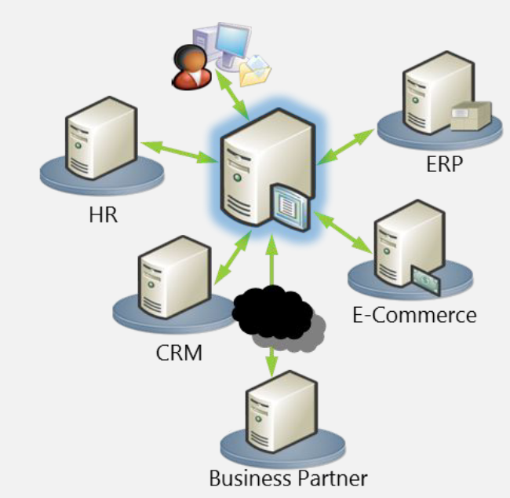

Architecture Hub and Spoke (réseau en étoile): Un composant central :

- Assure la médiation physique entre le client et sa cible
- Prend en charge les problématiques techniques de bas niveau (localisation,  disponibilité, communication, transcodage, traces, sécurité...)

Permettent d’assurer la transformation des données pour limiter le  couplage fonctionnel entre systèmes

Permettent d’appliquer des règles de routage sophistiquées  

Jouent le rôle d’orchestrateur : hébergent des processus métier de haut niveau

**Inconvénients**:

- Architecture propriétaire :
  - protocole d’échange et de transport
  - technologie interne
  - Formats et encodages des données
- SPOF (Single Point of Failure)
- **Mélange de rôles (médiation et orchestration)** -> Brique complexe

##### 2.4 ESB

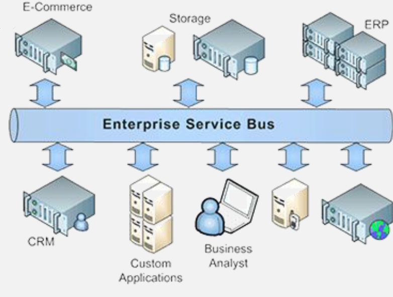

Les EAI se sont transformés en deux types de produits:

- Les ESB pour les fonctions d’interconnexion et de médiation
- Les solutions de type BPM pour l’orchestration des processus

Contrairement aux EAI, les données ne doivent pas être ramenées à l’ESB pour être traitées, mais sont envoyées aux applications via des connecteurs distants

Construit conformément aux principes SOA :

- Ses différentes parties sont faiblement couplées
- Peuvent être déployées séparément si nécessaire

ESB s’appuient en général sur des standards

**Définition** : Architecture de services distribuée, qui inclut un modèle  
de conteneur léger pour héberger des composants  
d’intégration comme services distants  

Permet de :

- Délivrer des messages entre applications et services  
- Réaliser les transformations des données  
- Router les messages selon leur contenu

Framework de sécurité flexible + Infrastructure de gestion qui permet de configurer,  déployer et gérer vos services distants

### B. Rôle des ESB dans une SOA

- **Réconcilier les mondes hétérogènes**
  - Standards d’interopérabilité ou connecteurs spécialisés
  - ESB apporte une couche d’abstraction vis à vis des technologies utilisées dans le SI
  - Ne dépend pas d’un SE ou d’un langage
  - Supporte plusieurs standards : WS, XML, JCA
  - Offre un panel ouvert de connecteurs spécialisés vers les  différentes briques du SI (mainframes, applications  propriétaires, progiciels...)
- Médiation et Routage:
  - Support de différentes sémantiques d’échange (synchrone,  asynchrone...)
  - Gestion des règles de routage sur les messages
  - Transformation et conversion de messages
  - Validation des données entrantes ou sortantes
- Découpler consommateurs et fournisseurs de services
  - Consommateur ne voit que l’ESB, et ne connaît ni le format ni le protocole utilisé par le fournisseur
- Agréger les services de niveau N pour construire des services de  niveau N+1
  - Si l’agrégation est complexe ou nécessite des structures de contrôle de flux d’exécution, il utilise un moteur d’orchestration (BPEL par exemple)
- Tracer les messages :
  - Traçabilité et monitoring des traitements
  - Peut utiliser une solution tierce pour adresser les problématiques de SLA, QoS, BAM (Business Activity Monitoring)...
- Exposer des services d’applications qui ne supportent pas la fonctionnalité de médiation (Mainframes ou progiciels)
- Mutualiser les accès aux applications
  - Mieux gérer les ressources
  - Contrôler la charge
  - Appliquer des règles de sécurité ou priorité
- Minimiser les coûts des connecteurs
  - Le connecteur est déployé une seule fois sur l’ESB au lieu d’être déployé sur chaque application cliente
- Implémenter un système de cache pour décharger certaines applications
- Gestion de la sécurisation des services:
  - Authentification / Autorisation / Confidentialité / Audit

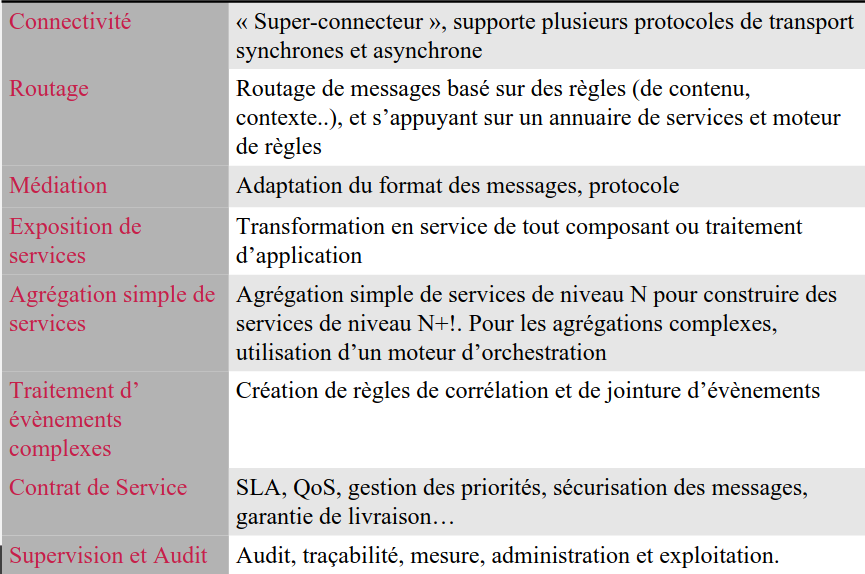

**Risques** :

- Un ESB n’est pas nécessaire au démarrage d’une SOA
  - Nécessité d’une réflexion plus large au niveau du SI et d’un certain niveau de maturité de la SOA.
  - Il faut d’abord définir la démarche, méthode, organisation et implémentation de la SOA.
- Un ESB ne doit pas être considéré comme un orchestrateur de services
- Un ESB ne doit pas embarquer trop de métier dans les médiations qu’il propose.
- L’ESB peut devenir un goulot d’étranglement
  - Plus les médiations sont complexes, plus il y’a perte de performances

### C. Cas d'utilisation d'un ESB

#### 1. Couplage Lâche

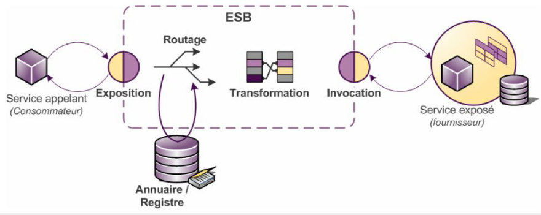

- **Exposition** : Le consommateur ne connaît que l’ESB, il invoque le service que ce dernier lui expose
- **Routage** : ESB détermine le fournisseur de service à invoquer
- **Transformation** : ESB réalise une médiation de format vers celui pris en charge par le fournisseur
- **Invocation** : ESB invoque le fournisseur

#### 2. Composition / Agrégation de services

ESB expose un service virtuel qu’il construit par composition ou agrégation de plusieurs autres services.

-> semblage simple de services, pas une orchestration de processus

#### 3. Gestions de versions

2 cas :

- Versions incompatibles : Le choix d’une version se fait par routage
- Versions compatibles : ESB appelle la nouvelle version en appliquant une transformation des données.

#### 4. Gestion de la Qos

QoS : temps de réponse moyen / fraîcheur des données

- ESB peut déterminer quelle implémentation invoquer en fonction de la QoS désirée (utilisation d’un moteur de règles)
- ESB peut géolocaliser les services, pour choisir le plus approprié

#### 5. Intégration avec solution d’orchestration (Important)

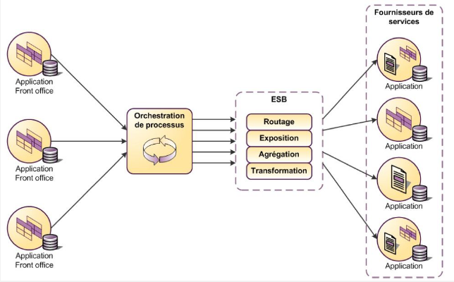

Éviter de lier fortement l’orchestrateur de processus avec les services qu’il appelle

- ESB convertit les données au format de conception du processus
- ESB expose tous les services avec la même technologie pour simplifier la réalisation du processus
- ESB crée un nouveau service en agrégeant plusieurs services existants

#### 6. Médiation Inter-domaine et Intra-domaine

Domaines :

- équipes différentes
- plannings différents
- budgets différents

- ESB introduit aux frontières des domaines
- Dé-corrélation et dé-couplement des appels entre domaines
- ESB peut être utilisé dans un échange B2B

#### 7. Exposition de services ( Comme un API Gateway )

- Exposition des services d’une application existante (legacy)
- Interrogation des systèmes existants pour créer les services du SI, grâce à des connecteurs dédiés
- Possibilité de créer une instance d’ESB distincte du médiateur, si les services exposés ont vocation à durer

## Chapter 4 : Composition des Services

### A. Composition de services (General)

Implémentation d’une application (offerte comme service) dont la  
logique implique l’invocation d’opérations offertes par d’autres  
services

- Le nouveau service est appelé **service composite**
- Les services invoqués sont des **composants de service**

Du point de vue du client, un service composite et un service  
basique (implémenté par un langage de programmation  
traditionnel) sont in-distinguables.

Notion de Service *Mashup* :

- Forme plus légère de composition
- Pour les applications web
- Implique l'intégration dans un site web de contenus provenant d'autres sites

Capacité d’invoquer les services d’une manière asynchrone

Gestion des exceptions et de l’intégrité transactionnelle. Les études montrent que presque 80% du temps de construction des processus métier est passé dans la gestion des exceptions

**Deux approches principales**: Orchestration et Chorégraphie

### B. Orchestration de services

- L’approche la plus commune.
- La séquence d’étape est définie dans un processus, avec  conditions et exceptions
- Un contrôleur central est ensuite créé pour implémenter la séquence
- Les étapes individuelles d’une séquence sont implémentés par des opérations sur des services
- **Pour des compositions de services simples**, l’orchestration est faite dans le code (Java, C#...) résidant dans le composite
- **Pour des orchestrations complexes**, un outil est utilisé pour :
  - Créer un modèle visuel d’une séquence
  - Générer le code qui exécute cette séquence dans un environnement d’exécution dédié
=> Approche BPM (Business Process Model)

#### Résumé de l'orchestration des Services

- Définit un seul maître contrôlant tous les aspects du processus
- Supporte une vue graphique de la séquence d’exécution
- Se couple facilement avec SOA
- Présente un bon point de départ, mais un passage à l'échelle difficile pour les processus complexes
- Supporté par la plupart des outils

Approche centralisée autour du moteur de composition

- En cas de panne, plus de composition

Schéma de composition statique

- En cas de changement dans les besoins, le schéma devient invalide

### C. Chorégraphie de services

- Dédiée
  - Aux **processus complexes** ayant plusieurs parties qui interagissent
  - Aux systèmes basés sur les évènements et sur les agents
- Des règles déterminent le comportement de chaque participant individuel d’un processus
- Le comportement global du processus est basé sur l’interaction des différentes parties, chacune suivant son propre rôle de manière autonome.
- Deux approches:
  - Basée sur les messages
  - Basée sur les composants fonctionnels

#### 1. Basée sur les messages

- Basée sur l’examen des messages entre les participants dans un processus
- Le comportement est défini par la capture des contrats de  messages entre les parties en collaboration
- Supporté par le standard WS-CDL (Web Service Choregraphy  Definition Language)
- Souvent utilisé pour les applications B2B (entre entreprises)
- Besoin de spécifier uniquement l’échange des messages (syntaxe, sémantique, comportement)

##### 1.1 WS-CDL

- Succède à WSCI (Web Services Choreography Interface)
- Décrit les messages qui sont impliqués dans l’échange collaboratif entre services
- Ne définit pas de processus métier exécutable (contrairement à BPEL)
- Contient un ensemble d’interactions, représentant les échanges de messages entre parties
- Décrit l’ordre des messages dans lequel ils doivent être observés

#### 2. Basée sur les composants fonctionnels

- Basée sur la configuration des composants du processus
- On définit le comportement des composants individuels et on laisse le comportement du processus émerger quand chaque instance de processus évolue.
- **Exemple : Implémentation du routage dans les différents composants avec de simples règles**
- Ressemblance avec les systèmes à base d’agents ( BPEL4Chor)

#### Résumé de la chorégraphie de services

- Le comportement global du processus émerge du travail des  différentes parties. Aucune perspective globale n’est nécessaire
- Les processus complexes sont décomposés en agendas de travail **où chaque élément autonome contrôle son propre agenda**.
- Se couple facilement avec les systèmes basés sur les événements et sur les agents
- Est généralement plus difficile à démarrer, mais la mise à l'échelle à des processus complexe est plus facile
- Les représentations graphiques peuvent être dérivées des processus -> La forme sucéde à la fonction

- Collaborations et partenaires statiques
  - Si les besoins ou partenaires changent, les collaborations deviennent impossibles
- Pas de langage pour exprimer les besoins
  - Les travaux existants proposent une chorégraphie statique

### D. Orchestration vs Chorégraphie

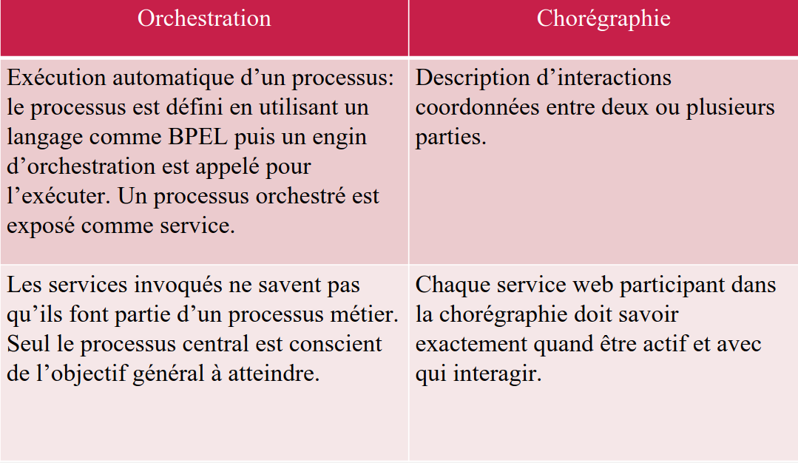

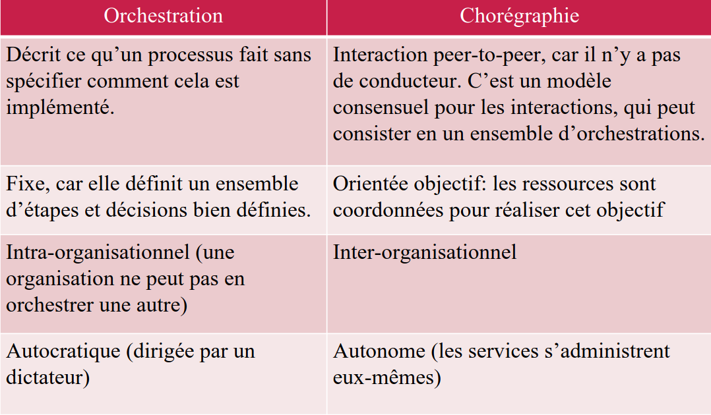

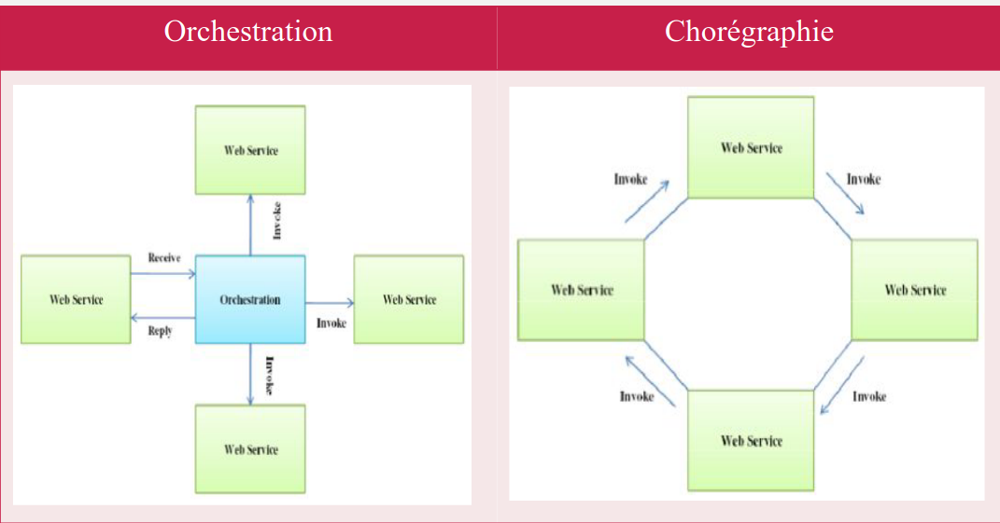

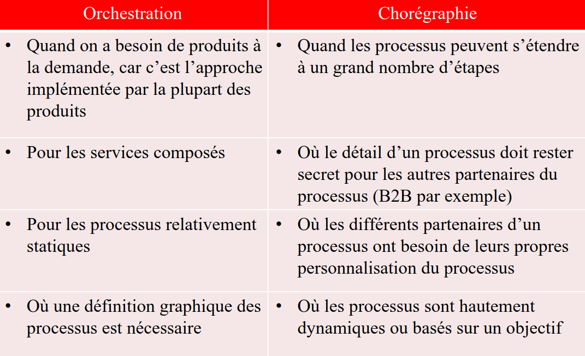
