---
authors:
  - name: Rami Zouari
    url: https://github.com/ramizouari
---

# Cheat sheet

## 1. Automate à États Finis

### 1.1 Définition

Une automate est un quintuplé $\mathcal{A}=(V,\Sigma,q_0,F,\delta)$ avec:

- $V$ est l'ensemble d'états finis
- $\Sigma$ est un ensemble finis représentant l'alphabet qui peut être exécuté par l'automate
- $q_0\in V$ est l'état initial de l'automate
- $F \subseteq V$  est l'ensemble des états finaux de l'automate
- $\delta \subseteq V\times \Sigma \times V$ est la relation de transition

### 1.2 Transition

On dit que $e=(u,a,v)$ est une transition si $e\in \delta$  

Informellement, si l'automate est dans un état $u$ et elle reçoit $a$ , un des états possibles qu'elle peut passer à est l'état $v$

### 1.3 Automate déterministe

Une automate déterministe est une automate $\mathcal{A}=(V,\Sigma,q_0,F,\delta)$ est une automate dont laquelle $\delta$ est une fonction partielle.

C'est à dire $\delta:\mathcal{T}\rightarrow V$ est une fonction avec $\mathcal{T}\subseteq V\times \Sigma $

Informellement, c'est à dire que si l'automate est dans un état $u$ et elle reçoit $a$ , elle ne peut passer qu'au maximum un seul état, et ça doit être l'état $\delta(u,a)$

### 1.4 Exécution, Chaîne & Langage Reconnu

#### 1.4.1 Exécution

Une exécution possible d'une automate de longueur $n\in\mathbb{N}^*$ est un tuple $\mathcal{E}=(u_0,s_0,u_1,s_1,\dots,u_{n-1},s_{n-1},u_n)$ avec:

- $u_0=q_0$
- $\forall i \in\{0,\dots,n\},\quad u_i\in V$
- $\forall i \in\{0,\dots,n-1\},\quad s_i\in \Sigma$
- $\forall i\in\{1,\dots,n\},\quad (u_{i-1},s_{i-1},u_i)\in \delta$

- $u_n\in F$

Toute autre séquence va être rejetée par l'automate

#### 1.4.2 Chaîne et Langage Reconnue

Une chaîne $S=s_0\dots s_{n-1}\in\Sigma^*$ est reconnue par l'automate $\mathcal{A}$ si il exécute une exécution $\mathcal{E}=(u_0,s_0,u_1,s_1,\dots,u_{n-1},s_{n-1},u_n)$

Le langage reconnue $\mathcal{L}\subseteq \Sigma^*$ par $\mathcal{A}$ est l'ensemble de toutes les chaînes reconnues

### 1.5 Exemple

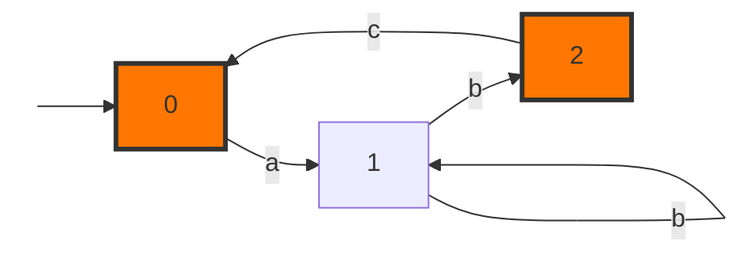

L'exemple ci dessus représente une automate $\mathcal{A}=(V,\Sigma,q_0,F,\delta)$ avec:

- $V=\{0,1,2\}$

- $\Sigma=\{a,b,c\}$

- $q_0=0$

- $F=\{0,2\}$ représente les états finaux

- $\delta$ est représenté par:

  |       | a   | b      | c   |
  | ----- | --- | ------ | --- |
  | **0** | 1   |        |     |
  | **1** |     | 1 ou 2 |     |
  | **2** |     |        | 0   |

1. $(1,b,1)$ et $(1,b,2)$ sont deux transitions. L'automate n'est pas déterministe car il y a deux transitions possibles à partir de $1$ avec le caractère $b$

2. Une exécution possible est: $(0,a,1,b,1,b,2,c,0)$, elle reconnaît la chaîne $abbc$

3. Le langage reconnue par $\mathcal{A}$ est représenté par l'expression régulière:

$$
(ab^+c)^* (ab^+)^?
$$

*Démonstration*
$$
\begin{align}
L_1&=bL_1+bL_2\\
\implies L_1&=b^*bL_2\\
L_2&=cL_0+\epsilon\\
L_0&=aL_1+\epsilon\\
&= ab⁺L_2+\epsilon\\
&=ab^+cL_0+ab^++\epsilon \\
\implies L_0&=(ab^+c)^* (ab^++\epsilon) \\
&=(ab^+c)^* (ab^+)^?

\end{align}
$$

## 2. Produits D'automate

### 2.1 Définition

Soit $\mathcal{A}_1=(V_1,\Sigma_1,q_1,F_1,\delta_1), \ \mathcal{A}_2=(V_2,\Sigma_2,q_2,F_2,\delta_2)$  deux automates.

Le produit cartésien entre $\mathcal{A}_1$ et $\mathcal{A}_2$ est l'automate $\mathcal{A}_3=(V_3,\Sigma_3,q_3,F_3,\delta_3)$ tels que:

- $V_3=V_1\times V_2$

- $\Sigma_3=\Sigma_1 \cup \Sigma_2$

- $F_3=V_1\times F_2 \cup F_1\times V_2 $

- $q_3=(q_1,q_2)$

- $\delta_3$ est définie par:
  $$
  \delta_3\left((u,u'),a,(v,v')\right)  \iff
  \delta_1(u,a,v) \ \text{and} \ u'=v'  \ \text{or} \ \delta_2(u',a,v') \ \text{ and } u=v
  $$
  
### 2.2 Explication Informelle

Informellement, le produit construit une automate "système" $\mathcal{A}_3$ représentant les deux automates ensembles.

Dans cette automate, le fonctionnement des deux sous-automates sont mutuellement indépendants.

C'est à dire, si $\mathcal{A}$ subit une transition avec un caractère $a$, exactement un des deux automates va subir une transition avec ce caractère.

### 2.3 Exemple

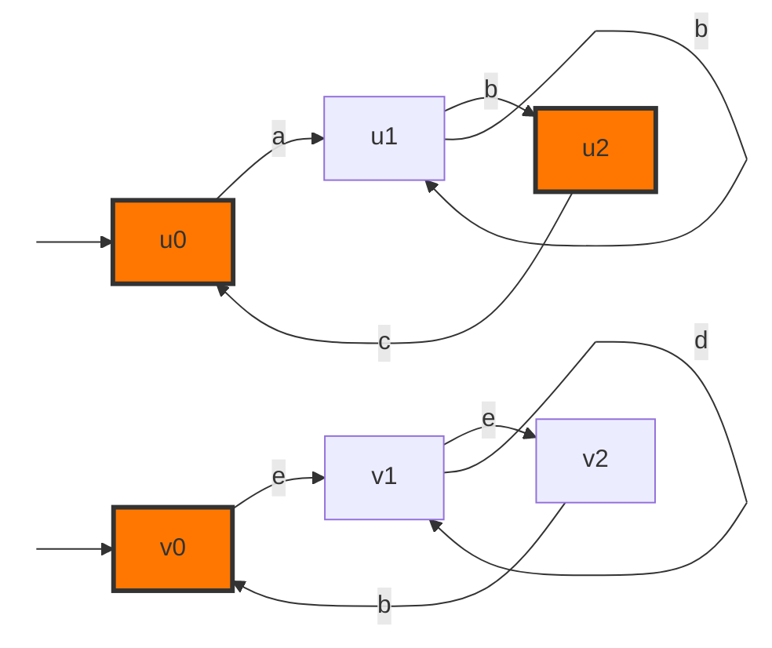

Le produit entre les deux automates est l'automate suivante:

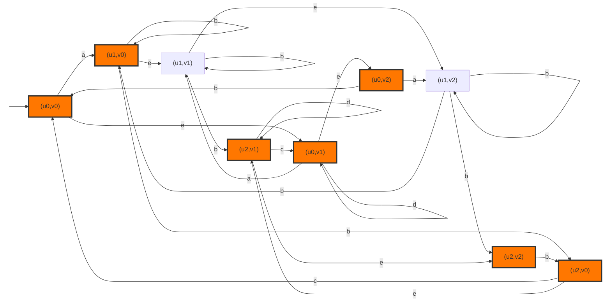

## 3. Produits Synchronisés D'automates

### 3.1 Notations

- Soit $\mathcal{A}_1=(\Sigma_1,V_1,q_1,\delta_1,F_1),\mathcal{A}_2=(\Sigma_2,V_2,q_2,\delta_2,F_2)$ deux automates

- Soit $\Sigma_\cap=\Sigma_1\cap\Sigma_2$ l'alphabet commun entre les deux automates. C'est l'alphabet dont lequel on va appliquer la synchronisation

### 3.2 Définition

La composition parallèle entre $\mathcal{A}_1$ et $\mathcal{A}_2$ est l'automate $\mathcal{A}_3=(\Sigma_3,V_3,q_3,\delta_3,F_3)$   définie par:

- $\Sigma_3=\Sigma_1\cup \Sigma_2$

- $q_3=(q_1,q_2)$

- $V_3=V_1\times V_2$

- $F_3=\left(F_1\times V_2\right)\cup \left(V_1\times F_2\right)$

- $\delta_3$ est définie par:
  $$
  \delta_3\left((u,u'),a,(v,v')\right) \iff \text{one of the following: } \cases
  {
  \big[\delta_1(u,a,v) \ \text{and} \ u'=v'  \ \text{or} \ \delta_2(u',a,v') \ \text{ and } u=v \big] \ \text{and} \ a\notin \Sigma_{\cap} \\
  \delta_1(u,a,v) \ \text{and} \ \delta_2(u',a,v') \ \text{and} \ a\in \Sigma_\cap
  }
  $$
  
### 3.3 Explication Informelle

Informellement, le produit synchronisé construit une automate "système" $\mathcal{A}_3$ représentant les deux automates ensembles.

Dans cette automate, il y a des parties qui doivent être synchronisées, et des parties qui vont être exécutées indépendamment:

- L'automate $\mathcal{A}$ ne peut faire une transition en acceptant un caractère $a$ de l'alphabet commun, que si chacune des deux automates $\mathcal{A}_1$ et $\mathcal{A}_2$ peut accepter $a$ à partir de son état courant.
- Si le caractère $a$ n'est pas commun, alors $a\in \Sigma_i$, dans ce cas, seul $\mathcal{A}_i$ fait une transition avec $a$. Plus précisément:
  - $\mathcal{A}_i$ fait la transition en acceptant $a$ à partir de son état courant
  - $\mathcal{A}_j$ reste invariant avec $j\neq i$

Cette construction peut être généralisé à plusieurs automates.

### 3.4 Exemple

L'exemple ci dessus représente deux automate $\mathcal{A}_1=(V_1,\Sigma_1,q_1,F_1,\delta_1), \mathcal{A}_2=(V_2,\Sigma_2,q_2,F_2,\delta_2)$ avec:

- $V_1=\{u_0,u_1,u_2\}$, et $V_2=\{v_0,v_1,v_2\}$
- $\Sigma_1=\{a,b,c\}, \ \Sigma_2=\{b,d,e\}$ et $\Sigma_\cap=\{b\}$
- $q_1=u_0$ et $q_2=v_0$
- $F_1=\{u_0,u_2\}$  et $F_2=\{v_0\}$

Le produit synchronisé est:

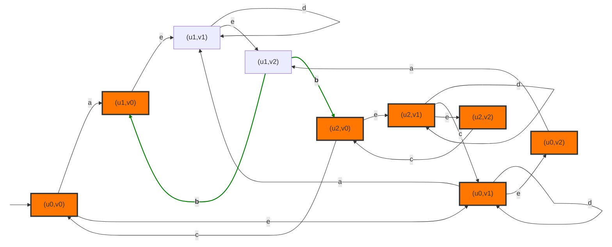

Les transitions en **verts** sont les transitions synchrones.

## 4. Équivalence entre Graphe directe et Fonction booléenne

### 4.1 Notations

- Soit $\mathcal{G}=(\mathcal{V},\mathcal{E})$ un graphe directe fini avec $\mathcal{E}\subseteq \mathcal{V}\times \mathcal{V}$
- Soit $\DeclareMathOperator{\Adj}{Adj}\Adj(u)=\{v\in\mathcal{V} / \quad (u,v)\in\mathcal{E}\}$ la liste d'adjacence d'un nœud $u\in\mathcal{V}$

- Soit $n=\lvert \mathcal{V}\vert$ le nombre de nœuds dans $\mathcal{G}$. En particulier, pour la simplicité, on pose que $n=2^m$ et $\mathcal{V}=\{0,\dots,n-1\}$

- Pour $k\in\{0,\dots,2^m-1\}$, soit $b_k=b_{k,m-1}\dots b_{k,0}$ la représentation binaire de $k$

- Soit $x_0,\dots,x_{m-1},x'_0,\dots,x'_{m-1}$ $2m$ variables booléennes.

- Soit $e(x,0)=x$ et $e(x,1)=\bar x$

- Soit $F$ tel que:
  $$
  F(k,x_0,\dots,x_{m-1})=\prod_{i=0}^{m-1}e(x_i,b_{k,i})=\prod_{b_{k,i}=0}x_i \times \prod_{b_{k,i}=1}\bar x_i
  $$
  
### 4.2 Fonction booléenne à partir d'un graphe

On définit la fonction $f$ par:
$$
\DeclareMathOperator{\Adj}{Adj}
f(x_0,\dots,x_{m-1},x'_1,\dots,x'_{m-1})=\sum_{i=0}^{n-1}\sum_{j\in\Adj (i)} F(i,x_0,\dots,x_{m-1})\times F(j,x'_0,\dots,x'_{m-1})
$$
Cette fonction binaire va encoder le graphe $\mathcal{G}$

##### Exemple 1

Soit $\mathcal{G}=(\mathcal{V},\mathcal{E})$ le graphe suivant:

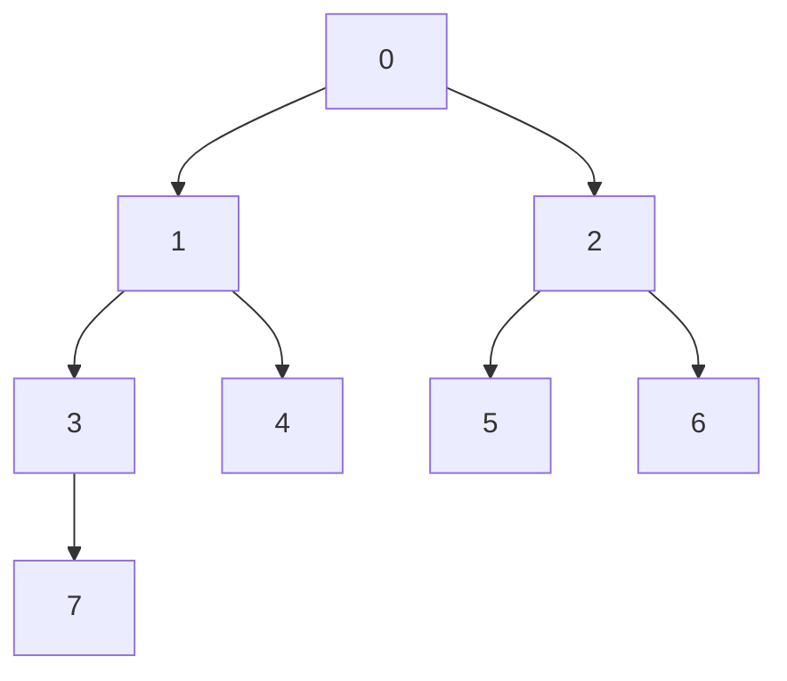

On a $m=3$, On construit le tableau de $F$

| $k$ | $\Adj(k)$   | $b_k$ | $F(k,x_0,x_1,x_2)$         |
| --- | ----------- | ----- | -------------------------- |
| $0$ | $\{1,2\}$   | $000$ | $x_0x_1x_2$                |
| $1$ | $\{3,4\}$   | $001$ | $\bar x_0x_1 x_2$          |
| $2$ | $\{5,6\}$   | $010$ | $x_0\bar x_1x_2$           |
| $3$ | $\{7\}$     | $011$ | $\bar x_0\bar x_1 x_2$     |
| $4$ | $\emptyset$ | $100$ | $x_0x_1\bar x_2$           |
| $5$ | $\emptyset$ | $101$ | $\bar x_0x_1\bar x_2$      |
| $6$ | $\emptyset$ | $110$ | $x_0\bar x_1\bar x_2$      |
| $7$ | $\emptyset$ | $111$ | $\bar x_0\bar x_1\bar x_2$ |

Ainsi:
$$
\begin{align}
 f(x_0,x_1,x_2,x'_0,x'_1,x'_2)&=\sum_{i=0}^{7}\sum_{j\in\Adj (i)} F(i,x_0,x_1,x_2)\times F(j,x'_0,x'_1,x'_2) \\
 &=\sum_{i=0}^{3}\sum_{j\in\Adj (i)} F(i,x_0,x_1,x_2)\times F(j,x'_0,x'_1,x'_2) \\
 &= F(0,x_0,x_1,x_2)\times F(1,x'_0,x'_1,x'_2)+F(0,x_0,x_1,x_2)\times F(2,x'_0,x'_1,x'_2) \\ & + F(1,x_0,x_1,x_2)\times F(3,x'_0,x'_1,x'_2) +F(1,x_0,x_1,x_2)\times F(4,x'_0,x'_1,x'_2) \\
 &+F(2,x_0,x_1,x_2)\times F(5,x'_0,x'_1,x'_2) +F(2,x_0,x_1,x_2)\times F(6,x'_0,x'_1,x'_2) \\
 &+F(3,x_0,x_1,x_2)\times F(7,x'_0,x'_1,x'_2) \\
 &=x_0x_1x_2\bar x'_0x'_1 x'_2 + x_0x_1x_2x'_0\bar x'_1x'_2+\bar x_0x_1 x_2\bar x'_0\bar x'_1  x'_2+\bar x_0x_1 x_2 x'_0x'_1 \bar x'_2\\
&+x_0\bar x_1x_2\bar x'_0x'_1\bar x'_2+ x_0\bar x_1x_2 x'_0\bar x'_1\bar x'_2+\bar x_0\bar x_1 x_2\bar x'_0\bar x'_1 \bar x'_2
\end{align}
$$

### 4.3 Graphe à partir d'une fonction booléenne

- Soit $f$ une fonction booléenne à $2m$ variables

- Soit $n=2^m$ et $\mathcal{V}=\{0,\dots,n-1\}$

On va construire le graphe $\mathcal{G}$ à partir de $f$

Pour cela on va calculer sa matrice d'adjacence $M$ en utilisant la propriété suivante:
$$
M_{i,j}=f(b_{i,0},\dots,b_{i,m-1},b_{j,0},\dots,b_{j,m-1})
$$
À partir de la matrice $M$ on peut construire la liste des arêtes $\mathcal{E}$ et par suite le graphe $\mathcal{G}=(\mathcal{V},\mathcal{E})$

##### Exemple 2

Soit $f(x_0,x_1,x'_0,x'_1)=x_0x'_1+x_1x'_0$

On génère la table de $f$

| $x_0$ | $x_1$ | $x'_0$ | $x'_1$ | $f$ |
| ----- | ----- | ------ | ------ | --- |
| 0     | 0     | 0      | 0      | 0   |
| 0     | 0     | 0      | 1      | 0   |
| 0     | 0     | 1      | 0      | 0   |
| 0     | 0     | 1      | 1      | 0   |
| 0     | 1     | 0      | 0      | 0   |
| 0     | 1     | 0      | 1      | 0   |
| 0     | 1     | 1      | 0      | 1   |
| 0     | 1     | 1      | 1      | 1   |
| 1     | 0     | 0      | 0      | 0   |
| 1     | 0     | 0      | 1      | 1   |
| 1     | 0     | 1      | 0      | 0   |
| 1     | 0     | 1      | 1      | 1   |
| 1     | 1     | 0      | 0      | 0   |
| 1     | 1     | 0      | 1      | 1   |
| 1     | 1     | 1      | 0      | 1   |
| 1     | 1     | 1      | 1      | 1   |

On a donc:
$$
\begin{align}M
&= \begin{pmatrix}f(0,0,0,0) & f(0,0,1,0) & f(0,0,0,1) & f(0,0,1,1) \\
f(1,0,0,0) & f(1,0,1,0) & f(1,0,0,1) & f(1,0,1,1) \\
f(0,1,0,0) & f(0,1,1,0) & f(0,1,0,1) & f(0,1,1,1) \\
f(1,1,0,0) & f(1,1,1,0) & f(1,1,0,1) & f(1,1,1,1)
\end{pmatrix} \\
&= \begin{pmatrix}0 & 0 & 0 & 0 \\
0 & 0 & 1 & 1 \\
0 & 1 & 0 & 1 \\
0 & 1 & 1 & 1
\end{pmatrix}
\end{align}
$$
Ainsi, le graphe  $\mathcal{G}$ est donc le suivant:

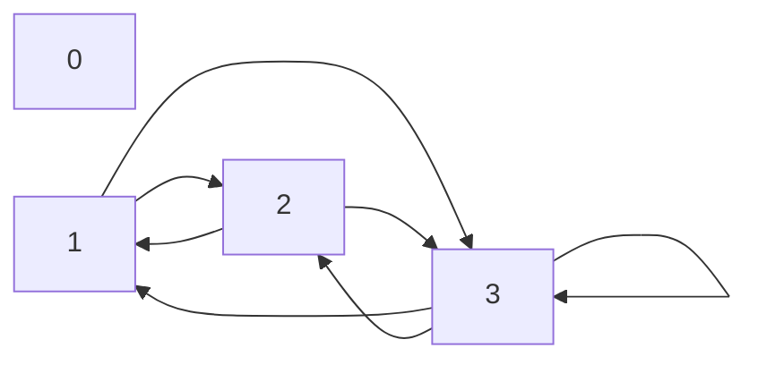

## 5. BDD à Partir d'une fonction booléenne

Toute fonction booléenne $f$ avec un nombre fini $n$ de variables booléennes peut être implémenté avec une arbre de décision.

Cependant, la taille d'une telle arbre peut être exponentielle en $n$. Pour cela, on doit représenter $f$ sous une forme compacte.

**La solution est d'utiliser un Binary Decision Diagram**

### 5.1 Cas d'étude: $f(x,y,z)=(x\oplus y\oplus z) +\bar xyz$

Pour introduire les BDDs, nous allons étudier la fonction booléenne:
$$
f(x,y,z)=(x\oplus y\oplus z) +\bar xyz
$$
Avec $\oplus$ est l'opérateur $\texttt{XOR}$

### 5.2 Génération de la table

| x   | y   | z   | f   |
| --- | --- | --- | --- |
| 0   | 0   | 0   | 0   |
| 0   | 0   | 1   | 1   |
| 0   | 1   | 0   | 1   |
| 0   | 1   | 1   | 1   |
| 1   | 0   | 0   | 1   |
| 1   | 0   | 1   | 0   |
| 1   | 1   | 0   | 0   |
| 1   | 1   | 1   | 1   |

### 5.3 Création d'un ordre sur les variables

En général, la BDD dépend de l'ordre utilisée sur les variables.

Dans notre cas on va utiliser l'ordre: $x>y>z$

### 5.4 Arbre de Décision

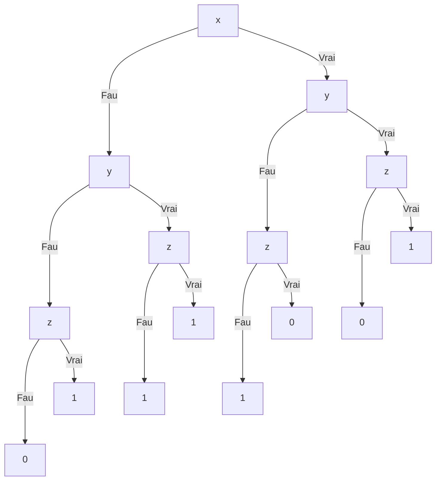

### 5.5 Construction de BDD

#### 5.5.1 Définition d'arbres isomorphes

Deux arbres binaires $\mathcal{T}_1,\mathcal{T}_2$ sont isomorphes lorsque:

1. Elles portent sur une même variable
2. Les sous-arbres $\text{left}(T_1)$ et $\text{left}(T_2)$ sont isomorphes
3. Les sous-arbres $\text{right}(T_1)$ et $\text{right}(T_2)$ sont isomorphes

On convient que deux arbre nulles sont isomorphes

#### 5.5.2 Supprimer les liaisons redondantes

Dans l'arbre de décision, la deuxième sous arbre (de gauche à droite) labellé par $z$ est redondante car elle donne toujours le même résultat $1$

On doit la supprimer

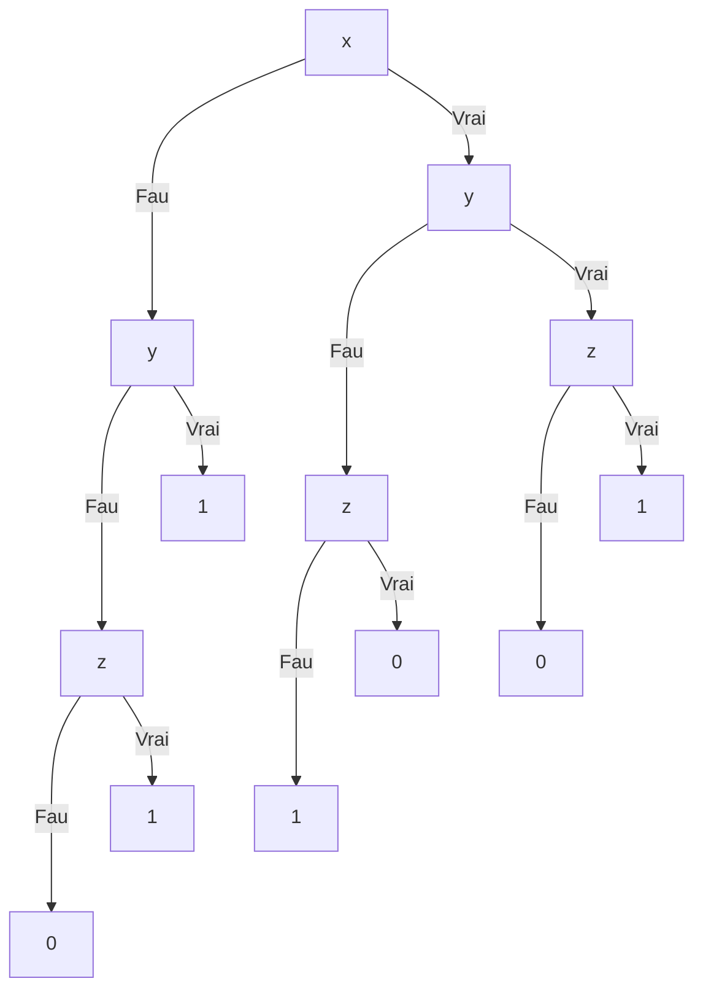

En effet, un arbre $\mathcal{T}$ est redondante si $\text{left}(\mathcal{T})$ et  $\text{right}(\mathcal{T})$ sont isomorphes. Dans ce cas on peut supprimer la redondance en:

- Mettant la racine de l'arbre à $\text{left}(\mathcal{T})$
- Si $\mathcal{T}$ est un fils de $\mathcal{T}'$, alors on remplace aussi $\mathcal{T}$ par $\text{left}(\mathcal{T})$

Cette technique va être appliquer itérativement.

#### 5.5.3 Regrouper les sous-arbres isomorphes

Cette technique regroupe chaque groupe d'arbre isomorphes, par un seul représentant.

Elle va être appliquée récursivement (ou itérativement):

##### Itération 1

On remarque qu'il y a deux sous arbres portant sur $z$ qui sont isomorphes

Ceux sont l'arbre la plus à gauche et l'arbre la plus à droite. Elle représente la même logique, donc on peut remplacer chacune par le même représentant.

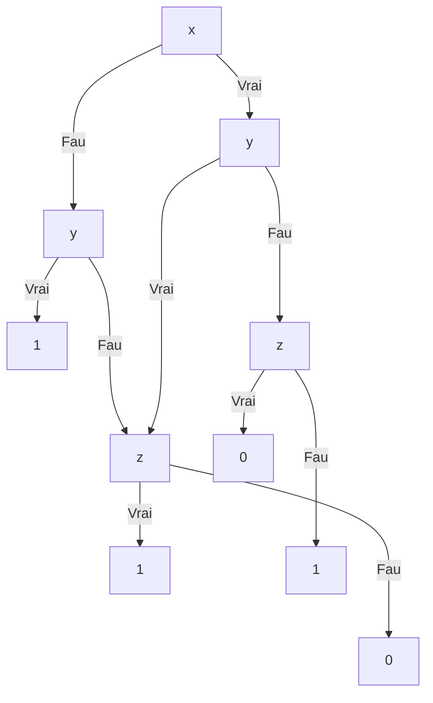

##### Itération 2

On remarque que les arbres portant $0$ sont isomorphes

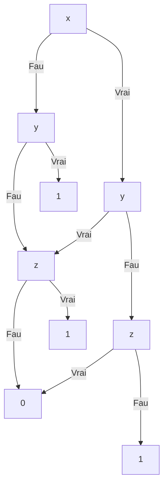

##### Itération 3

On remarque que les arbres portant sur $1$ sont isomorphes

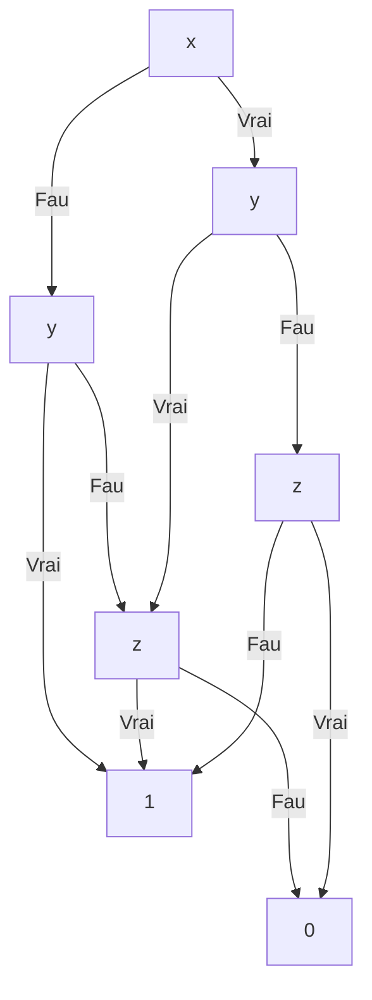
